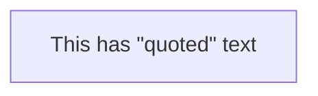
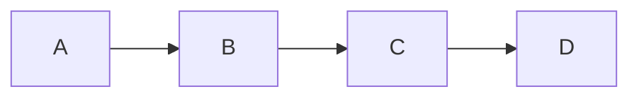
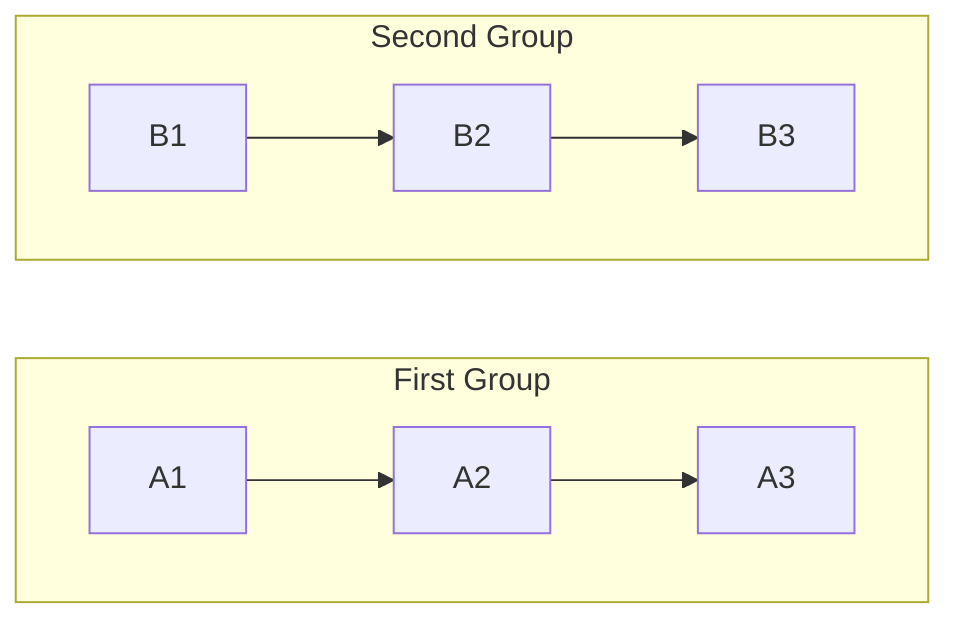
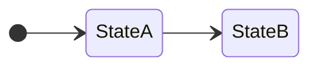
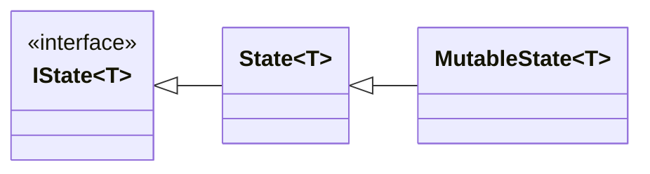
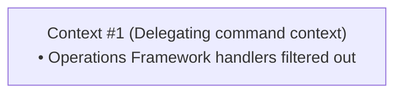
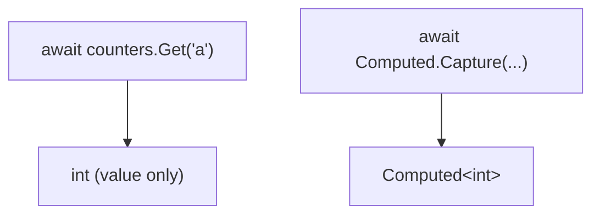

# Mermaid Diagram Syntax Guidelines

Use this when creating or editing Mermaid diagrams in documentation files.

## Quoting Rules

### Edge Labels with Special Characters

Edge labels containing `()`, `[]`, `<>`, or `<br/>` **must be quoted**:

```mermaid
flowchart LR
    A --> B                          %% OK - no special chars
    A -->|yes| B                     %% OK - no special chars
    A -->|"Set(value)"| B            %% REQUIRED - contains ()
    A -->|"uses [Interface]"| B      %% REQUIRED - contains []
    A -->|"line1<br/>line2"| B       %% REQUIRED - contains <br/>
```

**Wrong:**
```mermaid
flowchart LR
    A -->|Set(value)| B              %% PARSE ERROR!
```

### Node Labels

Parentheses inside `["..."]` node labels are **fine** and don't need escaping:

```mermaid
flowchart LR
    A["Call: Get('a')"]              %% OK - inside ["..."]
    B["Task.FromResult(default)"]    %% OK - inside ["..."]
```

### Escaping Quotes

To include quote characters inside quoted labels, use `#quot;`:



Renders as: `This has "quoted" text`

## Layout Preferences

### Prefer Horizontal (LR) Layout

Use `flowchart LR` (left-to-right) by default. It's more compact and readable for most diagrams:



### Subgraph Direction

For flowcharts with subgraphs:
- `flowchart LR/TB` controls **subgraph placement** (how subgraphs are arranged relative to each other)
- `direction LR/TB` inside subgraph controls **internal flow** (how nodes inside are arranged)



### State Diagrams

Use `direction LR` for horizontal layout:



## Class Diagrams

### Generic Type Names

Use separate IDs and display labels to avoid `<` `>` conflicts:



## Text Formatting

### Avoid ALL CAPS

Do not use ALL CAPS for subgraph labels, node labels, or any text in diagrams. Use sentence case or title case instead:

```mermaid
flowchart TD
    subgraph Loop [" Update Loop "]   %% Good - Title Case
        A --> B
    end
```

**Wrong:**
```mermaid
flowchart TD
    subgraph Loop [" UPDATE LOOP "]   %% Bad - ALL CAPS
        A --> B
    end
```

### Preventing Line Breaks ("nbsp trick")

Use `&nbsp;` instead of regular spaces to prevent word wrapping in node labels with long text:



This is useful for vertical (`TD`) flowcharts where nodes have enough width but mermaid still breaks lines.

## Diagram Ordering in *-D.md Files

Each `Part*-D.md` file should have diagrams ordered according to these rules:

1. **Follow TOC order**: Diagrams should follow the order in which concepts appear in the sidebar TOC (see `config.mts`). For example, PartR-D.md should order diagrams matching: Key Concepts → RpcNoWait → RpcStream → Server-to-Client Calls → System Calls → Configuration Options.

2. **Follow document section order**: Within each sub-document's scope, diagrams should match the order concepts are introduced in the prose (use `## ` headings as guide).

3. **Group related diagrams**: If two diagrams are conceptually very close (e.g., a state machine and its related table, or a flow diagram and its breakdown), keep them adjacent even if it slightly deviates from strict document order.

4. **Architecture/Overview first**: High-level architecture or overview diagrams should come first, before drilling into specifics.

### Reference: TOC Structure

```
PartF: Compute Services
  └─ Computed<T> → ComputedOptions → States → Server-Only → Diagrams → Cheat Sheet

PartR: ActualLab.Rpc
  └─ Key Concepts → RpcNoWait → RpcStream → Server-to-Client → System Calls → Config → Diagrams → Cheat Sheet

PartC: CommandR
  └─ Command Interfaces → Built-in Handlers → MediatR Comparison → Diagrams → Cheat Sheet

PartB: Blazor Integration
  └─ Services → UICommander → Authentication → Parameters → Diagrams → Cheat Sheet

PartO: Operations Framework
  └─ Events → Transient Operations → Config → Log Watchers → Diagrams → Cheat Sheet

PartAA: Authentication
  └─ Interfaces → Database Services → Server Components → Diagrams → Cheat Sheet

PartAP: Interceptors and Proxies
  └─ ArgumentList API → Proxy Generation → Built-in Interceptors → Diagrams → Cheat Sheet
```


## When to Use Tables Instead

Replace diagrams with tables when:
- The diagram shows simple mappings (call -> returns)
- The diagram is essentially a list with descriptions
- A table would be more readable and scannable

**Example - replace this diagram:**


**With this table:**
| Call | Returns |
|------|---------|
| `await counters.Get('a')` | `int` (value only) |
| `await Computed.Capture(() => counters.Get('a'))` | `Computed<int>` |

## Task

$ARGUMENTS
