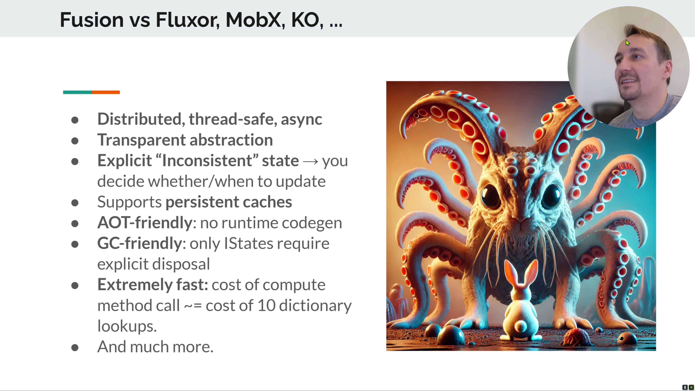
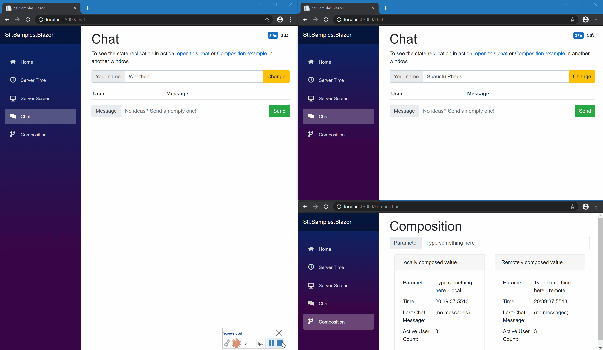

# 👾 Fusion: the "real-time on!" switch that actually exists

[](https://github.com/ActualLab/Fusion/actions?query=workflow%3A%22Build%22)
[](https://www.nuget.org/packages?q=tags%3A%22actual_lab_fusion%22+Owner%3A%22Actual.chat%22)

[](https://www.nuget.org/packages?q=tags%3A%22actual_lab_fusion%22+Owner%3A%22Actual.chat%22)
<br/>
[](https://fusion.actuallab.net/)
[](https://github.com/ActualLab/Fusion.Samples)
[](https://voxt.ai/chat/s-1KCdcYy9z2-uJVPKZsbEo)

## Overview

`ActualLab.Fusion` is a successor of [Stl.Fusion](https://github.com/servicetitan/Stl.Fusion). It works similarly to a **method call middleware** that transparently "plugs" a rich set of features into every call made to Fusion services &ndash; caching, invalidation, RPC, real-time sync, and many other capabilities, all without changing how you write your code.

You can think of Fusion as:

- `make` or `msbuild`, but operating on functions and their outputs instead of source files and build artifacts. Like MSBuild, Fusion uses **lazy computation**: when something changes, dependents are immediately marked as inconsistent, but recomputation only happens when you actually request the result. Old values remain accessible in the meantime.
- MobX, but managing an **arbitrarily large state spread across any number of machines** rather than a small UI state within a single process.

Fusion solves a set of infamously hard problems with a 🦄 single abstraction:

| Problem                         | Fusion's Answer                                                                                                                                                                  | So you don't need...                                                                                           |
|---------------------------------|----------------------------------------------------------------------------------------------------------------------------------------------------------------------------------|----------------------------------------------------------------------------------------------------------------|
| ⚡ Caching                      | In-memory memoization by call arguments                                                                                                                                          | Redis, memcached, ...                                                                                          |
| 🔄 Cache&nbsp;invalidation      | Automatic dependency tracking + cascading invalidation                                                                                                                           | Manual tracking &ndash; an [infamously hard problem](https://martinfowler.com/bliki/TwoHardThings.html) |
| 🪄 Real-time updates            | Fusion client automatically propagates server-side cache invalidation back to the client making it aware of state changes on the server side                                      | SignalR, WebSockets, custom pub/sub, ...                                                                       |
| ✈️ Offline operation            | Client-side persistent cache support (IndexedDB, SQLite) is integrated right into the Fusion RPC client, so you get offline mode for free!                                       | Service workers, sync logic, conflict resolution, ...                                                          |
| 🤬 Network chattiness           | Persistent cache enables speculative execution on the client side, allowing `ActualLab.Rpc` to batch hundreds of RPC calls into a single transmission frame                      | Request batching, debouncing, manual optimization, ...                                                         |
| 📡 Network traffic              | `ActualLab.Rpc` is 2-5x faster than gRPC and SignalR even in its "raw" mode; Fusion integration, if enabled, turns it into an efficiency beast by adding "cache match" responses | Protocol tuning, custom serialization, ...                                                                     |
| 🧩 Client-side state management | Same abstractions everywhere: `Computed<T>`, `MutableState<T>`, and compute methods                                                                                              | MobX, Flux/Redux, Recoil, ...                                                                                  |
| 💰 Single codebase              | Single codebase for Blazor Server, WebAssembly, and MAUI (iOS, Android, Windows, macOS, and more)                                                                                | Platform-specific code, multiple implementations, ...                                                          |

**The best part: you get all of this without turning your code into a mess.**
You can think of Fusion as a *call middleware* or a *decorator*.
That's why Fusion-based code looks as if there is no Fusion at all!
So you can *focus on building your app and ship faster* — and save yourself from dealing with a 2–3× larger codebase
and a plethora of "why is it stale?" bugs, which are among the hardest to debug.

## Documentation

[Documentation] is the best place to start from.

If you prefer video, check out:

| [ActualLab.Fusion Video](https://youtu.be/eMO7AmI6ui4)<br/>[](https://youtu.be/eMO7AmI6ui4) | [ActualLab.Rpc Video](https://youtu.be/vwm1l8eevak)<br/>[](https://youtu.be/vwm1l8eevak) |
| ------------------------------------------------------------------------------------------------------------------------------------------------------------------------------------------------------------ | ------------------------------------------------------------------------------------------------------------------------------------------------------------------------------------------------------------ |

## Samples

1. Clone [Fusion Samples] repository: `git clone git@github.com:ActualLab/Fusion.Samples.git`
2. Follow the instructions from
   [README.md](https://github.com/ActualLab/Fusion.Samples/blob/master/README.md)
   to build and run everything.

Below is [Fusion+Blazor Sample](https://github.com/ActualLab/Fusion.Samples#3-blazor-samples)
delivering real-time updates to 3 browser windows:



The sample supports [**both** Blazor Server and Blazor WebAssembly
hosting modes](https://learn.microsoft.com/en-us/aspnet/core/blazor/hosting-models).
And even if you use different modes in different windows,
Fusion still keeps in sync literally every bit of a shared state there,
including the sign-in state:


## Is Fusion fast?

**Yes, it's incredibly fast.** Here is an RPC call duration distribution for one of the most frequent calls on [Voxt.ai]:


`IChats.GetTile` reads a small "chat tile" &ndash; typically 5 entries pinned to a specific ID range, so it can be efficiently cached. And even for these calls the typical response time is barely measurable: every X-axis mark is 10x larger than the previous one, so **the highest peak you see is at `0.03ms`!**

The next bump at ~`4-5ms` is when the service actually goes to the DB &ndash; i.e., it's the time you'd expect to see without Fusion. The load would be much higher though, because _the calls you see on this chart are only the calls that "made it" to the server_ &ndash; in other words, they weren't eliminated by the client and its Fusion services.

### Benchmark Highlights

Our [benchmarks](./docs/Performance.md) show Fusion delivering **over 300 million calls per second** on a consumer CPU (AMD Ryzen 9 9950X3D) with its transparent caching:

| Scenario                                       | Without Fusion        | With Fusion     | Speedup     |
|------------------------------------------------|-----------------------|-----------------|-------------|
| Local DAL, almost no writes (peak performance) | 38.61K calls/s        | 313.75M calls/s | **>8,000x** |
| Local repo-like service, non-stop writes       | 136.91K calls/s       | 263.62M calls/s | **~2,000x** |
| Remote repo-like service, non-stop writes      | 99.66K calls/s (REST) | 223.15M calls/s | **~2,200x** |

These aren't typos &ndash; Fusion makes your services **thousands of times faster** by eliminating redundant computation, RPC, and database access.

Note that these benchmarks test Fusion method calls with no dependency chains. Real-life Fusion-based API services typically call other compute services, forming deep dependency graphs. Each layer multiplies the savings (i.e. when something is recomputed, it's typically recomputed just partially), so real-world speedups are often *even higher* than what you see here.

### ActualLab.Rpc: The Fastest RPC Protocol on .NET

`ActualLab.Rpc` is an extendable RPC protocol powering Fusion's distributed features. It isn't "coupled" to Fusion, so you can use it independently. It outperforms all major alternatives on plain RPC tests, especially on call tests and small-item streaming tests:

| Framework | Calls/s | Streaming |
|-----------|---------|-----------|
| **ActualLab.Rpc** | **8.87M** | **95.10M items/s** |
| SignalR | 5.34M | 17.11M items/s |
| gRPC | 1.11M | 38.75M items/s |

So it's **significantly faster** than gRPC and SignalR, both for calls and for streaming.

#### What makes Fusion fast:

- The concept itself is all about eliminating any unnecessary computation. Think `msbuild`, but for your method call results: what's computed and consistent is never recomputed.
- Fusion caches call results in memory, so if there's a cache hit, the result is instantly available. No round-trips to external caches, no serialization/deserialization, etc.
- Moreover, there is no cloning: what's cached is the .NET object or struct returned from a call, so any call result is "shared". This is much more CPU cache-friendly than, e.g., deserializing a new copy on every hit.
- Fusion uses its own `ActualLab.Interception` library for method interception. Unlike [Castle.DynamicProxy](http://www.castleproject.org/projects/dynamicproxy/) and similar libraries that box arguments and allocate heavily, our interceptors require just 1 allocation per call with zero boxing &ndash; making them the fastest on .NET.
- `ActualLab.Rpc` uses the fastest serializers available on .NET &ndash; [MemoryPack](https://github.com/Cysharp/MemoryPack) by default (it doesn't require runtime IL Emit), though you can also use [MessagePack](https://github.com/MessagePack-CSharp/MessagePack-CSharp) (it's slightly faster, but requires IL Emit) or anything else you prefer.
- All critical execution paths in Fusion are heavily optimized. The [archived version of this page](https://web.archive.org/web/20201212144353/https://github.com/servicetitan/Stl.Fusion/) shows that the performance of local compute services is currently 10x better than it was a few years ago.

## Does Fusion scale?

Yes. Fusion does something similar to what any [MMORPG] game engine does: even though the complete game state is huge, it's still possible to
run the game in real time for 1M+ players, because every player observes a tiny fraction of a complete game state, and thus all you need is to ensure _the observed part_ of the state fits in RAM.

And that's exactly what Fusion does:

- It spawns the observed part of the state on-demand (i.e. when you call a [Compute Service] method)
- Ensures the dependency graph backing this part of the state stays in memory while someone uses it
- Destroys what's unobserved.


## Enough talk. Show me the code!

To use Fusion, you need to:

1. Reference the `ActualLab.Fusion` NuGet package
2. "Implement" `IComputeService` (a tagging interface) on your service
3. Mark methods requiring caching/invalidation with `[ComputeMethod]` and declare them as `virtual`
4. Register the service via `services.AddFusion().AddService<MyService>()`

A typical Compute Service looks as follows:

```cs
public class ExampleService : IComputeService
{
    [ComputeMethod]
    public virtual async Task<string> GetValue(string key)
    {
        // This method reads the data from non-Fusion "sources",
        // so it requires invalidation on write (see SetValue)
        return await File.ReadAllTextAsync(_prefix + key);
    }

    [ComputeMethod]
    public virtual async Task<string> GetPair(string key1, string key2)
    {
        // This method uses only other [ComputeMethod]-s or static data,
        // thus it doesn't require invalidation on write
        var v1 = await GetValue(key1);
        var v2 = await GetValue(key2);
        return $"{v1}, {v2}";
    }

    public async Task SetValue(string key, string value)
    {
        // This method changes the data read by GetValue and GetPair,
        // but since GetPair uses GetValue, it will be invalidated
        // automatically once we invalidate GetValue.
        await File.WriteAllTextAsync(_prefix + key, value);
        using (Invalidation.Begin()) {
            // This is how you invalidate what's changed by this method.
            // Call arguments matter: you invalidate only a result of a
            // call with matching arguments rather than every GetValue
            // call result!
            _ = GetValue(key);
        }
    }
}
```

`[ComputeMethod]` indicates that every time you call this method, its result is "backed" by a [Computed Value], and thus it captures dependencies when it runs and instantly returns the result if the current computed value is still consistent.

Compute services are registered similarly to singletons:

```cs
var services = new ServiceCollection();
var fusion = services.AddFusion(); // It's ok to call it many times
// ~ Like service.AddSingleton<[TService, ]TImplementation>()
fusion.AddService<ExampleService>();
```

Check out [CounterService](https://github.com/ActualLab/Fusion.Samples/blob/master/src/HelloBlazorServer/Services/CounterService.cs)
from [HelloBlazorServer sample](https://github.com/ActualLab/Fusion.Samples)
to see the actual code of compute service.

Now, I guess you're curious how the UI code looks with Fusion. You'll be surprised, but it's as simple as it could be:

```cs
// MomentsAgoBadge.razor
@inherits ComputedStateComponent<string>
@inject IFusionTime _fusionTime

<span>@State.Value</span>

@code {
    [Parameter]
    public DateTime Value { get; set; }

    protected override Task<string> ComputeState()
        => _fusionTime.GetMomentsAgo(Value);
}
```

`MomentsAgoBadge` is a Blazor component that displays an
`"N [seconds/minutes/...] ago"` string. The code above is _almost identical_ to its
[actual code](https://github.com/ActualLab/Fusion.Samples/blob/master/templates/TodoApp/UI/Shared/MomentsAgoBadge.razor),
which is a bit more complex due to `null` handling.

You see it uses `IFusionTime` &ndash; one of the built-in compute services that provides `GetUtcNow` and `GetMomentsAgo` methods. As you might guess, the results of these methods are invalidated automatically; check out [`FusionTime` service](https://github.com/ActualLab/Fusion/blob/master/src/ActualLab.Fusion/Extensions/Internal/FusionTime.cs#L46) to see how it works.

But what's important here is that `MomentsAgoBadge` is inherited from
[ComputedStateComponent<T>](https://github.com/ActualLab/Fusion/blob/master/src/ActualLab.Fusion.Blazor/Components/ComputedStateComponent.cs) &ndash;
an abstract type which provides `ComputeState` method. As you might guess, this method behaves like a [Compute Method].

`ComputedStateComponent<T>` exposes `State` property (of `ComputedState<T>` type),
which allows you to get the most recent output of `ComputeState()` via its
`Value` property. "State" is another key Fusion abstraction &ndash; it implements a ["wait for invalidation and recompute" loop
similar to this one](https://github.com/ActualLab/Fusion/blob/master/samples/TodoApp/ConsoleClient/Program.cs#L18):

```cs
var computed = await Computed.Capture(_ => service.Method(...));
while (true) {
    await computed.WhenInvalidated();
    computed = await computed.Update();
}
```

The only difference is that it does this in a more robust way - in particular,
it allows you to control the delays between the invalidation and the update,
access the most recent non-error value, etc.

Finally, `ComputedStateComponent` automatically calls `StateHasChanged()`
once its `State` gets updated to make sure the new value is displayed.

**So if you use Fusion, you don't need to code any reactions in the UI.**
Reactions (i.e. partial updates and re-renders) happen automatically due
to dependency chains that connect your UI components with the
data providers they use, which in turn are connected to data
providers they use, and so on - till the very basic "ingredient providers",
i.e. compute methods that are invalidated on changes.

If you want to see a few more examples of similarly simple UI components,
check out:

- [Counter.razor](https://github.com/ActualLab/Fusion.Samples/blob/master/src/HelloBlazorServer/Pages/Counter.razor) - a Blazor component that uses
  [CounterService](https://github.com/ActualLab/Fusion.Samples/blob/master/src/HelloBlazorServer/Services/CounterService.cs)
  from [HelloBlazorServer sample](https://github.com/ActualLab/Fusion.Samples)
- [ChatMessageCountBadge.razor](https://github.com/alexyakunin/BoardGames/blob/main/src/UI/Chat/ChatMessageCountBadge.razor)
  and [AppUserBadge.razor](https://github.com/alexyakunin/BoardGames/blob/main/src/UI/Game/AppUserBadge.razor) from [Board Games].

## Why is Fusion a game changer for real-time apps?

Real-time typically implies you use events to deliver change
notifications to every client whose state might be impacted by
a change, so you have to:

1. _Know which clients to notify about a particular event._ This alone is
   a fairly hard problem - in particular, you need to know what every client
   "sees" now. Sending events for anything that's out of the "viewport"
   (e.g. a post you may see, but don't see right now) doesn't make sense,
   because it's a huge waste that severely limits the scalability.
   Similarly to [MMORPG], the "visible" part of the state is
   tiny in comparison to the "available" one for most of web apps too.
2. _Apply events to the client-side state._ This seems easy too,
   but note that you should do the same on the server side as well, and
   keeping the logic in two completely different handlers in sync
   for every event is a source of potential problems in the future.
3. _Make the UI properly update its event subscriptions on every
   client-side state change._ This is what client-side code has
   to do to ensure p.1 properly works on the server side. And again,
   this looks like a solvable problem on paper, but things get
   much more complex if you want to ensure your UI provides
   a truly eventually consistent view. Just think in which order
   you'd run "query the initial data" and "subscribe to the subsequent events"
   actions to see some issues here.
4. _Throttle down the rate of certain events_
   (e.g. "like" events for every popular post).
   Easy on paper, but more complex if you want to ensure the user sees
   _eventually consistent view_ on your system.
   In particular, this implies that every event you send "summarizes"
   the changes made by it and every event you discard, so likely,
   you'll need a dedicated type, producer, and handlers for each of such
   events.

And Fusion solves all these problems using a single abstraction that allows it
to identify and track data dependencies automatically.

## Why is Fusion a game changer for Blazor apps with complex UI?

**Fusion allows you to create truly independent UI components.**
You can embed them in any part of the UI without any need
to worry about how they'll interact with each other.

**This makes Fusion a perfect fit for
[micro-frontends](https://martinfowler.com/articles/micro-frontends.html)
on Blazor**: the ability to create loosely coupled UI components
is paramount there.

Besides that, if your invalidation logic is correct,
**Fusion guarantees that your UI state is eventually consistent.**

You might think all of this works only in Blazor Server mode.
But no, **all these UI components work in Blazor WebAssembly
mode as well, which is another unique feature Fusion provides.**
Any [Compute Service] can be substituted with a [Compute Service Client], which doesn't simply proxy the calls, but also completely
eliminates the chattiness you'd expect from a regular client-side proxy.

## Next Steps

- Read [Documentation]
- Check out [Samples]
- Join [Fusion Place] to ask questions and track project updates.

[Compute Services]: https://fusion.actuallab.net/PartF#_1-compute-services-and-compute-methods
[Compute Service]: https://fusion.actuallab.net/PartF#_1-compute-services-and-compute-methods
[Compute Method]: https://fusion.actuallab.net/PartF#_1-compute-services-and-compute-methods
[`Computed<T>`]: https://fusion.actuallab.net/PartF-C
[Computed Value]: https://fusion.actuallab.net/PartF-C
[Computed Values]: https://fusion.actuallab.net/PartF-C
[Compute Service Clients]: https://fusion.actuallab.net/PartR#what-is-compute-service-client
[Compute Service Client]: https://fusion.actuallab.net/PartR#what-is-compute-service-client
[Fusion Samples]: https://github.com/ActualLab/Fusion.Samples
[Samples]: https://github.com/ActualLab/Fusion.Samples
[Board Games]: https://github.com/alexyakunin/BoardGames
[Documentation]: https://fusion.actuallab.net/
[Slides]: https://alexyakunin.github.io/ActualLab.Fusion.Materials/Slides/Fusion_v2/Slides.html
[MMORPG]: https://en.wikipedia.org/wiki/Massively_multiplayer_online_role-playing_game
[Voxt.ai]: https://voxt.ai
[Fusion Place]: https://voxt.ai/chat/s-1KCdcYy9z2-uJVPKZsbEo
