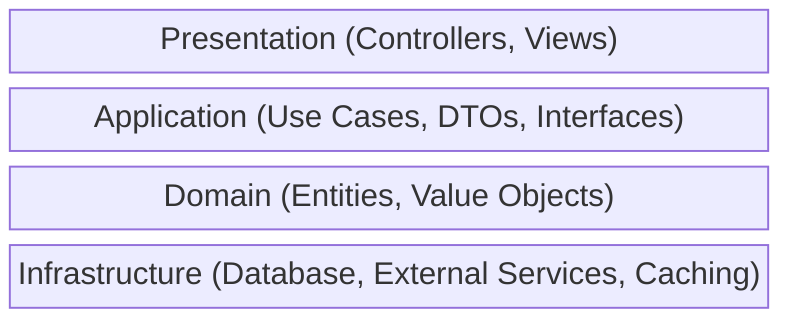

# ActualLab.Fusion vs Clean Architecture

Clean Architecture is a software design philosophy that emphasizes separation of concerns and dependency inversion. Fusion is a framework that can be used within Clean Architecture — they're not mutually exclusive.

## The Core Difference

**Clean Architecture** is a set of design principles: dependencies point inward, business logic is independent of frameworks, and external concerns (UI, database) are adapters. It doesn't prescribe specific technologies.

**Fusion** is a framework providing caching, real-time updates, and RPC. It can be an implementation detail within Clean Architecture, or it can inform your architecture decisions.

## Traditional Clean Architecture



```csharp
// Domain
public class Order { ... }

// Application (Use Case)
public interface IOrderRepository { Task<Order> GetById(Guid id); }

public class GetOrderUseCase
{
    private readonly IOrderRepository _repo;
    public async Task<OrderDto> Execute(Guid id)
    {
        var order = await _repo.GetById(id);
        return MapToDto(order);
    }
}

// Infrastructure
public class SqlOrderRepository : IOrderRepository { ... }

// Presentation
[ApiController]
public class OrdersController
{
    public async Task<OrderDto> Get(Guid id) => await _useCase.Execute(id);
}
```

## Fusion Within Clean Architecture

```csharp
// Domain (unchanged)
public class Order { ... }

// Application — Fusion compute service implements use case interface
public interface IOrderService
{
    Task<Order> GetOrder(Guid id, CancellationToken ct);
}

public class OrderService : IOrderService, IComputeService
{
    private readonly IOrderRepository _repo;

    [ComputeMethod]
    public virtual async Task<Order> GetOrder(Guid id, CancellationToken ct)
        => await _repo.GetById(id, ct);  // Cached and observable
}

// Presentation — Blazor component with automatic updates
@inherits ComputedStateComponent<Order>
@code {
    protected override Task<Order> ComputeState(CancellationToken ct)
        => OrderService.GetOrder(OrderId, ct);
}
```

## Where Each Excels

### ActualLab.Fusion is better at

- Real-time updates without additional infrastructure
- Intelligent caching with automatic invalidation
- Reducing boilerplate for reactive applications
- Performance through dependency tracking
- Rapid development of real-time features

### Clean Architecture is better at

- Testable business logic independent of frameworks
- Flexibility to swap infrastructure components
- Long-term maintainability for large codebases
- Teams with varying framework expertise
- Projects where framework lock-in is a concern

## Architectural Comparison

| Aspect | Clean Architecture | Fusion |
|--------|-------------------|--------|
| Philosophy | Design principles | Framework |
| Testability | High (isolated layers) | High (mockable interfaces) |
| Framework coupling | Minimal | Requires Fusion |
| Real-time | Not addressed | Built-in |
| Caching | Your responsibility | Automatic |
| Flexibility | Maximum | Within Fusion patterns |

## When to Use Each

### Follow Clean Architecture strictly when:
- Building a system that must outlive any framework
- Team needs clear boundaries between concerns
- Multiple frontends with different technologies
- Regulatory requirements for code auditability
- Long-term maintainability is paramount

### Embrace Fusion's patterns when:
- Building a .NET application with real-time requirements
- Productivity gains outweigh framework coupling concerns
- The team is committed to the .NET ecosystem
- Caching and reactivity are core requirements
- Time-to-market is important

## Fusion-Friendly Clean Architecture

You can apply Clean Architecture principles while using Fusion:

```csharp
// Domain Layer — pure, no Fusion dependencies
public class Order { public Guid Id; public decimal Total; }
public interface IOrderRepository { Task<Order> GetById(Guid id, CancellationToken ct); }

// Application Layer — Fusion lives here
public class OrderService : IComputeService
{
    private readonly IOrderRepository _repo;  // Dependency inversion

    [ComputeMethod]
    public virtual async Task<Order> GetOrder(Guid id, CancellationToken ct)
        => await _repo.GetById(id, ct);
}

// Infrastructure Layer — repository implementations
public class SqlOrderRepository : IOrderRepository
{
    public async Task<Order> GetById(Guid id, CancellationToken ct)
        => await _db.Orders.FindAsync(id, ct);
}
```

The domain remains pure. Fusion is an application/infrastructure concern.

## The Pragmatic Middle Ground

Clean Architecture purists might object to Fusion's `[ComputeMethod]` attributes in application services. Pragmatists recognize that:

1. **Fusion solves real problems** (caching, real-time) that Clean Architecture doesn't address
2. **The domain stays clean** — Fusion lives in application/infrastructure layers
3. **Testability remains** — compute services are easily mockable
4. **The trade-off is explicit** — you gain reactivity, you accept Fusion dependency

## The Key Insight

Clean Architecture and Fusion answer different questions:

- **Clean Architecture**: "How do I organize code so business logic is independent of technical concerns?"
- **Fusion**: "How do I make my application reactive with intelligent caching?"

They're complementary. Use Clean Architecture principles to structure your application. Use Fusion to make it reactive and cache-aware. The domain layer stays pure; Fusion lives in the layers that deal with external concerns.

The question isn't "Clean Architecture vs Fusion" — it's "How do I use Fusion within a well-architected application?"
