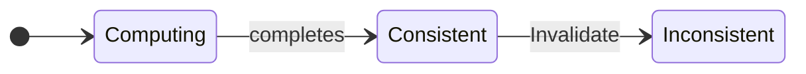
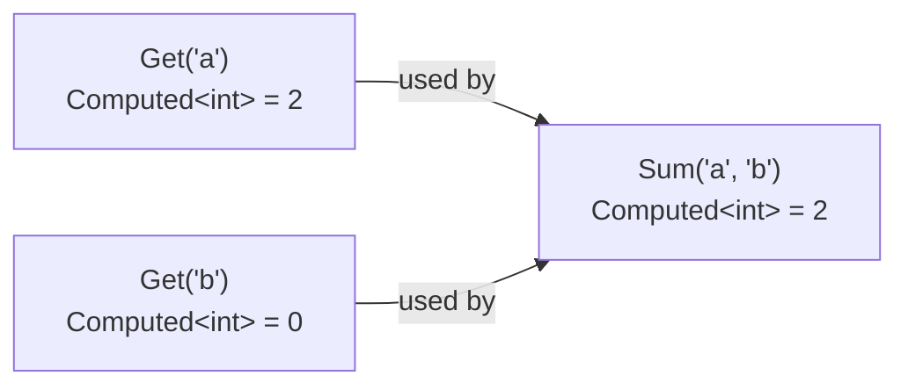
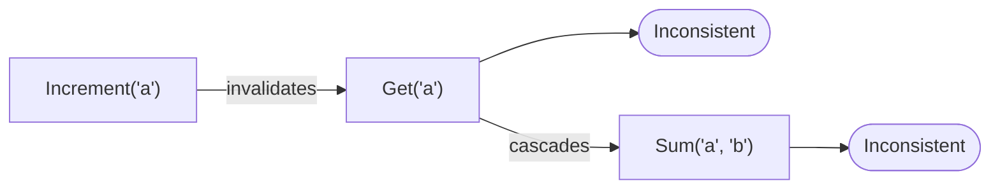
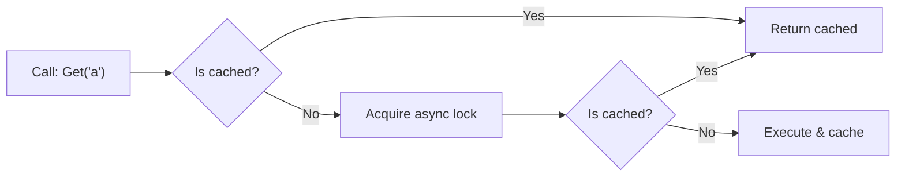
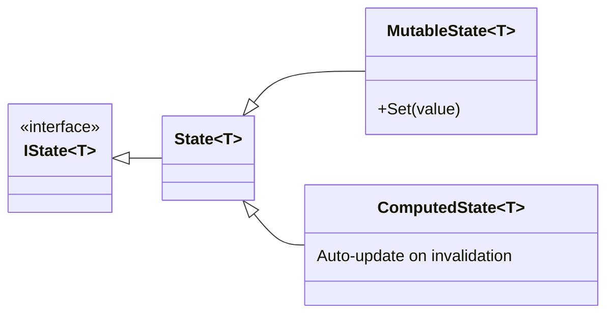
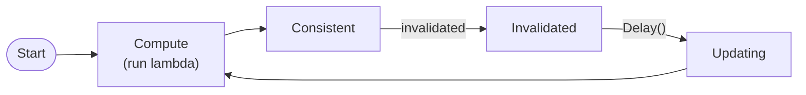
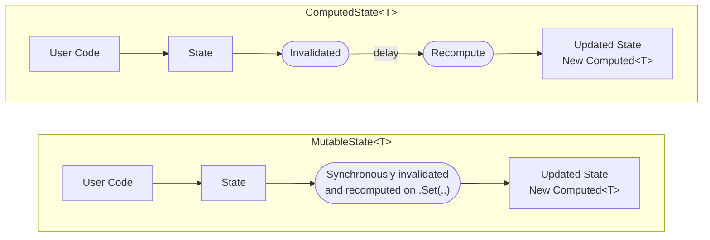

# Compute Services: Diagrams

Text-based diagrams for the core concepts introduced in [Part 01](Part01.md).

## `Computed<T>` Lifecycle States



## Capturing `Computed<T>` Values

| Call | Returns |
|------|---------|
| `await counters.Get('a')` | `int` (value only) |
| `await Computed.Capture(() => counters.Get('a'))` | `Computed<int>` |

**`Computed<T>` API:**
| Property/Method | Returns |
|-----------------|---------|
| `.Value` | `int` |
| `.IsConsistent()` | `bool` |
| `.Invalidate()` | `void` |
| `.Update()` | `Task<Computed<T>>` |
| `.WhenInvalidated()` | `Task` |
| `.When(predicate)` | `Task<Computed<T>>` |
| `.Changes()` | `IAsyncEnumerable` |
| `.Invalidated` | event |

## Invalidation Block Behavior

```csharp
using (Invalidation.Begin()) {
    _ = Get(key);  // Does NOT execute method body
}
```

| Behavior | Description |
|----------|-------------|
| Method body | Does NOT execute |
| Return value | `Task.FromResult(default(T))` or `default(T)` |
| Side effect | Invalidates cached `Computed<T>` for this call |

## Computed Value Dependency Graph (DAG)

Example from Part01: `Sum("a", "b")` depends on `Get("a")` and `Get("b")`.



### Cascading Invalidation Flow



## Compute Method Cache Resolution



## `State<T>` Inheritance Hierarchy



## `ComputedState<T>` Update Loop



## `MutableState<T>` vs `ComputedState<T>`



| MutableState&lt;T&gt; | ComputedState&lt;T&gt; |
|----------------------|------------------------|
| Use case: UI input state (e.g., search box text) | Use case: Derived/reactive values (e.g., filtered list, totals) |
