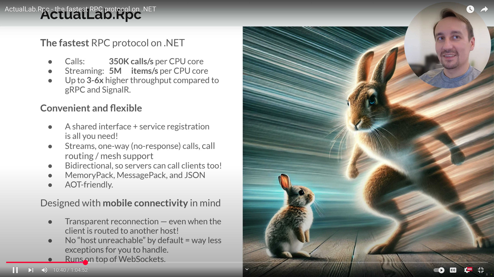

# ActualLab.Rpc and Compute Service Clients

Fusion is designed with distributed applications in mind,
and one of its key features is the ability to expose Compute Services
over the network via `ActualLab.Rpc` and consume such services
via Compute Service Clients.

## What is ActualLab.Rpc?

ActualLab.Rpc is a high-performance RPC framework for .NET that provides
a way to call methods on remote services as if they were local.
It uses **WebSockets** as low-level transport, but it's built to run on top of
nearly any packet-based or streaming protocol, so it will support
WebTransport in the near future.

It is designed to be fast, efficient, and extensible enough
to support Fusion's Remote Compute Service scenario.

If you want to learn more about ActualLab.Rpc performance, check out this video:<br/>
[](https://youtu.be/vwm1l8eevak)

## What is Compute Service Client?

Compute Service Clients are remote (client-side) proxies for Compute Services built on top of the ActualLab.Rpc
infrastructure. They take the behavior of `Computed<T>` into account to be significantly more
efficient than equivalent plain RPC clients:

1. **Consistent Behavior**: They back the result of any call with `Computed<T>` that mimics the matching `Computed<T>` on the server side. This means client-side proxies can be used in other client-side Compute Services, and invalidation of a server-side dependency will trigger invalidation of its client-side replica.

2. **Efficient Caching**: They cache consistent `Computed<T>` replicas, and they won't make a remote call when a *consistent* replica is still available. This provides exactly the same behavior as Compute Services, replacing "computation" with an "RPC call responsible for the computation."

3. **Automatic Invalidation**: Client-side replicas  of `Computed<T>` are automatically invalidated when their server-side counterparts get invalidated, ensuring eventual consistency across the network.

4. Resilience features like transparent reconnection on disconnect, persistent client-side caching, and ETag-style checks for every computed replica on reconnect are bundled - `ActualLab.Rpc` and `ActualLab.Fusion.Client` take care of that.

## Creating a Compute Service Client

Let's create a simple chat service that demonstrates how Compute Service Clients work. We'll need both server and client implementations.

### 1. Common Interface

First, we define a common interface that both the server-side service and client-side proxy will implement:

<!-- snippet: Part02_CommonServices -->
```cs
// The interface for our chat service
public interface IChatService : IComputeService
{
    // Compute methods - they cache the output not only on the server side
    // but on the client side as well!
    [ComputeMethod]
    Task<List<string>> GetRecentMessages(CancellationToken cancellationToken = default);
    [ComputeMethod]
    Task<int> GetWordCount(CancellationToken cancellationToken = default);

    // Regular methods
    Task Post(string message, CancellationToken cancellationToken = default);
    Task<int> GetWordCountPlainRpc(CancellationToken cancellationToken = default);
}
```
<!-- endSnippet -->

### 2. Server-Side Implementation

Now let's implement the server-side service:

<!-- snippet: Part02_ServerImplementation -->
```cs
public class ChatService : IChatService
{
    private readonly Lock _lock = new();
    private List<string> _posts = new();

    public virtual Task<List<string>> GetRecentMessages(CancellationToken cancellationToken = default)
        => Task.FromResult(_posts);

    public virtual async Task<int> GetWordCount(CancellationToken cancellationToken = default)
    {
        // NOTE: GetRecentMessages() is a compute method, so the GetWordCount() call becomes dependent on it,
        // and that's why it gets invalidated automatically when GetRecentMessages() is invalidated.
        var messages = await GetRecentMessages(cancellationToken).ConfigureAwait(false);
        return messages
            .Select(m => m.Split(" ", StringSplitOptions.RemoveEmptyEntries).Length)
            .Sum();
    }

    public Task<int> GetWordCountPlainRpc(CancellationToken cancellationToken = default)
        => GetWordCount(cancellationToken);

    public virtual Task Post(string message, CancellationToken cancellationToken = default)
    {
        lock (_lock) {
            var posts = _posts.ToList(); // We can't update the list itself (it's shared), but we can re-create it
            posts.Add(message);
            if (posts.Count > 10)
                posts.RemoveAt(0);
            _posts = posts;
        }

        using var _1 = Invalidation.Begin();
        _ = GetRecentMessages(default); // No need to invalidate GetWordCount(), because it depends on GetRecentMessages()
        return Task.CompletedTask;
    }
}
```
<!-- endSnippet -->

### 3. Performance Comparison

Compute methods provide powerful caching and invalidation features, but they do have some overhead compared to regular methods. We've already added the `GetWordCountPlainRpc` method to our interface and implementation. When we run a performance test with 1 million calls to each method, we can see the difference:

```cs
// Performance comparison: 1M calls to GetWordCountPlainRpc vs GetWordCount
WriteLine("Performance comparison: 1M calls to GetWordCountPlainRpc vs GetWordCount");
var stopwatch = System.Diagnostics.Stopwatch.StartNew();

// Test GetWordCountPlainRpc (regular method)
for (int i = 0; i < 1000000; i++) {
    await chatClient.GetWordCountPlainRpc();
}
stopwatch.Stop();
WriteLine($"GetWordCountPlainRpc: {stopwatch.ElapsedMilliseconds} ms");

// Test GetWordCount (compute method)
stopwatch.Restart();
for (int i = 0; i < 1000000; i++) {
    await chatClient.GetWordCount();
}
stopwatch.Stop();
WriteLine($"GetWordCount: {stopwatch.ElapsedMilliseconds} ms");
```

The regular method `GetWordCountPlainRpc` will typically be faster than the compute method `GetWordCount` because it doesn't have the overhead of caching and dependency tracking. However, the compute method provides automatic caching and invalidation, which can be more efficient in scenarios where the same values are requested multiple times.

### 4. Server Setup

To host our service, we need to set up a web server:

<!-- snippet: Part02_ServerSetup -->
```cs
public static WebApplication CreateHost()
{
    var builder = WebApplication.CreateBuilder();
    builder.Logging.ClearProviders().SetMinimumLevel(LogLevel.Debug).AddConsole();
    builder.Services.AddFusion(RpcServiceMode.Server, fusion => {
        fusion.AddWebServer();
        fusion.AddService<IChatService, ChatService>();
    });

    var app = builder.Build();
    app.UseWebSockets();
    app.MapRpcWebSocketServer();
    return app;
}
```
<!-- endSnippet -->

### 5. Client Setup

On the client side, we need to set up the service provider with the client proxy:

<!-- snippet: Part02_ClientSetup -->
```cs
public static IServiceProvider CreateClientServices(string baseUrl)
{
    var services = new ServiceCollection()
        .AddLogging(logging => {
            logging.ClearProviders();
            logging.SetMinimumLevel(LogLevel.Debug).AddConsole();
        })
        .AddFusion(fusion => {
            fusion.Rpc.AddWebSocketClient(baseUrl);
            fusion.AddClient<IChatService>();
        });
    return services.BuildServiceProvider();
}
```
<!-- endSnippet -->

### 6. Using the Client

Now we can use our client to interact with the server:

<!-- snippet: Part02_ClientUsage -->
```cs
public static async Task Run()
{
    await (new[] { "both" } switch {
        ["server"] => RunServer(),
        ["client"] => RunClient(),
        _ => Task.WhenAll(RunServer(), RunClient()),
    });
}

public static async Task RunServer()
{
    var app = CreateHost();
    try {
        await app.RunAsync("http://localhost:22222/");
    }
    catch (Exception error) {
        Error.WriteLine($"Server failed: {error.Message}");
    }
}

public static async Task RunClient()
{
    // Create client services
    var services = CreateClientServices("http://localhost:22222/");
    var chatClient = services.GetRequiredService<IChatService>();

    // Start GetWordCount() change observer
    var cWordCount0 = await Computed.Capture(() => chatClient.GetWordCount());
    _ = Task.Run(async () => {
        await foreach (var cWordCount in cWordCount0.Changes())
            WriteLine($"GetWordCount() -> {cWordCount}, Value: {cWordCount.Value}");
    });

    // Start GetRecentMessages() change observer
    var cMessages0 = await Computed.Capture(() => chatClient.GetRecentMessages());
    _ = Task.Run(async () => {
        await foreach (var cMessages in cMessages0.Changes()) {
            await Task.Delay(25); // We delay the output to print GetWordCount() first
            WriteLine($"GetRecentMessages() -> {cMessages}, Value:");
            foreach (var message in cMessages.Value)
                WriteLine($"- {message}");
            WriteLine();
        }
    });

    // Post some messages
    await chatClient.Post("Hello, World!");
    await Task.Delay(100);
    await chatClient.Post("Let's count to 3!");
    string[] data = ["One", "Two", "Three"];
    for (var i = 1; i <= 3; i++) {
        await Task.Delay(1000);
        await chatClient.Post(data.Take(i).ToDelimitedString());
    }
    await Task.Delay(1000);
    await chatClient.Post("Done counting!");
    await Task.Delay(1000);

    // Remote compute method call vs plain RPC call performance comparison
    WriteLine("100K calls to GetWordCount() vs GetWordCountPlainRpc() - run in Release!");
    WriteLine("- Warmup...");
    for (int i = 0; i < 100_000; i++)
        await chatClient.GetWordCount().ConfigureAwait(false);
    for (int i = 0; i < 100_000; i++)
        await chatClient.GetWordCountPlainRpc().ConfigureAwait(false);
    WriteLine("- Benchmarking...");
    var stopwatch = Stopwatch.StartNew();
    for (int i = 0; i < 100_000; i++)
        await chatClient.GetWordCount().ConfigureAwait(false);
    WriteLine($"- GetWordCount():         {stopwatch.Elapsed.ToShortString()}");
    stopwatch.Restart();
    for (int i = 0; i < 100_000; i++)
        await chatClient.GetWordCountPlainRpc().ConfigureAwait(false);
    WriteLine($"- GetWordCountPlainRpc(): {stopwatch.Elapsed.ToShortString()}");

    /* The output:
    GetWordCount() -> RemoteComputed<Int32>(*IChatService.GetWordCount(ct-none)-Hash=14783957 v.4u, State: Consistent), Value: 0
    GetRecentMessages() -> RemoteComputed<List<String>>(*IChatService.GetRecentMessages(ct-none)-Hash=14783978 v.d5, State: Invalidated), Value:

    GetWordCount() -> RemoteComputed<Int32>(*IChatService.GetWordCount(ct-none)-Hash=14783957 v.h5, State: Consistent), Value: 2
    GetRecentMessages() -> RemoteComputed<List<String>>(*IChatService.GetRecentMessages(ct-none)-Hash=14783978 v.l5, State: Consistent), Value:
    - Hello, World!

    GetWordCount() -> RemoteComputed<Int32>(*IChatService.GetWordCount(ct-none)-Hash=14783957 v.p5, State: Consistent), Value: 6
    GetRecentMessages() -> RemoteComputed<List<String>>(*IChatService.GetRecentMessages(ct-none)-Hash=14783978 v.4q, State: Consistent), Value:
    - Hello, World!
    - Let's count to 3!

    GetWordCount() -> RemoteComputed<Int32>(*IChatService.GetWordCount(ct-none)-Hash=14783957 v.d0, State: Consistent), Value: 7
    GetRecentMessages() -> RemoteComputed<List<String>>(*IChatService.GetRecentMessages(ct-none)-Hash=14783978 v.cp, State: Consistent), Value:
    - Hello, World!
    - Let's count to 3!
    - One

    GetWordCount() -> RemoteComputed<Int32>(*IChatService.GetWordCount(ct-none)-Hash=14783957 v.4v, State: Consistent), Value: 9
    GetRecentMessages() -> RemoteComputed<List<String>>(*IChatService.GetRecentMessages(ct-none)-Hash=14783978 v.gp, State: Consistent), Value:
    - Hello, World!
    - Let's count to 3!
    - One
    - One, Two

    GetWordCount() -> RemoteComputed<Int32>(*IChatService.GetWordCount(ct-none)-Hash=14783957 v.ou, State: Consistent), Value: 12
    GetRecentMessages() -> RemoteComputed<List<String>>(*IChatService.GetRecentMessages(ct-none)-Hash=14783978 v.8v, State: Consistent), Value:
    - Hello, World!
    - Let's count to 3!
    - One
    - One, Two
    - One, Two, Three

    GetWordCount() -> RemoteComputed<Int32>(*IChatService.GetWordCount(ct-none)-Hash=14783957 v.h0, State: Consistent), Value: 14
    GetRecentMessages() -> RemoteComputed<List<String>>(*IChatService.GetRecentMessages(ct-none)-Hash=14783978 v.kp, State: Consistent), Value:
    - Hello, World!
    - Let's count to 3!
    - One
    - One, Two
    - One, Two, Three
    - Done counting!

    100K calls to GetWordCount() vs GetWordCountPlainRpc() - run in Release!
    - Warmup...
    - Benchmarking...
    - GetWordCount():         12.187ms
    - GetWordCountPlainRpc(): 2.474s
    */
}
```
<!-- endSnippet -->

## How It Works

When you run this example, you'll see that:

1. The client automatically caches consistent replicas of computed values
2. When a command is executed on the server, the relevant computed values are invalidated on the client
3. The client automatically refreshes its cached values when they become invalidated
4. The WebSocket connection provides real-time updates with automatic reconnection

This approach provides a seamless experience where client-side code can work with remote services almost as if they were local, while still benefiting from efficient caching and automatic invalidation.

#### [Next: Part 03 &raquo;](./Part03.md) | [Documentation Home](./README.md)
