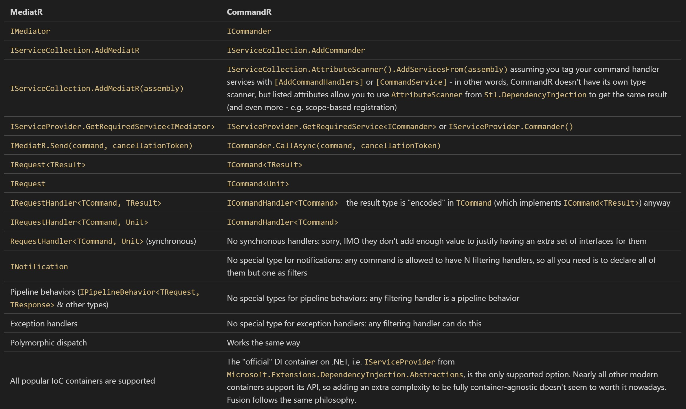

# Part 9: CommandR

[ActualLab.CommandR](https://www.nuget.org/packages/ActualLab.CommandR/)
is [MediatR](hhttps://github.com/jbogard/MediatR)-like library helping
to implement CQRS-style command handlers.
Together with a set of other abstractions it enables you to
get the pipeline described in the previous section with
almost no extra code.

> This part of the tutorial will cover CommandR itself. The next one
> will show how to use it together with other Fusion services
> to implement a robust CQRS pipeline.

Even though CommandR solves the same problem as MediatR, it offers
a few new features:

- Unified handler pipeline. Any CommandR handler
  can act either as a filter (~ middleware-like handler)
  or as the final one. MediatR supports pipeline behaviors, which
  are similar to filtering handlers in CommandR, but
  they are the same for all commands.
  And this feature is actually quite useful – e.g.
  built-in filter for `IPreparedCommand` helps to unify validation.
- `CommandContext` – an `HttpContext`-like type helping to
  non-handler code to store and access the state associated with
  the currently running command. Even though command contexts can
  be nested (commands may invoke other commands), the whole
  hierarchy of them is always available.
- Convention-based command handler discovery and invocation.
  You don't have to implement `ICommandHandler<TCommand, TResult>`
  every time you want to add a handler &ndash; any async method tagged
  with `[CommandHandler]`
  and having command as its first parameter, and `CancellationToken` as the
  last one works; all other arguments are resolved via IoC container.
- AOP-style command handlers.
  Such handlers are virtual async methods with two arguments:
  `(command, cancellationToken)`. To make AOP part work,
  the type declaring such handlers must be registered with
  `AddCommandService(...)` &ndash;
  an extension method to `IServiceCollection` that registers
  a runtime-generated proxy instead of the actual implementation type.
  The proxy ensures any call to such method is _still_ routed via
  `Commander.Call(command)` to invoke the whole pipeline
  for this command &ndash; i.e. all other handlers associated
  with it.
  In other words, such handlers can be invoked directly or via
  `Commander`, but the result is always the same.

Since many of you are familiar with MediatR, here is the map
of its terms to CommandR terms:



You might notice the API offered by CommandR is somewhat simpler &ndash;
at least while you don't use some of its unique features mentioned
earlier.

## Hello, CommandR!

Let's declare our first command and its MediatR-style handler:

<!-- snippet: Part09_PrintCommandSession -->
```cs
public class PrintCommand : ICommand<Unit>
{
    public string Message { get; set; } = "";
}

// Interface-based command handler
public class PrintCommandHandler : ICommandHandler<PrintCommand>, IDisposable
{
    public PrintCommandHandler() => WriteLine("Creating PrintCommandHandler.");
    public void Dispose() => WriteLine("Disposing PrintCommandHandler");

    public async Task OnCommand(PrintCommand command, CommandContext context, CancellationToken cancellationToken)
    {
        WriteLine(command.Message);
        WriteLine("Sir, yes, sir!");
    }
}
```
<!-- endSnippet -->

Using CommandR and MediatR is quite similar:

<!-- snippet: Part09_PrintCommandSession2 -->
```cs
// Building IoC container
var serviceBuilder = new ServiceCollection()
    .AddScoped<PrintCommandHandler>(); // Try changing this to AddSingleton
var rpc = serviceBuilder.AddRpc();
var commanderBuilder = serviceBuilder.AddCommander()
    .AddHandlers<PrintCommandHandler>();
var services = serviceBuilder.BuildServiceProvider();

var commander = services.Commander(); // Same as .GetRequiredService<ICommander>()
await commander.Call(new PrintCommand() { Message = "Are you operational?" });
await commander.Call(new PrintCommand() { Message = "Are you operational?" });
```
<!-- endSnippet -->

The output:

```
Creating PrintCommandHandler.
Are you operational?
Sir, yes, sir!
Disposing PrintCommandHandler
Creating PrintCommandHandler.
Are you operational?
Sir, yes, sir!
Disposing PrintCommandHandler
```

Notice that:

- CommandR doesn't auto-register command handler services &ndash; it
  cares only about figuring out how to map commands to
  command handlers available in these services.
  That's why you have to register services separately.
- `Call` creates its own `IServiceScope` to resolve
  services for every command invocation.

Try changing `AddScoped` to `AddSingleton` in above example.

## Convention-based handlers, `CommandContext`, recursion

Let's write a bit more complex handler to see how
`CommandContext` works.

<!-- snippet: Part09_RecSumCommandSession -->
```cs
public class RecSumCommand : ICommand<long>
{
    public long[] Numbers { get; set; } = Array.Empty<long>();
}
```
<!-- endSnippet -->

<!-- snippet: Part09_RecSumCommandSession2 -->
```cs
// Building IoC container
var serviceBuilder = new ServiceCollection()
    .AddScoped<RecSumCommandHandler>();
var rpc = serviceBuilder.AddRpc();
var commanderBuilder = serviceBuilder.AddCommander()
    .AddHandlers<RecSumCommandHandler>();
var services = serviceBuilder.BuildServiceProvider();

var commander = services.Commander(); // Same as .GetRequiredService<ICommander>()
WriteLine(await commander.Call(new RecSumCommand() { Numbers = new [] { 1L, 2, 3 }}));
```
<!-- endSnippet -->

The output:

```
Creating RecSumCommandHandler.
Numbers: 1, 2, 3
CommandContext stack size: 1
Depth via context.Items: 1
Numbers: 2, 3
CommandContext stack size: 2
Depth via context.Items: 2
Numbers: 3
CommandContext stack size: 3
Depth via context.Items: 3
Numbers:
CommandContext stack size: 4
Depth via context.Items: 4
6
```

A few things are interesting here:

1. You can use convention-based command handlers:
   all you need is to decorate a method with `[CommandHandler]`
   instead of implementing `ICommandHandler<TCommand>`.
2. Such handlers are more flexible with the arguments:
   - The first argument should always be the command
   - The last one should always be the `CancellationToken`
   - `CommandContext` arguments are resolved via `CommandContext.GetCurrent()`
   - Everything else is resolved via `CommandContext.Services`,
     i.e. a scoped service provider.

But the most complex part of this example covers `CommandContext`.
Contexts are "typed" &ndash; even though they all are inherited from
`CommandContext`, their actual type is `CommandContext<TResult>`.

Command context allows to:

- Find currently running command
- Set or read its result. Usually you don't have to set the result manually &ndash;
  the code invoking command handlers ensures the result is set once
  the "deepest" handler exist, but you may want to read it
  in some handlers in your pipeline.
- Manage `IServiceScope`
- Access its `Items`. It's an `OptionSet`, ~ a thread-safe dictionary-like structure
  helping to store any info associated with the current command.

Finally, `CommandContext` is a class, but there is also
[`ICommandContext` – an internal interface defining its API](https://github.com/ActualLab/Fusion/blob/master/src/ActualLab.CommandR/Internal/ICommandContext.cs) &ndash; check it out.
And if you're looking for details, check out
[`CommandContext` itself](https://github.com/ActualLab/Fusion/blob/master/src/ActualLab.CommandR/CommandContext.cs).

So when you call a command, a new `CommandContext` is created.
But what about the service scope? The code from `CommandContext<TResult>`
constructor explains this better than a few sentences:

```cs
// PreviousContext here is CommandContext.Current,
// which will be replaced with `this` soon after.
if (PreviousContext?.Commander != commander) {
    OuterContext = null;
    OutermostContext = this;
    ServiceScope = Commander.Services.CreateScope();
    Items = new OptionSet();
}
else {
    OuterContext = PreviousContext;
    OutermostContext = PreviousContext!.OutermostContext;
    ServiceScope = OutermostContext.ServiceScope;
    Items = OutermostContext.Items;
}
```

As you see, if you "switch" `ICommander` instances on such
calls, the new context behaves like it's a top-level one,
i.e. it creates a new service scope, new `Items`, and
exposes itself as `OutermostContext`.

Now it's a good time to try changing `false` to `true` in this fragment above:

```cs
var tailSum = await context.Commander.Call(
    new RecSumCommand() { Numbers = tail }, false, // Try changing it to true
    cancellationToken);
```

## Ways To Run A Command

[`ICommander` offers just a single method to run the command](https://github.com/ActualLab/Fusion/blob/master/src/ActualLab.CommandR/ICommander.cs), but in reality,
it's the most "low-level" option, so you'll rarely need it.

The actual options are implemented in
[`CommanderExt` type](https://github.com/ActualLab/Fusion/blob/master/src/ActualLab.CommandR/CommanderEx.cs)
(`Ext` is a shortcut for `Extensions` that's used everywhere in
`ActualLab` projects for such classes).

- `Call` is the one you should normally use.
  It "invokes" the command and returns its result.
- `Run` acts like `Call`, but returns `CommandContext`
  instead. Which is why it doesn't throw an exception
  even when one of the command handlers does &ndash; it completes
  successfully in any case.
  You can use e.g. `CommandContext.UntypedResult` to
  get the actual command completion result or exception.
- `Start` is fire-and-forget way to start a command.
  Similarly to `Run`, it returns `CommandContext`,
  but note that it returns this context immediately,
  i.e. while the command associated with this context is still running.
  Even though `CommandContext` allows you to know when
  the command produced its result (via e.g. `CommandContext.UntypedResultTask`),
  the result itself doesn't mean the pipeline for this command
  completed its execution, so code in its handlers might be still running.

All these methods take up to 3 arguments:

- `ICommand` &ndash; obviously
- `bool isolate = false` &ndash; an optional parameter indicating whether
  the command should be executed in isolated fashion. If it's true,
  the command will be executed inside
  [`ExecutionContext.TrySuppressFlow` block](https://docs.microsoft.com/en-us/dotnet/api/system.threading.executioncontext.suppressflow?view=net-5.0),
  so it will also be the outermost for sure.
- `CancellationToken cancellationToken = default` &ndash;
  a usual argument of almost any async method.

## Command Services and filtering handlers

The most interesting way to register command handlers
are to declare them inside so-called Command Service:

<!-- snippet: Part09_RecSumCommandServiceSession -->
```cs
public class RecSumCommandService : ICommandService
{
    [CommandHandler] // Note that ICommandHandler<RecSumCommand, long> support isn't needed
    public virtual async Task<long> RecSum( // Notice "public virtual"!
        RecSumCommand command,
        // You can't have any extra arguments here
        CancellationToken cancellationToken = default)
    {
        if (command.Numbers.Length == 0)
            return 0;
        var head = command.Numbers[0];
        var tail = command.Numbers[1..];
        var context = CommandContext.GetCurrent();
        var tailSum = await context.Commander.Call( // Note it's a direct call, but the whole pipeline still gets invoked!
            new RecSumCommand() { Numbers = tail },
            cancellationToken);
        return head + tailSum;
    }

    // This handler is associated with ANY command (ICommand)
    // Priority = 10 means it runs earlier than any handler with the default priority 0
    // IsFilter tells it triggers other handlers via InvokeRemainingHandlers
    [CommandHandler(Priority = 10, IsFilter = true)]
    protected virtual async Task DepthTracker(ICommand command, CancellationToken cancellationToken)
    {
        var context = CommandContext.GetCurrent();
        var depth = 1 + (int) (context.Items["Depth"] ?? 0);
        context.Items["Depth"] = depth;
        WriteLine($"Depth via context.Items: {depth}");

        await context.InvokeRemainingHandlers(cancellationToken).ConfigureAwait(false);
    }

    // Another filter for RecSumCommand
    [CommandHandler(Priority = 9, IsFilter = true)]
    protected virtual Task ArgumentWriter(RecSumCommand command, CancellationToken cancellationToken)
    {
        WriteLine($"Numbers: {command.Numbers.ToDelimitedString()}");
        var context = CommandContext.GetCurrent();
        return context.InvokeRemainingHandlers(cancellationToken);
    }
}
```
<!-- endSnippet -->

Such services has to be registered via `AddCommandService` method
of the `CommanderBuilder`:

<!-- snippet: Part09_RecSumCommandServiceSession2 -->
```cs
// Building IoC container
var serviceBuilder = new ServiceCollection();
var rpc = serviceBuilder.AddRpc();
var commanderBuilder = serviceBuilder.AddCommander()
    .AddService<RecSumCommandService>(); // Such services are auto-registered as singletons
var services = serviceBuilder.BuildServiceProvider();

var commander = services.Commander();
var recSumService = services.GetRequiredService<RecSumCommandService>();
WriteLine(recSumService.GetType());
WriteLine(await commander.Call(new RecSumCommand() { Numbers = new [] { 1L, 2 }}));
WriteLine(await commander.Call(new RecSumCommand() { Numbers = new [] { 3L, 4 }}));
```
<!-- endSnippet -->

The output:

```
Castle.Proxies.RecSumCommandServiceProxy
Depth via context.Items: 1
Numbers: 1, 2
Depth via context.Items: 2
Numbers: 2
Depth via context.Items: 3
Numbers:
3
Depth via context.Items: 1
Numbers: 3, 4
Depth via context.Items: 2
Numbers: 4
Depth via context.Items: 3
Numbers:
7
```

As you see, the proxy type generated for such services routes
**every direct invocation of a command handler** through `ICommander.Call`.
So contrary to regular handlers, you can invoke such handlers
directly &ndash; the whole CommandR pipeline gets invoked for them anyway.
