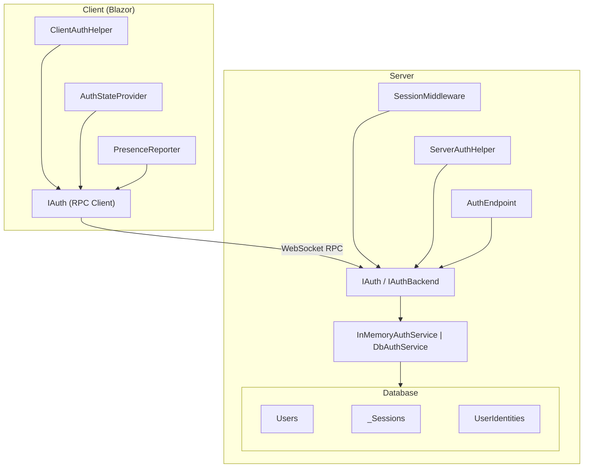
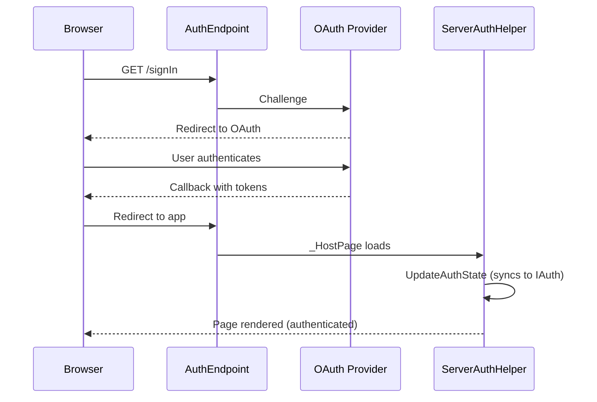
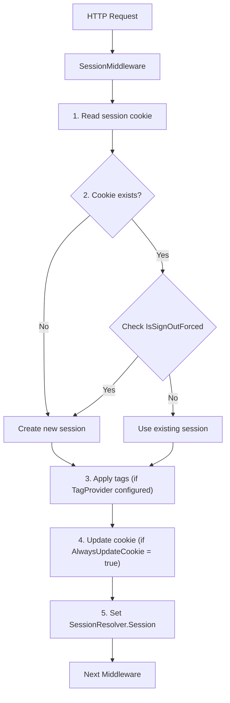
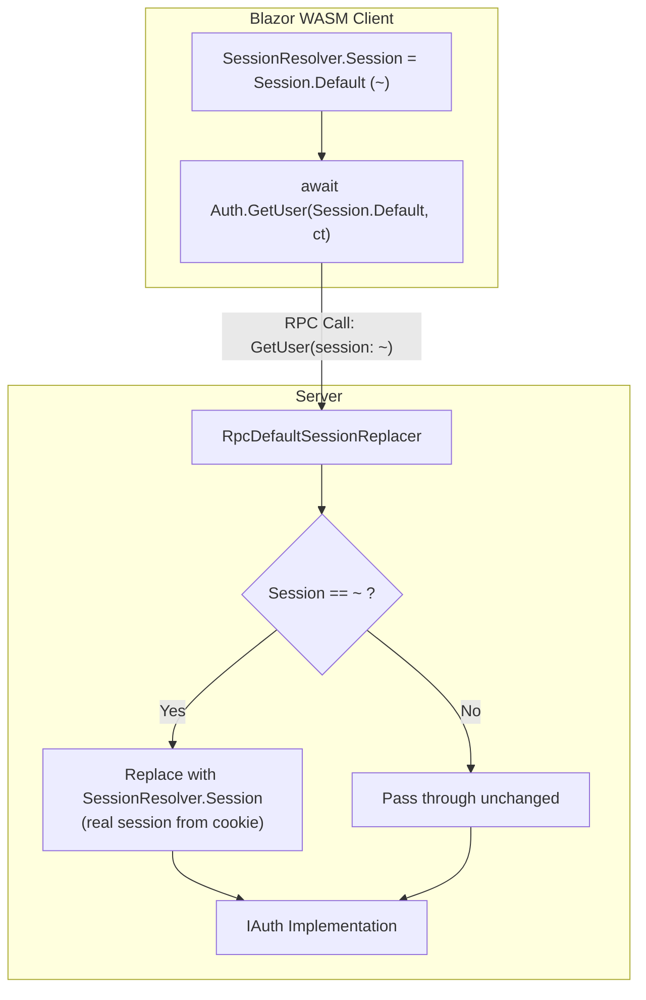
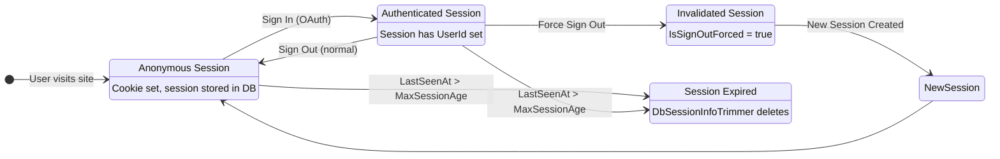
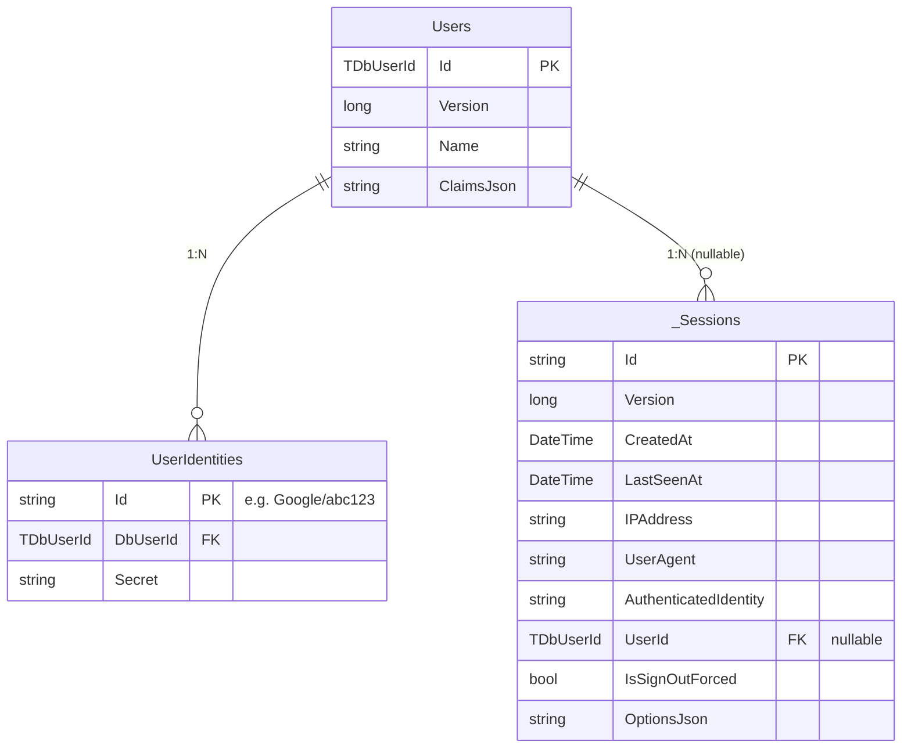
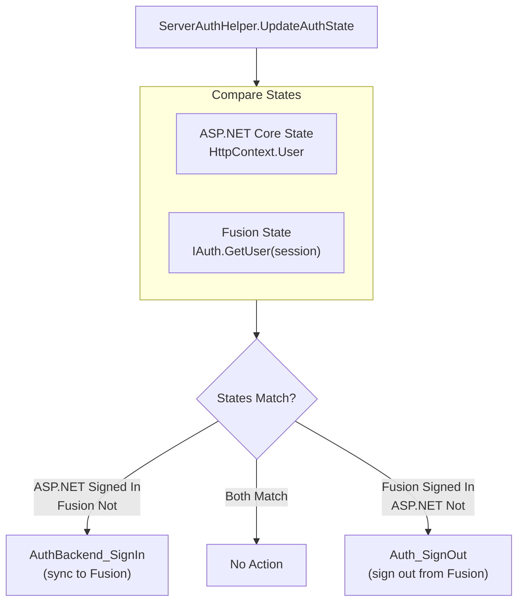
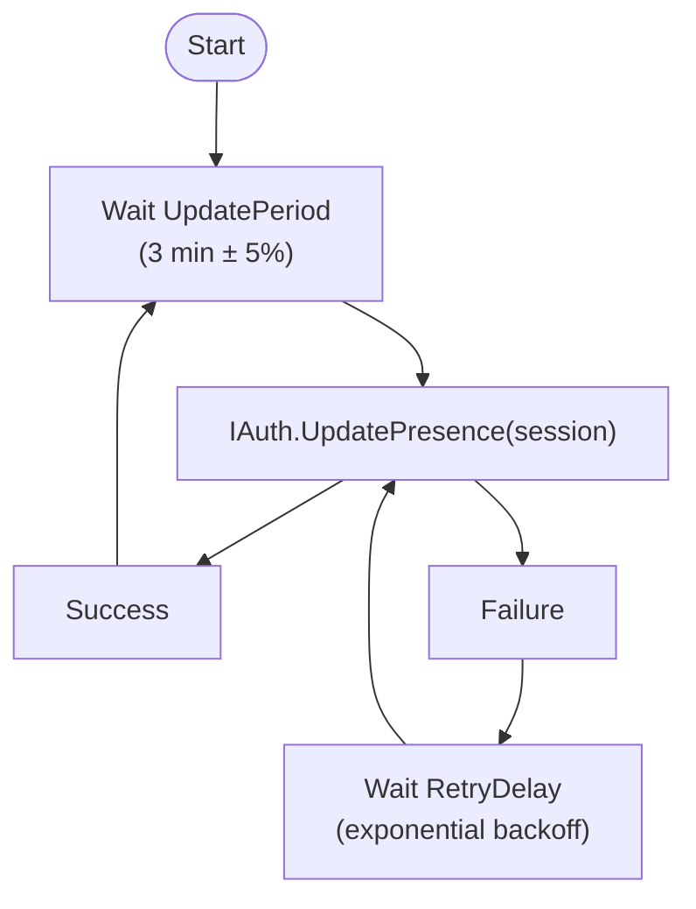
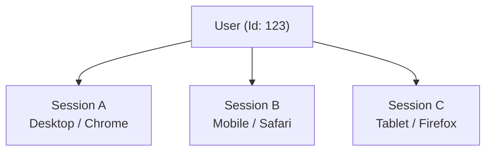

# Authentication: Diagrams

Diagrams illustrating Fusion's authentication architecture and flows.

## Authentication Service Architecture

## IAuth vs IAuthBackend

| Aspect | `IAuth` (Client-Facing) | `IAuthBackend` (Server-Only) |
|--------|-------------------------|------------------------------|
| **Exposed via RPC** | Yes | No (`IBackendService`) |
| **Session required** | Yes (all queries) | No |

### IAuth Commands

| Command | Description |
|---------|-------------|
| `SignOut(session)` | Sign out current session |
| `EditUser(session, name)` | Edit current user |
| `UpdatePresence(session)` | Update last-seen |

### IAuth Queries

| Query | Description |
|-------|-------------|
| `GetUser(session)` | Get current user |
| `GetSessionInfo(session)` | Get session details |
| `GetAuthInfo(session)` | Get auth info |
| `IsSignOutForced(session)` | Check forced sign-out |
| `GetUserSessions(session)` | Get all user's sessions |

### IAuthBackend Commands

| Command | Description |
|---------|-------------|
| `SignIn(session, user, identity)` | Authenticate session |
| `SetupSession(session, ip, ua)` | Create/update session |
| `SetOptions(session, options)` | Set session options |

### IAuthBackend Queries

| Query | Description |
|-------|-------------|
| `GetUser(shard, userId)` | Get any user by ID (no session required) |

## Sign-In Flow

## Session Resolution Flow

## Default Session Replacement

## Session Lifecycle

## Database Entity Relationships

**Indexes on `_Sessions`:**
- `(CreatedAt, IsSignOutForced)`
- `(LastSeenAt, IsSignOutForced)` - Used by `DbSessionInfoTrimmer`
- `(UserId, IsSignOutForced)`
- `(IPAddress, IsSignOutForced)`

## Authentication State Sync

## Presence Reporting

**Server-side effect:**
- `DbSessionInfo.LastSeenAt` updated
- Prevents session from being trimmed

## Multi-Session Management

| Sign Out Option | Code | Effect |
|-----------------|------|--------|
| Current session only | `Auth_SignOut(session: A)` | Only Session A signed out |
| Specific session | `Auth_SignOut(session: A, kickSessionHash: B.Hash)` | Session B signed out |
| All sessions | `Auth_SignOut(session: A, kickAllUserSessions: true)` | Sessions A, B, C all signed out |
| Force sign out | `Auth_SignOut(session: A, force: true)` | Session A permanently invalidated (new session created) |
