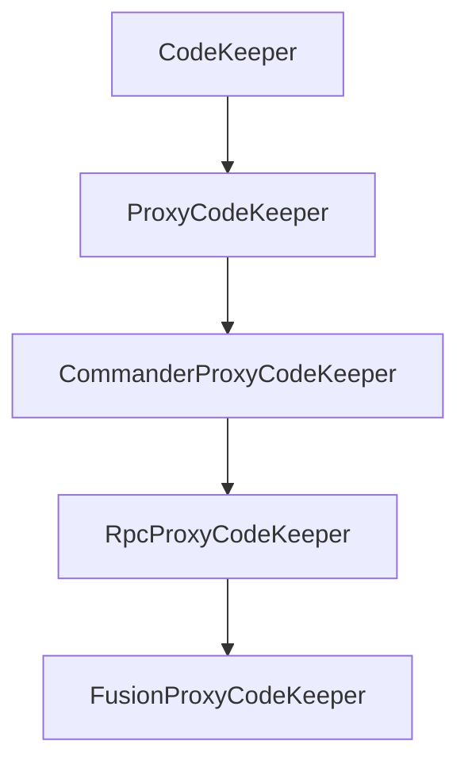

# Native AOT and Trimming Support

ActualLab libraries support .NET Native AOT compilation and IL trimming. This guide covers the `CodeKeeper`
infrastructure that prevents the trimmer from removing required code.


## Overview

Fusion uses runtime code generation for:
- Proxy classes (for compute services, RPC services, commanders)
- Generic `ArgumentList` implementations
- Method invocation infrastructure

When publishing with AOT or trimming, the .NET linker may remove code that appears unused at compile time
but is needed at runtime. The `CodeKeeper` infrastructure solves this by registering "fake" usage of
required types and methods.


## RuntimeCodegen Modes

Fusion supports multiple code generation strategies:

| Mode | Description |
|------|-------------|
| `DynamicMethods` | Runtime IL generation (default for JIT) |
| `InterpretedExpressions` | Expression tree interpretation (AOT-compatible) |
| `RuntimeCalls` | Reflection-based invocation (slowest, AOT-compatible) |

The mode is selected based on the runtime environment:

```cs
// Check the current mode
Console.WriteLine($"RuntimeCodegen.Mode: {RuntimeCodegen.Mode}");

// In Native AOT:
// - NativeMode will be InterpretedExpressions or RuntimeCalls
// - DynamicMethods is not available
```


## CodeKeeper Infrastructure

### Base CodeKeeper Class

`CodeKeeper` is the base class for preventing trimming of required code:

```cs
public abstract class CodeKeeper
{
    // Never evaluates to true at runtime, but compiler can't prove it
    public static readonly bool AlwaysFalse;
    public static readonly bool AlwaysTrue;

    // Register a type to prevent trimming
    public static T Keep<T>(bool ensureInitialized = false);

    // Register serializable types
    public static T KeepSerializable<T>();

    // Run all registered actions (called at startup)
    public static void RunActions();
}
```

### ProxyCodeKeeper Hierarchy

Specialized code keepers for each subsystem:



| Class | Purpose |
|-------|---------|
| `ProxyCodeKeeper` | Base proxy and ArgumentList support |
| `CommanderProxyCodeKeeper` | Commander command handlers |
| `RpcProxyCodeKeeper` | RPC service methods |
| `FusionProxyCodeKeeper` | Compute methods and Fusion-specific types |


## Usage in Native AOT Applications

### Basic Setup

At the start of your program, before any Fusion code runs:

```cs
using ActualLab.Trimming;
using ActualLab.Interception.Trimming;
using ActualLab.Fusion.Trimming;

// Set the code keeper to use (FusionProxyCodeKeeper includes all subsystems)
CodeKeeper.Set<ProxyCodeKeeper, FusionProxyCodeKeeper>();

// Run the code keeper actions to register types
if (RuntimeCodegen.NativeMode != RuntimeCodegenMode.DynamicMethods)
    CodeKeeper.RunActions();
```

### Complete Example

From the `NativeAot` sample:

```cs
using ActualLab.Fusion.Trimming;
using ActualLab.Interception;
using ActualLab.Interception.Trimming;
using ActualLab.Trimming;

#pragma warning disable IL3050

// Configure code keeper before anything else
CodeKeeper.Set<ProxyCodeKeeper, FusionProxyCodeKeeper>();
if (RuntimeCodegen.NativeMode != RuntimeCodegenMode.DynamicMethods)
    CodeKeeper.RunActions();

// Now configure services as usual
var services = new ServiceCollection()
    .AddLogging(l => l.AddSimpleConsole())
    .AddFusion(fusion => {
        fusion.Rpc.AddWebSocketClient();
        fusion.AddServerAndClient<ITestService, TestService>();
    })
    .AddSingleton(_ => RpcOutboundCallOptions.Default with {
        RouterFactory = methodDef => args => RpcPeerRef.Loopback,
    })
    .BuildServiceProvider();

// Use services
var client = services.RpcHub().GetClient<ITestService>();
var now = await client.GetTime();
```


## Keeping Custom Types

### For Service Methods

Register the types used in your service methods:

```cs
public class MyAppCodeKeeper : FusionProxyCodeKeeper
{
    public MyAppCodeKeeper()
    {
        if (AlwaysTrue)
            return;

        // Keep types used as method results
        KeepAsyncMethod<MyResult>();                    // Task<MyResult>
        KeepAsyncMethod<MyResult, string>();            // Task<MyResult> Method(string arg)
        KeepAsyncMethod<MyResult, string, int>();       // Task<MyResult> Method(string, int)

        // Keep types used as method arguments
        KeepMethodArgument<MyCommand>();

        // Keep serializable types
        KeepSerializable<MyDto>();
    }
}
```

### For Proxy Types

If you pre-generate proxy classes, keep them explicitly:

```cs
public class MyAppCodeKeeper : FusionProxyCodeKeeper
{
    public MyAppCodeKeeper()
    {
        if (AlwaysTrue)
            return;

        // Keep service interface and its generated proxy
        KeepProxy<IMyService, MyServiceProxy>();
    }
}

// Use your custom code keeper
CodeKeeper.Set<ProxyCodeKeeper, MyAppCodeKeeper>();
```


## How CodeKeeper Works

CodeKeepers use a clever pattern to prevent trimming while avoiding runtime overhead:

```cs
public class MyCodeKeeper : CodeKeeper
{
    public void KeepMyType()
    {
        // This condition is always false at runtime, but the compiler can't prove it
        if (AlwaysTrue)
            return;

        // This code is never executed, but the trimmer sees the reference
        // and preserves the type
        Keep<MyType>();
    }
}
```

The `AlwaysFalse`/`AlwaysTrue` constants use runtime values that the compiler cannot evaluate:

```cs
public static readonly bool AlwaysFalse =
    CpuTimestamp.Now.Value == -1 && RandomShared.NextDouble() < 1e-300;
```


## Project Configuration

### Enable AOT Publishing

In your `.csproj`:

```xml
<PropertyGroup>
    <PublishAot>true</PublishAot>
</PropertyGroup>
```

### Suppress Trimming Warnings

For code that uses reflection intentionally:

```cs
[UnconditionalSuppressMessage("Trimming", "IL2026",
    Justification = "Types are preserved by CodeKeeper")]
[UnconditionalSuppressMessage("Trimming", "IL3050",
    Justification = "Types are preserved by CodeKeeper")]
public void MyMethod() { }
```

### DynamicallyAccessedMembers

For generic parameters that need reflection:

```cs
public void ProcessType<[DynamicallyAccessedMembers(DynamicallyAccessedMemberTypes.All)] T>()
{
    // T's members are preserved by the trimmer
}
```


## ArgumentList Support

`ArgumentList` requires special handling because it uses generic types based on argument count:

```cs
// These types are auto-generated and need preservation
var l0 = ArgumentList.New();                    // ArgumentList0
var l2 = ArgumentList.New(1, "s");              // ArgumentList2<int, string>
var l10 = ArgumentList.New(0, 1, 2, 3, 4, 5, 6, 7, 8, 9);  // ArgumentList10<...>
```

The `ArgumentListCodeKeeper` (invoked through `ProxyCodeKeeper`) preserves these types:

```cs
public void KeepArgumentListArgument<T>()
{
    // Keeps ArgumentListN types that include T as a type argument
}
```


## Limitations

1. **Dynamic proxy generation**: Native AOT doesn't support `System.Reflection.Emit` at runtime.
   Proxies must be either:
   - Pre-generated at build time (source generators)
   - Using interpreted expressions mode

2. **Expression tree limitations**: Some complex expressions may not work in interpreted mode.
   Test your application in AOT mode during development.

3. **Serialization**: All serialized types must be annotated with appropriate attributes
   (`[DynamicallyAccessedMembers]`, `[MemoryPackable]`, etc.)


## Best Practices

1. **Initialize early**: Call `CodeKeeper.Set()` and `CodeKeeper.RunActions()` at the very start
   of your application, before any DI containers are built.

2. **Use FusionProxyCodeKeeper**: It includes all subsystems (Commander, RPC, Fusion).
   Only create a custom code keeper if you need to add application-specific types.

3. **Test in AOT mode**: Run `dotnet publish -c Release` and test the AOT binary regularly
   during development to catch trimming issues early.

4. **Annotate serializable types**: Use `[DynamicallyAccessedMembers]` or serialization attributes
   on all types that may be serialized/deserialized.

5. **Check RuntimeCodegen.Mode**: If your code behaves differently based on the codegen mode,
   log it at startup for easier debugging.


## Related Topics

- [Serialization](./PartS.md) - Type annotations for serialization
- [Interceptors and Proxies](./PartAP.md) - Proxy generation details
