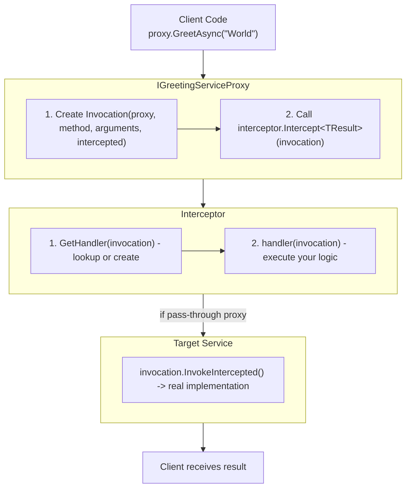
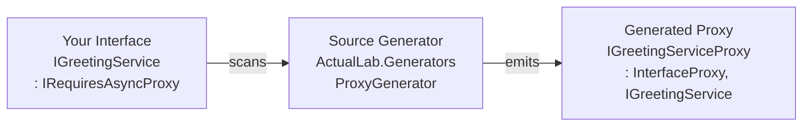
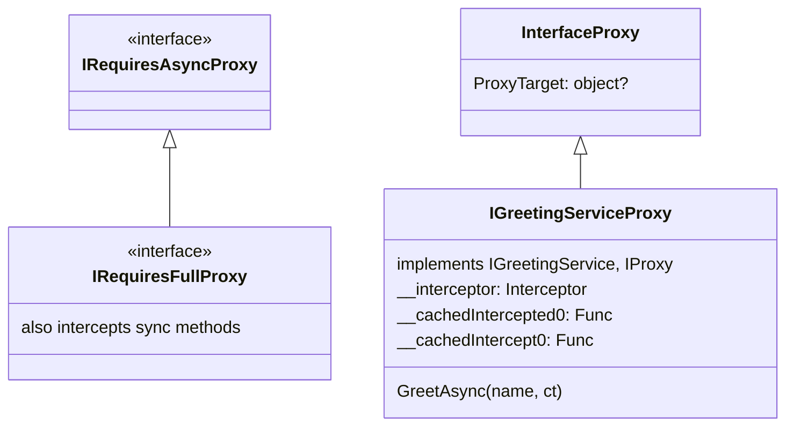
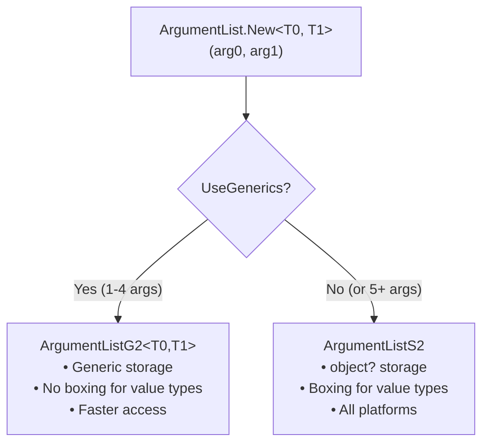
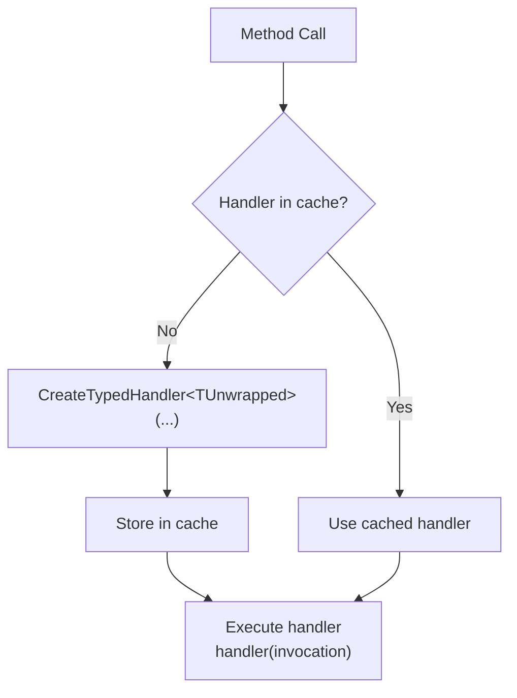
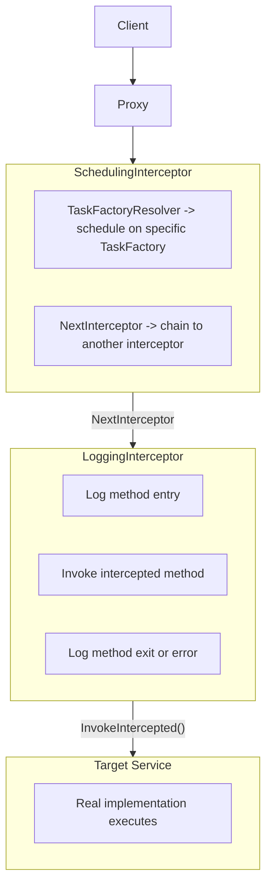
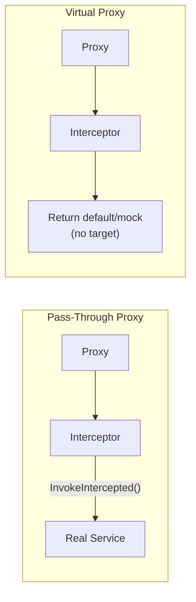

# Interceptors and Proxies: Diagrams

Diagrams for the concepts introduced in [Interceptors and Proxies](PartAP.md).

## Proxy Call Flow

How a method call flows through the proxy system:

## Proxy Generation at Compile Time

## Proxy Type Hierarchy

### Generated Proxy Fields

| Field | Type | Purpose |
|-------|------|---------|
| `__interceptor` | `Interceptor` | The interceptor instance |
| `__cachedIntercepted0` | `Func<ArgumentList, Task<string>>` | Cached delegate to target |
| `__cachedIntercept0` | `Func<Invocation, Task<string>>` | Cached intercept delegate |
| `ProxyTarget` | `object?` | Real service (from `InterfaceProxy`) |

## Invocation Structure

| Field | Description |
|-------|-------------|
| `Proxy` | The proxy instance (e.g., `IGreetingServiceProxy`) |
| `Method` | `MethodInfo` of the called method |
| `Arguments` | `ArgumentList` containing method arguments |
| `InterceptedDelegate` | Delegate to call the real implementation (for pass-through) |
| `InterfaceProxyTarget` | The real service instance |

## ArgumentList Variants

| Count | Generic Type | Simple Type |
|-------|--------------|-------------|
| 0 | `ArgumentList0` | `ArgumentList0` |
| 1 | `ArgumentListG1<>` | `ArgumentListS1` |
| 2 | `ArgumentListG2<,>` | `ArgumentListS2` |
| 3 | `ArgumentListG3<,,>` | `ArgumentListS3` |
| 4 | `ArgumentListG4<,,,>` | `ArgumentListS4` |
| 5-10 | (uses Simple) | `ArgumentListS5-S10` |

### ArgumentList Methods

| Method | Description |
|--------|-------------|
| `.Get<T>(index)` | Get argument at index |
| `.GetCancellationToken(index)` | Get cancellation token |
| `.Set<T>(index, val)` | Set argument value |
| `.Length` | Number of arguments |

## Handler Caching

## Interceptor Chain

Multiple interceptors can be chained together:

## Pass-Through vs Virtual Proxy

| Aspect | Pass-Through Proxy | Virtual Proxy |
|--------|-------------------|---------------|
| **Creation** | `Proxies.New(typeof(IService), interceptor, proxyTarget: realService)` | `Proxies.New(typeof(IService), interceptor)` |
| **ProxyTarget** | `!= null` | `== null` |
| **Flow** | Proxy → Interceptor → `InvokeIntercepted()` → Real Service | Proxy → Interceptor → Return default/mock |
| **Use cases** | Logging, Metrics, Caching, Retry logic | Mocking/Stubs, Default values, RPC client proxies, Lazy initialization |

## Typed vs Untyped Handlers

| Aspect | Typed Handlers (Default) | Untyped Handlers |
|--------|--------------------------|------------------|
| **Method** | `CreateTypedHandler<TUnwrapped>(invocation, methodDef)` | `CreateUntypedHandler(invocation, methodDef)` |
| **Setup** | Default behavior | `UsesUntypedHandlers = true` in constructor |
| **Return type** | `TUnwrapped` (e.g., `string` for `Task<string>`) | `object?` |
| **Performance** | One handler instantiation per unique return type | No generic instantiation overhead |
| **Use case** | Most use cases | `ComputeServiceInterceptor` for max performance |

## MethodDef Key Properties

For `Task<string> GreetAsync(string name, CancellationToken ct)`:

| Property | Value |
|----------|-------|
| `MethodInfo` | `GreetAsync` |
| `FullName` | `"MyNamespace.IGreetingService.GreetAsync"` |
| `ReturnType` | `typeof(Task<string>)` |
| `UnwrappedReturnType` | `typeof(string)` |
| `IsAsyncMethod` | `true` |
| `ReturnsTask` | `true` |
| `ReturnsValueTask` | `false` |
| `IsAsyncVoidMethod` | `false` |
| `CancellationTokenIndex` | `1` |
| `Parameters` | `[name: string, ct: CancellationToken]` |

### Helper Methods

| Method | Description |
|--------|-------------|
| `DefaultResult` | Completed Task with `default(T)` |
| `WrapResult(value)` | `Task.FromResult(value)` |
| `WrapAsyncInvokerResult(task)` | Proper `Task<T>` or `ValueTask<T>` |
| `InterceptedAsyncInvoker` | `Func<Invocation, Task<T>>` |
| `TargetAsyncInvoker` | `Func<object, Args, Task<T>>` |

## See Also

- [Interceptors and Proxies](./PartAP.md) - Main documentation
- [ArgumentList API](./PartAP-AL.md) - Working with method arguments
- [Proxy Generation](./PartAP-PG.md) - Source generator details
- [Built-in Interceptors](./PartAP-BI.md) - Ready-to-use interceptors
- [Cheat Sheet](./PartAP-CS.md) - Quick reference
