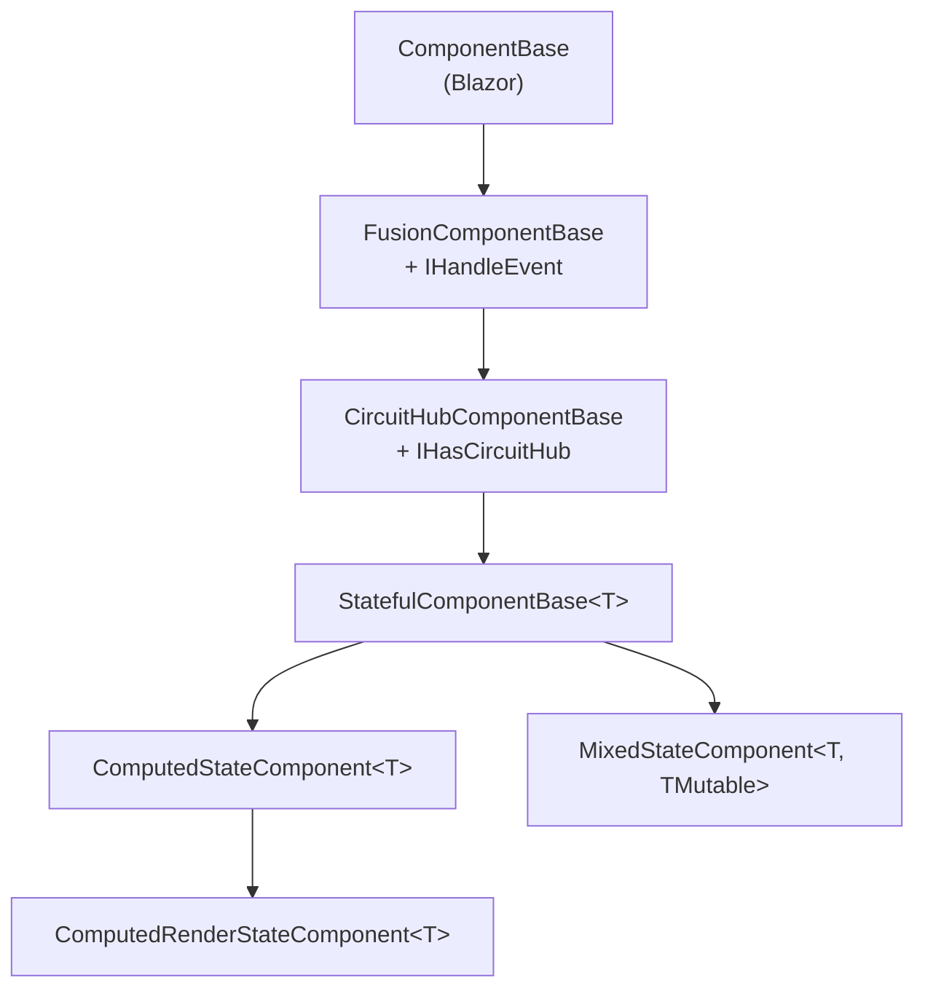
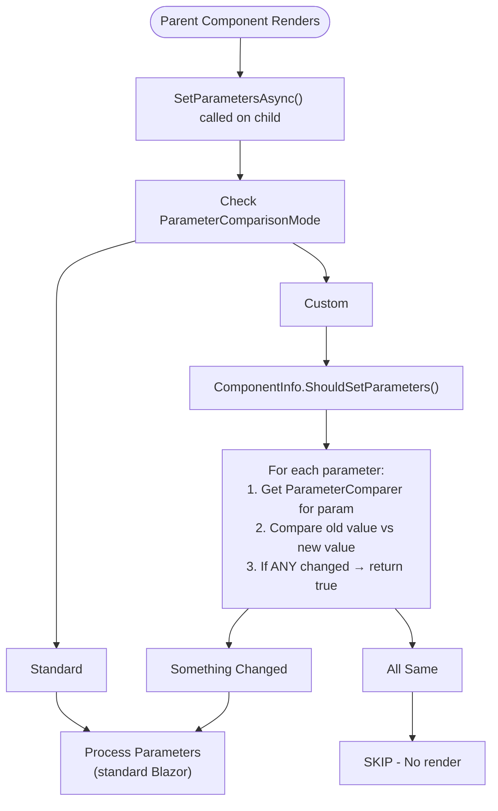
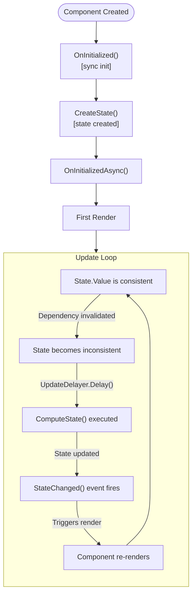
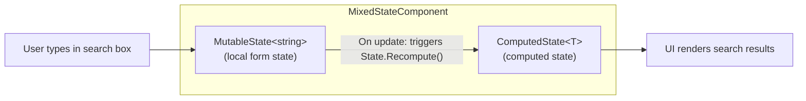
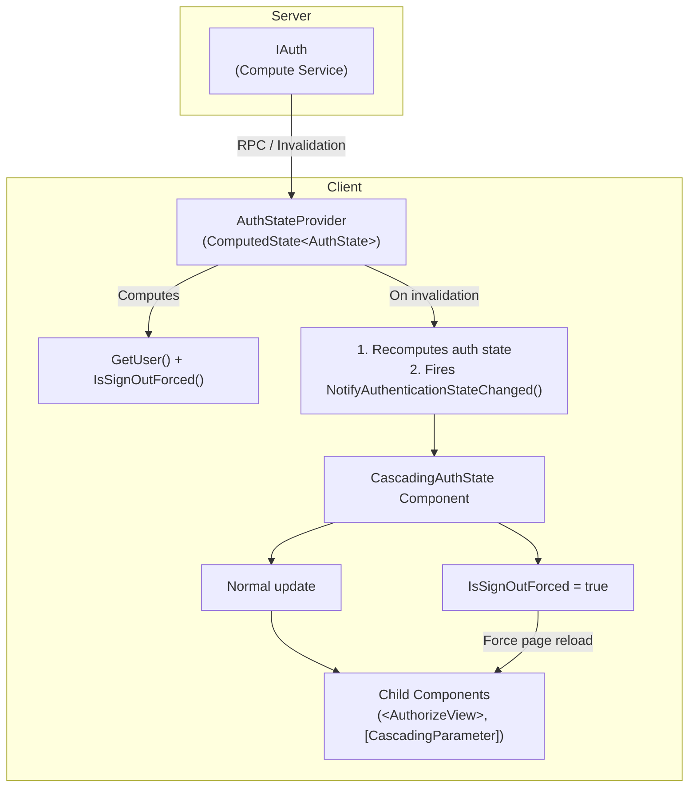
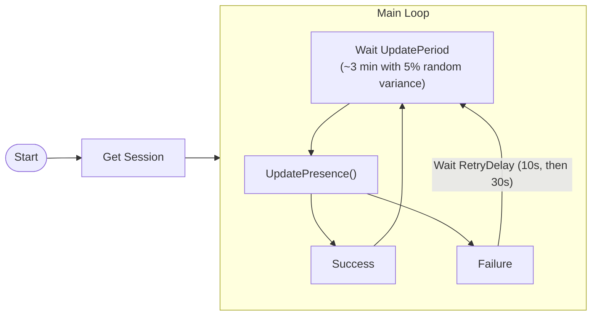
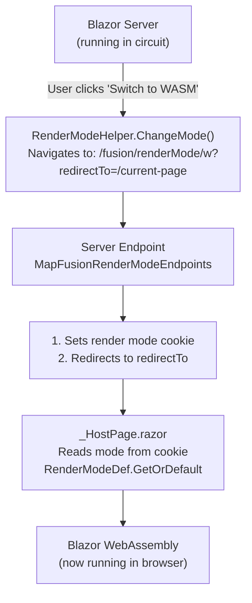

# Blazor Integration: Diagrams

Diagrams for the Blazor integration concepts introduced in [Part 3](PartB.md).

## Component Hierarchy

| Component | Purpose |
|-----------|---------|
| `ComponentBase` | Blazor's base class |
| `FusionComponentBase` | Optimized parameter comparison & events |
| `CircuitHubComponentBase` | CircuitHub access & service shortcuts |
| `StatefulComponentBase<T>` | State management & auto-updates |
| `ComputedStateComponent<T>` | Auto-computed state, dependency tracking |
| `ComputedRenderStateComponent<T>` | Tracks render state snapshot, optimized re-rendering |
| `MixedStateComponent<T, TMutable>` | Computed state + mutable state for form inputs |

## FusionComponentBase Parameter Comparison Flow

| Comparer Resolution Order | Description |
|---------------------------|-------------|
| 1. `[ParameterComparer]` on property | If found, use it |
| 2. `KnownComparerTypes[propertyType]` | If found, use it |
| 3. `[ParameterComparer]` on property's type | If found, use it |
| 4. `[ParameterComparer]` on declaring class | If found, use it |
| 5. `DefaultParameterComparer` | Fallback |

## CircuitHub Service Architecture

`CircuitHub` is a scoped service providing access to commonly used services and state:

| Category | Property | Description |
|----------|----------|-------------|
| **Fusion Services** | `Session` | Current user session |
| | `Commander` | Command executor |
| **Blazor Services** | `NavManager` | Navigation manager |
| | `JSRuntime` | JavaScript interop runtime |
| | `UICommander` | UI-aware command executor |
| | `JSRuntimeInfo` | Runtime type inspection |
| | `UIActionFailureTracker` | Tracks command failures |
| **State Info** | `RenderMode` | Current Blazor render mode |
| | `IsPrerendering` | Whether currently prerendering |

## ComputedStateComponent Lifecycle

| Step | Description |
|------|-------------|
| `CreateState()` | Creates `ComputedState<T>` with `ComputeState` as the computation function |
| First Render | `State.HasValue` determines what to render |
| `ComputeState()` | Calls your compute methods (tracked) |
| `StateChanged()` | Calls `NotifyStateHasChanged()` |

## MixedStateComponent Lifecycle

| State | Purpose |
|-------|---------|
| `MutableState<string>` | User input binding, always consistent, `Set()` updates value |
| `ComputedState<T>` | Reads `MutableState.Value`, calls compute services, returns computed result |

**Note:** `ComputeState` doesn't need to explicitly call `.Use()` on `MutableState` - the dependency is assumed. Any change to `MutableState` triggers an immediate re-render (no update delays).

**Example Flow:**
1. User types "react" in search box
2. `MutableState.Value` updates to "react"
3. `ComputeState()` executes: reads search term → calls `SearchService.Search()` → returns results
4. UI renders search results

## Authentication Flow

| Method | Description |
|--------|-------------|
| `GetUser()` | Compute method returning current user |
| `IsSignOutForced()` | Compute method checking forced sign-out |

## PresenceReporter.Run Flow

| Timeline | Sequence |
|----------|----------|
| Normal | Start → Update (~3min) → Update (~3min) → Update (~3min) |
| On Failure | Start → Update (fail) → Retry 10s (fail) → Retry 30s (success) → Update (~3min) |

## Render Mode Switching

| Mode | Code | Description |
|------|------|-------------|
| Auto | `a` | Automatic mode selection |
| Server | `s` | Blazor Server mode |
| WebAssembly | `w` | Blazor WebAssembly mode |
