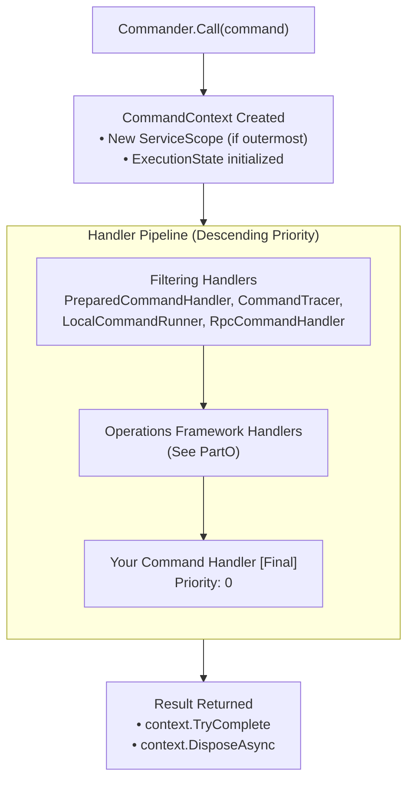
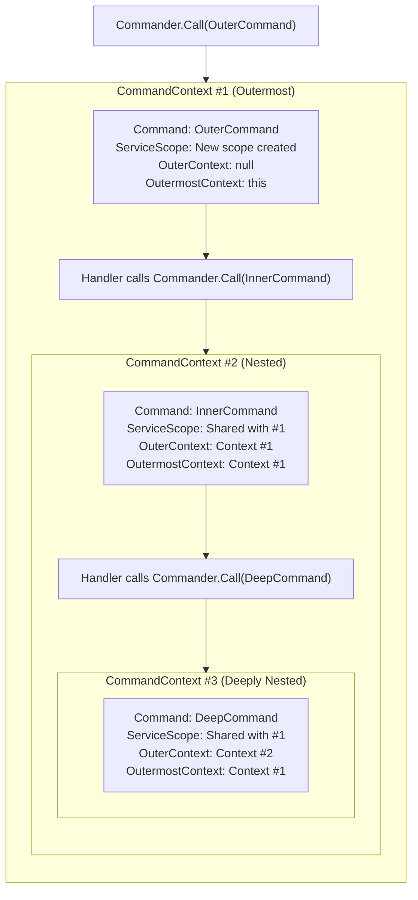
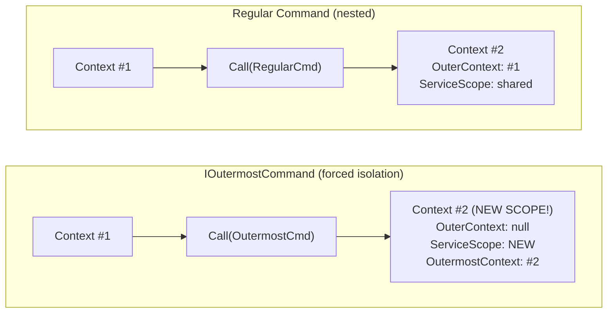
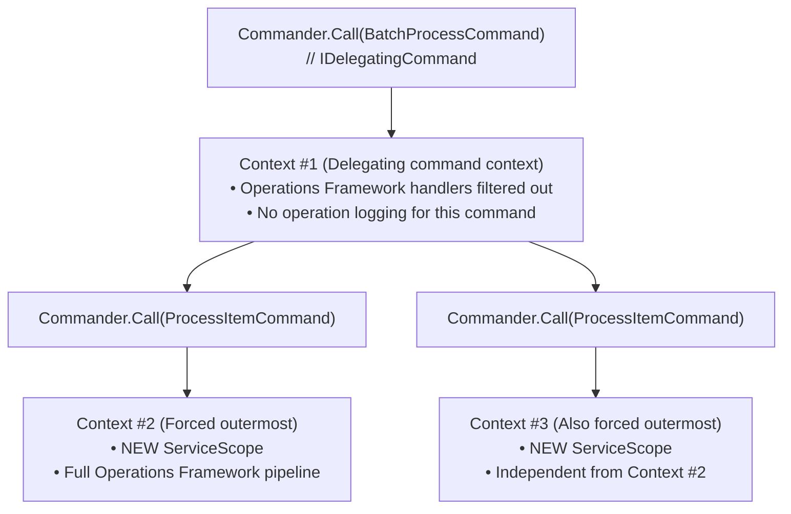
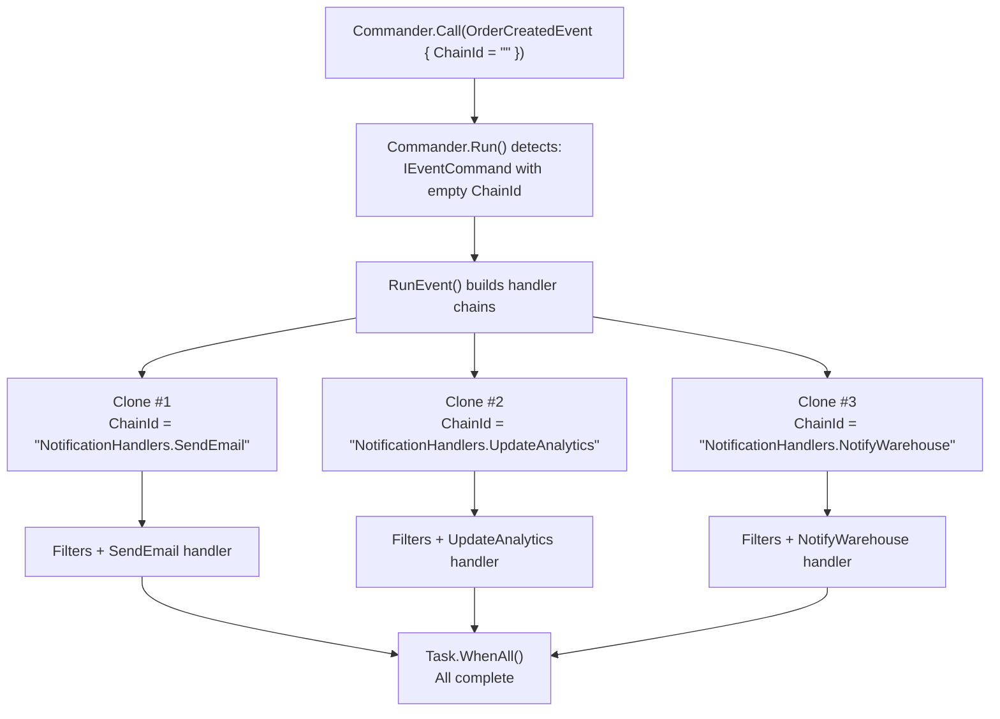
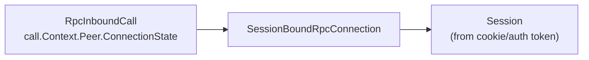
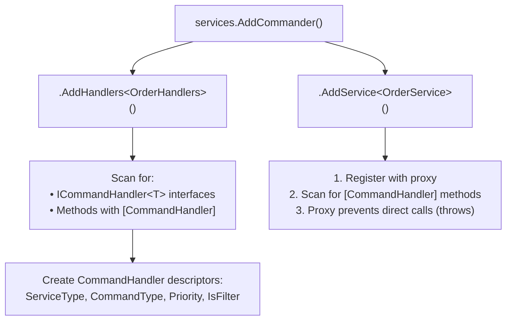
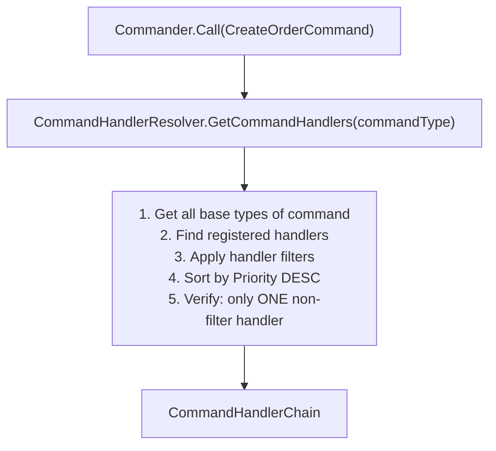
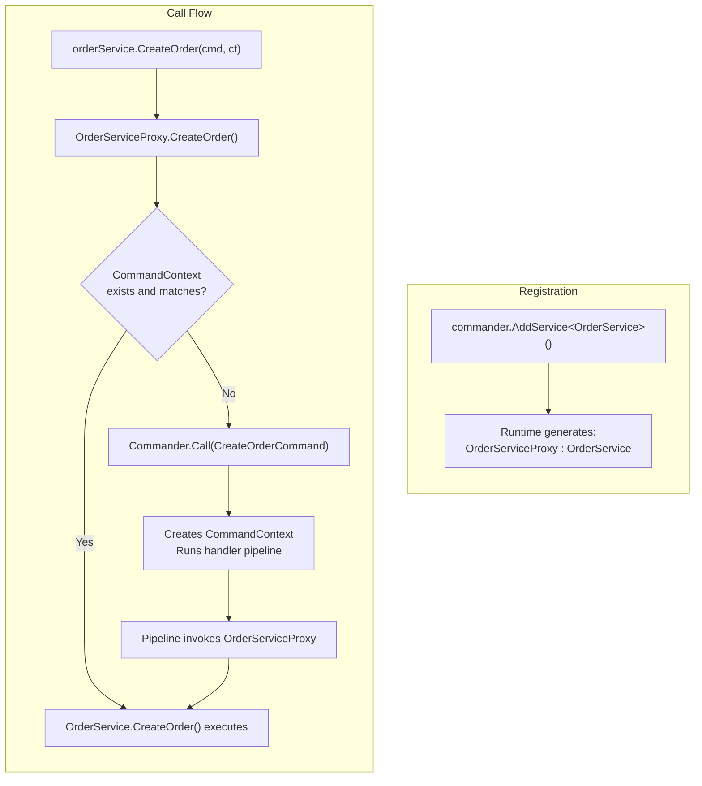

# CommandR: Diagrams

Diagrams for the CommandR concepts introduced in [Part 4](PartC.md).


## Command Handler Pipeline



| Handler | Priority | Type | Purpose |
|---------|----------|------|---------|
| `PreparedCommandHandler` | 1,000,000,000 | Filter | Calls `IPreparedCommand.Prepare()` if implemented |
| `CommandTracer` | 998,000,000 | Filter | Creates Activity for tracing, logs errors |
| `LocalCommandRunner` | 900,000,000 | Filter | Runs `ILocalCommand.Run()` if implemented |
| `RpcCommandHandler` | 800,000,000 | Filter | Routes to RPC if command should be handled remotely |
| `OperationReprocessor` | 100,000 | Filter | Operations Framework |
| `NestedOperationLogger` | 11,000 | Filter | Operations Framework |
| `OperationScopeProvider` | 10,000 | Filter | Operations Framework |
| `DbOperationScopeProvider` | 1,000 | Filter | Operations Framework |
| Your Handler | 0 | Final | Your business logic |


## CommandContext Hierarchy for Nested Commands



| Property | Behavior |
|----------|----------|
| `ServiceScope` | Shared across all nested contexts (same `ICommander`) |
| `Items` | Each context has its own dictionary |
| `OutermostContext` | Always points to the root context |
| Data sharing | Use `context.OutermostContext.Items` to share across contexts |


## IOutermostCommand Behavior



### IDelegatingCommand Behavior



**Code in `CommandContext.New()`:**
```csharp
if (!isOutermost && (command is IOutermostCommand ||
                     Current?.UntypedCommand is IDelegatingCommand))
    isOutermost = true;
```


## IEventCommand Parallel Execution



| Scenario | Behavior |
|----------|----------|
| `ChainId` is empty | `RunEvent()` builds chains, clones command for each, runs in parallel |
| `ChainId` is set | Goes through `RunCommand()`, executes only that specific handler chain |

**ChainId format:** `{ServiceType.GetName()}.{Method.Name}`


## ISessionCommand Processing (RpcDefaultSessionReplacer)

```mermaid
flowchart TD
    subgraph Client
        Cmd["var&nbsp;cmd&nbsp;=&nbsp;new&nbsp;UpdateProfileCommand&nbsp;{&nbsp;Session&nbsp;=&nbsp;Session.Default&nbsp;}"]
        Call["Commander.Call(cmd)"]
        Cmd --> Call
    end

    Call -->|RPC Call| Inbound

    subgraph Server
        Inbound["RPC&nbsp;Inbound&nbsp;Pipeline"]
        Replacer["RpcDefaultSessionReplacer&nbsp;(IRpcMiddleware)"]
        Handler["Command&nbsp;Handler&nbsp;—&nbsp;cmd.Session&nbsp;is&nbsp;now&nbsp;valid!"]

        Inbound --> Replacer
        Replacer -->|"Session.Default&nbsp;→&nbsp;actual&#8209;session&#8209;id"| Handler
    end
```



### RpcDefaultSessionReplacer Logic

| Step | Action |
|------|--------|
| 1 | Check if first param is `ISessionCommand` |
| 2 | Get `SessionBoundRpcConnection` from peer |
| 3 | If `session.IsDefault()`: `command.SetSession(connection.Session)` |
| 4 | Else: `session.RequireValid()` |

### Session Resolution Flow




## Handler Registration and Resolution

### Registration (at startup)



### Resolution (at runtime)



| Index | Handler | Priority | Type |
|-------|---------|----------|------|
| [0] | `PreparedCommandHandler` | 1,000,000,000 | Filter |
| [1] | `CommandTracer` | 998,000,000 | Filter |
| [2] | `LocalCommandRunner` | 900,000,000 | Filter |
| [3] | `RpcCommandHandler` | 800,000,000 | Filter |
| [4] | `OperationReprocessor` | 100,000 | Filter |
| [5] | `NestedOperationLogger` | 11,000 | Filter |
| [6] | `InMemoryOperationScope` | 10,000 | Filter |
| [7] | `DbOperationScopeProvider` | 1,000 | Filter |
| [8] | `YourHandler` | 0 | Final |


## Command Service Proxy (AOP)



| Call Style | Result |
|------------|--------|
| `commander.Call(new CreateOrderCommand(...), ct)` | Full pipeline |
| `orderService.CreateOrder(new CreateOrderCommand(...), ct)` | Full pipeline (via proxy) |

Both paths go through: `PreparedCommandHandler` → `CommandTracer` → ... → `Handler`
