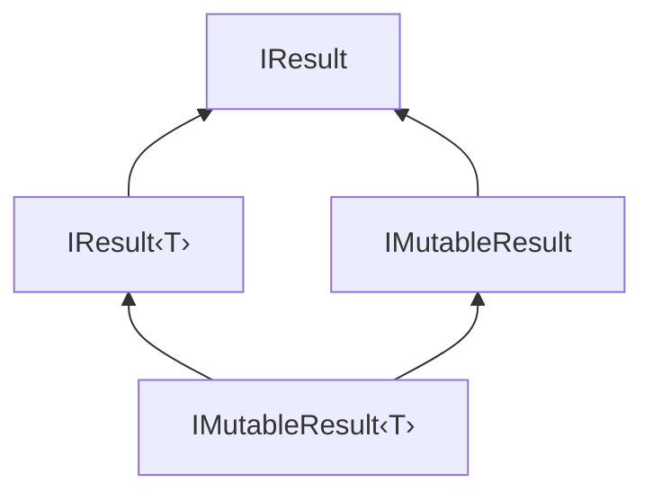

# Result and Option Types

`Result<T>` and `Option<T>` are foundational types for explicit error handling and optional values,
avoiding exceptions for control flow and null references.

## Key Types

| Type | Description | Source |
|------|-------------|--------|
| `Result<T>` | Success/error discriminated union | [Result.cs](https://github.com/ActualLab/Fusion/blob/master/src/ActualLab.Core/Result.cs) |
| `IResult` | Untyped result interface | [Result.cs](https://github.com/ActualLab/Fusion/blob/master/src/ActualLab.Core/Result.cs) |
| `IResult<T>` | Typed result interface | [Result.cs](https://github.com/ActualLab/Fusion/blob/master/src/ActualLab.Core/Result.cs) |
| `IMutableResult` | Mutable untyped result interface | [Result.cs](https://github.com/ActualLab/Fusion/blob/master/src/ActualLab.Core/Result.cs) |
| `IMutableResult<T>` | Mutable typed result interface | [Result.cs](https://github.com/ActualLab/Fusion/blob/master/src/ActualLab.Core/Result.cs) |
| `Option<T>` | Optional value type | [Option.cs](https://github.com/ActualLab/Fusion/blob/master/src/ActualLab.Core/Option.cs) |
| `IOption` | Untyped option interface | [Option.cs](https://github.com/ActualLab/Fusion/blob/master/src/ActualLab.Core/Option.cs) |


## Result\<T>

Represents either a successful value or an error — similar to Rust's `Result` or F#'s `Result`.

### Why Use Result?

- **Explicit error handling**: Errors are part of the return type, not hidden exceptions
- **Composable**: Chain operations that may fail
- **Type-safe**: Compiler ensures you handle both cases
- **Performance**: Avoids exception overhead for expected failure cases

### Creating Results

```cs
// Implicit conversion from value (success)
Result<int> success = 42;

// Implicit conversion from exception (error)
Result<int> error = new InvalidOperationException("Something went wrong");

// Explicit creation
Result<int> r1 = Result.Value(42);
Result<int> r2 = Result.Error<int>(new Exception("failed"));
```

### Checking and Accessing

```cs
Result<User> result = GetUser(userId);

// Check state
if (result.HasValue) {
    User user = result.Value;  // Safe to access
    Console.WriteLine(user.Name);
}

if (result.HasError) {
    Exception error = result.Error;  // Safe to access
    Log.Error(error, "Failed to get user");
}

// Value throws if HasError is true
// Error returns null if HasValue is true
```

### Deconstruction

```cs
var (value, error) = result;

if (error != null) {
    // Handle error
    return;
}

// Use value safely
ProcessUser(value);
```

### Result Hierarchy



**Implementations in Fusion:**

| Type | Implements | Description |
|------|------------|-------------|
| `Result<T>` | `IResult<T>` | Value type for method returns |
| `Computed<T>` | `IResult<T>` | Cached computation result |
| `UIActionResult<T>` | `IResult<T>` | UI action outcome |
| `MutableState<T>` | `IMutableResult<T>` | Mutable state container |

### IResult and IResult\<T> Interfaces

For code that works with results of any type:

```cs
public interface IResult
{
    object? Value { get; }
    Exception? Error { get; }
    bool HasValue { get; }
    bool HasError { get; }
}

public interface IResult<T> : IResult
{
    new T Value { get; }
    T? ValueOrDefault { get; }
}
```

### IMutableResult and IMutableResult\<T> Interfaces

For results that can be modified (used by `MutableState<T>` and other Fusion types):

```cs
public interface IMutableResult : IResult
{
    new object? Value { get; set; }
    void Set(Result result);
    void SetError(Exception error);
}

public interface IMutableResult<T> : IResult<T>, IMutableResult
{
    new T Value { get; set; }
    void Set(Result<T> result);
}
```

### ErrorBox

When you need to store either a value or error in a single `object?` field:

```cs
object? stored = result.GetUntypedValueOrErrorBox();

// Later, to check what it is:
if (stored is ErrorBox errorBox) {
    Exception error = errorBox.Error;
} else {
    object? value = stored;
}
```

### Usage in Fusion

`IResult<T>` is used extensively throughout Fusion:

- **Computed\<T\>**: Implements `IResult<T>` to store cached computation results — either the computed value or an error
- **MutableState\<T\>**: Implements `IMutableResult<T>` for mutable state with change notifications
- **UIActionResult\<T\>**: Implements `IResult<T>` for UI command outcomes
- **RPC responses**: Method results are wrapped in `Result<T>` for transport
- **Task extensions**: `task.ToResultAsync()` converts tasks to results

```cs
// Computed<T> implements IResult<T>
Computed<User> computed = await userService.Get(userId);

if (computed.HasValue) {
    User user = computed.Value;
}
else {
    Exception error = computed.Error;  // Computation failed
}
```


## Option\<T>

Represents an optional value — similar to F#'s `Option`, Rust's `Option`, or C#'s `Nullable<T>` but for reference types too.

### Why Use Option?

- **No null references**: Explicit about when values may be absent
- **Self-documenting**: Return type shows value is optional
- **Serializable**: Works correctly across serialization boundaries
- **Composable**: Chain operations on optional values

### Creating Options

```cs
// Some value
Option<string> some = Option.Some("hello");

// No value
Option<string> none = Option.None<string>();

// From nullable reference
string? maybeNull = GetString();
Option<string> opt = Option.FromClass(maybeNull);

// From nullable value type
int? maybeInt = GetInt();
Option<int> optInt = Option.FromNullable(maybeInt);
```

### Checking and Accessing

```cs
Option<User> option = FindUser(userId);

if (option.HasValue) {
    User user = option.Value;  // Safe to access
    Console.WriteLine(user.Name);
}

// Value throws InvalidOperationException if !HasValue
```

### IOption Interface

For code that works with options of any type:

```cs
public interface IOption
{
    bool HasValue { get; }
    object? Value { get; }
}
```

### Serialization

Both `Result<T>` and `Option<T>` support all serialization formats:

```cs
[DataContract, MemoryPackable, MessagePackObject]
public readonly partial struct Option<T> { ... }

[DataContract, MemoryPackable, MessagePackObject]
public readonly partial struct Result<T> { ... }
```

Attributes applied:
- `[DataContract]` — MessagePack and DataContractSerializer
- `[MemoryPackable]` — MemoryPack
- `[MessagePackObject]` — MessagePack
- JSON converters for System.Text.Json and Newtonsoft.Json


## Best Practices

### Use Result for Expected Failures

```cs
// Good: Login failure is expected, not exceptional
public Result<User> Login(string username, string password)
{
    var user = FindUser(username);
    if (user == null)
        return new InvalidCredentialsException();

    if (!VerifyPassword(user, password))
        return new InvalidCredentialsException();

    return user;
}

// Caller handles both cases explicitly
var result = Login(username, password);
if (result.HasError) {
    ShowError(result.Error.Message);
    return;
}
var user = result.Value;
```

### Use Option for Absent Values

```cs
// Good: User may or may not exist
public Option<User> FindUser(string id)
{
    var user = _db.Users.Find(id);
    return Option.FromClass(user);
}

// Caller knows to check
var userOpt = FindUser(id);
if (!userOpt.HasValue) {
    return NotFound();
}
var user = userOpt.Value;
```

### Avoid for Exceptional Cases

```cs
// Bad: Network failures are exceptional, use exceptions
public Result<Data> FetchData(string url) { ... }

// Good: Let exceptions propagate for truly exceptional cases
public async Task<Data> FetchDataAsync(string url) { ... }
```
