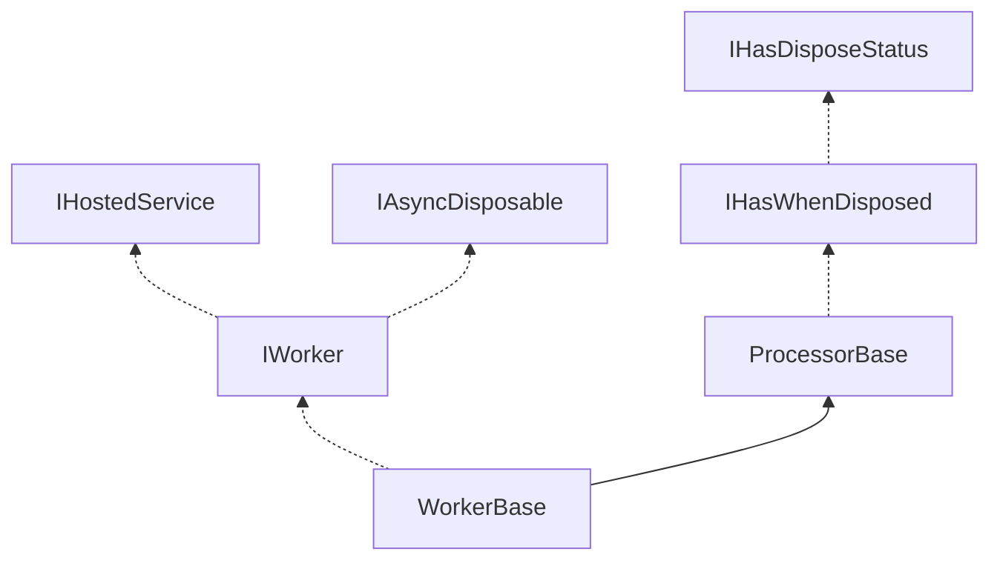
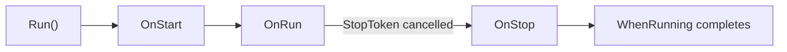

# WorkerBase and IWorker

`WorkerBase` provides a robust foundation for background workers with proper lifecycle management,
graceful shutdown, and integration with .NET's `IHostedService`.

## Key Types

| Type | Description | Source |
|------|-------------|--------|
| `IWorker` | Worker interface with Run/Stop lifecycle | [IWorker.cs](https://github.com/ActualLab/Fusion/blob/master/src/ActualLab.Core/Async/IWorker.cs) |
| `WorkerBase` | Abstract base class for workers | [WorkerBase.cs](https://github.com/ActualLab/Fusion/blob/master/src/ActualLab.Core/Async/WorkerBase.cs) |
| `ProcessorBase` | Base class with disposal and cancellation | [ProcessorBase.cs](https://github.com/ActualLab/Fusion/blob/master/src/ActualLab.Core/Async/ProcessorBase.cs) |
| `WorkerExt` | Extension methods for starting workers | [WorkerExt.cs](https://github.com/ActualLab/Fusion/blob/master/src/ActualLab.Core/Async/WorkerExt.cs) |


## Inheritance Hierarchy



**Legend:** Solid arrows = inheritance, dashed arrows = interface implementation


## IWorker Interface

```cs
public interface IWorker : IAsyncDisposable, IDisposable, IHasWhenDisposed, IHostedService
{
    Task? WhenRunning { get; }
    Task Run();
    Task Stop();
}
```

| Member | Description |
|--------|-------------|
| `WhenRunning` | Task that completes when worker stops (never fails) |
| `Run()` | Starts the worker, returns `WhenRunning` |
| `Stop()` | Signals graceful shutdown, returns `WhenRunning` |


## ProcessorBase

Base class providing disposal and cancellation infrastructure:

```cs
public abstract class ProcessorBase : IAsyncDisposable, IDisposable, IHasWhenDisposed
{
    protected CancellationTokenSource StopTokenSource { get; }
    public CancellationToken StopToken { get; }
    public bool IsDisposed { get; }
    public Task? WhenDisposed { get; }
}
```

| Member | Description |
|--------|-------------|
| `StopToken` | Cancelled when disposal begins |
| `StopTokenSource` | Source for `StopToken` |
| `IsDisposed` | True after `DisposeAsync()` called |
| `WhenDisposed` | Task that completes when disposal finishes |


## WorkerBase

Extends `ProcessorBase` with worker lifecycle:

```cs
public abstract class WorkerBase : ProcessorBase, IWorker
{
    public Task? WhenRunning { get; }

    protected abstract Task OnRun(CancellationToken cancellationToken);
    protected virtual Task OnStart(CancellationToken cancellationToken);
    protected virtual Task OnStop();
}
```

### Lifecycle Methods

| Method | When Called | Purpose |
|--------|-------------|---------|
| `OnStart` | Before `OnRun` | Initialize resources |
| `OnRun` | Main execution | Worker's main loop |
| `OnStop` | After `OnRun` completes | Cleanup resources |

### Lifecycle Flow




## Basic Usage

### Minimal Worker

```cs
public class MyWorker : WorkerBase
{
    protected override async Task OnRun(CancellationToken cancellationToken)
    {
        while (!cancellationToken.IsCancellationRequested) {
            await DoWork(cancellationToken);
            await Task.Delay(TimeSpan.FromSeconds(10), cancellationToken);
        }
    }
}

// Start and run
var worker = new MyWorker();
await worker.Run();  // Blocks until worker stops
```

### With Initialization and Cleanup

```cs
public class DatabaseSyncWorker : WorkerBase
{
    private DbConnection? _connection;

    protected override async Task OnStart(CancellationToken cancellationToken)
    {
        _connection = await OpenConnection(cancellationToken);
    }

    protected override async Task OnRun(CancellationToken cancellationToken)
    {
        while (!cancellationToken.IsCancellationRequested) {
            await SyncData(_connection!, cancellationToken);
            await Task.Delay(TimeSpan.FromMinutes(1), cancellationToken);
        }
    }

    protected override async Task OnStop()
    {
        if (_connection != null)
            await _connection.DisposeAsync();
    }
}
```


## Starting Workers

### Fire and Forget

```cs
var worker = new MyWorker();
worker.Start();  // Returns immediately, worker runs in background

// Later...
await worker.Stop();  // Graceful shutdown
```

### With External Cancellation

```cs
var worker = new MyWorker();
await worker.Run(cancellationToken);  // Stops when token cancelled
```

### Isolated Execution Context

```cs
// Prevents AsyncLocal values from flowing to worker
worker.Start(isolate: true);
```


## IHostedService Integration

`WorkerBase` implements `IHostedService`, so workers can be registered as hosted services:

```cs
services.AddSingleton<MyWorker>();
services.AddHostedService(sp => sp.GetRequiredService<MyWorker>());

// Or simply:
services.AddSingleton<MyWorker>().AddHostedService<MyWorker>();
```

The worker starts with the host and stops gracefully during shutdown.


## Disposal

Workers support both sync and async disposal:

```cs
// Async (preferred)
await worker.DisposeAsync();

// Sync (calls DisposeAsync internally)
worker.Dispose();

// Wait for disposal to complete
if (worker.WhenDisposed != null)
    await worker.WhenDisposed;
```

Disposal automatically:
1. Cancels `StopToken`
2. Waits for `WhenRunning` to complete
3. Runs `OnStop()` cleanup


## Error Handling

`WhenRunning` **never throws** — errors are suppressed to ensure safe disposal:

```cs
public class FaultyWorker : WorkerBase
{
    protected override Task OnRun(CancellationToken cancellationToken)
    {
        throw new Exception("Worker failed!");
    }
}

var worker = new FaultyWorker();
await worker.Run();  // Completes successfully (error is swallowed)
```

For error handling, catch exceptions inside `OnRun`:

```cs
protected override async Task OnRun(CancellationToken cancellationToken)
{
    try {
        await DoWork(cancellationToken);
    }
    catch (Exception ex) when (ex is not OperationCanceledException) {
        _logger.LogError(ex, "Worker failed");
        // Optionally rethrow, retry, or let it stop
    }
}
```


## Common Patterns

### Periodic Worker

```cs
public class PeriodicWorker(TimeSpan interval) : WorkerBase
{
    protected override async Task OnRun(CancellationToken cancellationToken)
    {
        while (!cancellationToken.IsCancellationRequested) {
            await DoPeriodicWork(cancellationToken);
            await Task.Delay(interval, cancellationToken);
        }
    }
}
```

### Worker with Retry

```cs
public class ResilientWorker : WorkerBase
{
    protected override async Task OnRun(CancellationToken cancellationToken)
    {
        var delays = RetryDelaySeq.Exp(1, 60);
        var attempt = 0;

        while (!cancellationToken.IsCancellationRequested) {
            try {
                await DoWork(cancellationToken);
                attempt = 0;  // Reset on success
            }
            catch (Exception ex) when (ex is not OperationCanceledException) {
                var delay = delays[attempt++];
                _logger.LogWarning(ex, "Retrying in {Delay}", delay);
                await Task.Delay(delay, cancellationToken);
            }
        }
    }
}
```

### Worker with AsyncChain

Combine `WorkerBase` with `AsyncChain` for resilient background processing with retry, logging, and composition.

From Fusion's `ComputedGraphPruner` ([source](https://github.com/ActualLab/Fusion/blob/master/src/ActualLab.Fusion/Internal/ComputedGraphPruner.cs)):

```cs
public sealed class ComputedGraphPruner : WorkerBase
{
    private ILogger Log { get; }

    protected override async Task OnRun(CancellationToken cancellationToken)
    {
        // Initial delay before first run
        await Task.Delay(Settings.CheckPeriod.Next(), cancellationToken);

        // Build async chain with retry and logging
        var chain = CreatePruneOnceChain()
            .AppendDelay(Settings.CheckPeriod)    // Delay between cycles
            .RetryForever(Settings.RetryDelays)   // Retry on failure
            .CycleForever()                       // Run indefinitely
            .Log(Log);                            // Log start/complete/error

        await chain.Start(cancellationToken);
    }

    private AsyncChain CreatePruneOnceChain()
        => new AsyncChain(nameof(PruneDisposedInstances), PruneDisposedInstances)
            .Silence()  // Suppress exceptions (handled by retry)
            .Append(new AsyncChain(nameof(PruneEdges), PruneEdges).Silence());

    private Task PruneDisposedInstances(CancellationToken ct) { /* ... */ }
    private Task PruneEdges(CancellationToken ct) { /* ... */ }
}
```

This pattern provides:
- **Automatic retry** with exponential backoff on failures
- **Structured logging** of each cycle
- **Graceful cancellation** via `StopToken`
- **Composable operations** chained together


### Multiple Workers

```cs
public class CompositeWorker : WorkerBase
{
    private readonly IWorker[] _workers;

    public CompositeWorker(params IWorker[] workers)
        => _workers = workers;

    protected override Task OnRun(CancellationToken cancellationToken)
    {
        foreach (var worker in _workers)
            worker.Start();
        return Task.WhenAll(_workers.Select(w => w.WhenRunning!));
    }

    protected override async Task OnStop()
    {
        await Task.WhenAll(_workers.Select(w => w.Stop()));
    }
}
```


## Best Practices

### Always Check Cancellation

```cs
protected override async Task OnRun(CancellationToken cancellationToken)
{
    while (!cancellationToken.IsCancellationRequested) {  // Check token
        await ProcessItem(cancellationToken);            // Pass token
    }
}
```

### Keep OnStart/OnStop Fast

```cs
// Good: Quick initialization
protected override Task OnStart(CancellationToken cancellationToken)
{
    _timer = new PeriodicTimer(TimeSpan.FromSeconds(10));
    return Task.CompletedTask;
}

// Bad: Long operation in OnStart
protected override async Task OnStart(CancellationToken cancellationToken)
{
    await DownloadLargeFile(cancellationToken);  // Move to OnRun
}
```

### Use Structured Logging

```cs
protected override async Task OnRun(CancellationToken cancellationToken)
{
    _logger.LogInformation("Worker started");
    try {
        // ...
    }
    finally {
        _logger.LogInformation("Worker stopped");
    }
}
```
