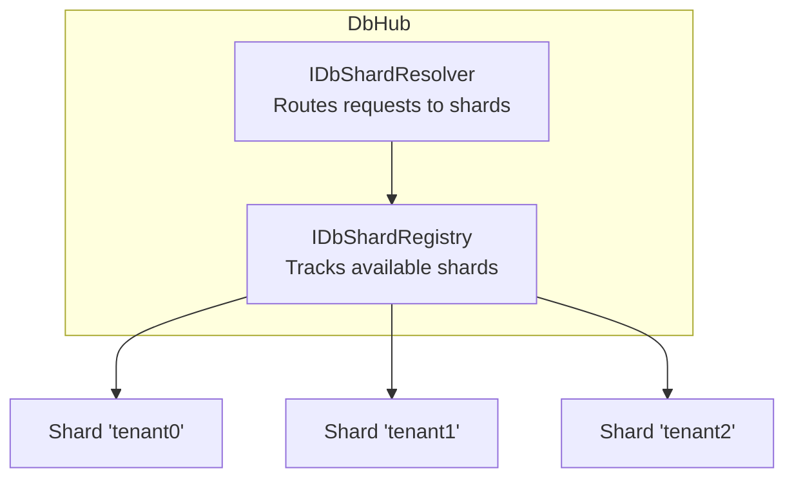

# Entity Framework Extensions

`ActualLab.Fusion.EntityFramework` provides a set of extensions that simplify working with Entity Framework Core
in Fusion applications. These extensions handle common concerns like database context management, sharding,
and efficient entity loading.

Most of these extensions are used internally by the [Operations Framework](./PartO.md), which is itself
built on top of this infrastructure. However, they're also useful on their own for any Fusion service
that works with Entity Framework.

## Required Package

| Package | Purpose |
|---------|---------|
| [ActualLab.Fusion.EntityFramework](https://www.nuget.org/packages/ActualLab.Fusion.EntityFramework/) | Core EF extensions: DbHub, sharding, entity resolvers |

## DbHub

`DbHub<TDbContext>` is the central hub for all database operations. It provides:
- DbContext creation (read-only and read-write)
- Operation-scoped DbContext creation (for Operations Framework)
- Access to sharding infrastructure
- Version generation for optimistic concurrency

### Basic Setup

```cs
services.AddDbContextServices<AppDbContext>(db => {
    // Configure your DbContext
    db.AddDbContextFactory(dbContext => {
        dbContext.UseNpgsql(connectionString);
    });
});
```

### Key Properties

| Property | Type | Description |
|----------|------|-------------|
| `ShardResolver` | `IDbShardResolver` | Resolves which shard to use for a given source |
| `ShardRegistry` | `IDbShardRegistry` | Registry of all available shards |
| `ContextFactory` | `IShardDbContextFactory` | Factory for creating DbContext instances |
| `VersionGenerator` | `VersionGenerator<long>` | Generates unique version numbers |
| `Commander` | `ICommander` | Fusion's command executor |

### Creating DbContext

```cs
public class TodoService(DbHub<AppDbContext> dbHub) : IComputeService
{
    [ComputeMethod]
    public virtual async Task<Todo[]> GetAll(CancellationToken cancellationToken = default)
    {
        // Create a read-only DbContext (default)
        await using var dbContext = await dbHub.CreateDbContext(cancellationToken);
        return await dbContext.Todos.ToArrayAsync(cancellationToken);
    }

    [CommandHandler]
    public virtual async Task Create(CreateTodoCommand command, CancellationToken cancellationToken = default)
    {
        if (Invalidation.IsActive) {
            _ = GetAll(default);
            return;
        }

        // Create DbContext for operations (participates in operation scope)
        await using var dbContext = await dbHub.CreateOperationDbContext(cancellationToken);
        dbContext.Todos.Add(new DbTodo { Id = command.Id, Title = command.Title });
        await dbContext.SaveChangesAsync(cancellationToken);
    }
}
```

### DbContext Types

| Method | Use Case |
|--------|----------|
| `CreateDbContext()` | Read-only queries in compute methods |
| `CreateDbContext(readWrite: true)` | Direct writes (rare, prefer commands) |
| `CreateOperationDbContext()` | Command handlers with Operations Framework |
| `CreateOperationDbContext(isolationLevel)` | Commands requiring specific isolation |


## Sharding

Fusion's EF extensions support database sharding out of the box. Sharding is useful for:
- Multi-tenant applications (one database per tenant)
- Horizontal scaling (distributing data across databases)
- Data isolation requirements

### Core Concepts



### IDbShardRegistry

The shard registry maintains the list of available shards:

```cs
services.AddDbContextServices<AppDbContext>(db => {
    db.AddSharding(sharding => {
        // Register multiple shards
        sharding.AddShardRegistry("tenant0", "tenant1", "tenant2");

        // Or dynamically
        var tenants = Enumerable.Range(0, tenantCount).Select(i => $"tenant{i}");
        sharding.AddShardRegistry(tenants);
    });
});
```

**Key Properties:**

| Property | Type | Description |
|----------|------|-------------|
| `HasSingleShard` | `bool` | True if operating in single-shard mode |
| `Shards` | `IState<ImmutableHashSet<string>>` | All registered shards (reactive) |
| `UsedShards` | `IState<ImmutableHashSet<string>>` | Shards that have been accessed |

**Special Shards:**

| Shard | Value | Purpose |
|-------|-------|---------|
| `DbShard.Single` | `""` | Default single-shard mode |
| `DbShard.Template` | `"__template"` | Schema access when actual shards aren't known yet |

`DbShard.Template` is automatically added to the shard registry in multi-shard mode. It provides database
connection for schema operations like generating migrations, where the actual data shards aren't relevant.
The template shard points to a database that may be empty or contain reference data, but is never used
to store application data. It's particularly useful for:
- EF Core migration generation (`dotnet ef migrations add`)
- Schema introspection (e.g., extracting primary key info in `DbEntityResolver`)
- Creating execution strategies for transient failure detection

### IDbShardResolver

`IDbShardResolver` is an **optional** component that resolves which database shard to use for a given
object. It maps arbitrary objects—typically typed identifiers like `UserId`, `Session`, or commands—to
shard identifiers.

The default implementation handles common scenarios:

```cs
public class DbShardResolver<TDbContext> : IDbShardResolver<TDbContext>
{
    public virtual string Resolve(object source)
    {
        // Resolution order:
        // 1. If single shard mode, return DbShard.Single
        // 2. If source is Session, extract shard from session tag
        // 3. If source implements IHasShard, use its Shard property
        // 4. If source is ISessionCommand, extract from session
        // 5. Default: DbShard.Single
    }
}
```

**Using IDbShardResolver:**

Once you resolve a shard, pass it to `DbHub.CreateDbContext()` or `DbHub.CreateOperationDbContext()`:

```cs
public class MyService(DbHub<AppDbContext> dbHub, IDbShardResolver<AppDbContext> shardResolver)
{
    public async Task ProcessCommand(MyCommand command, CancellationToken cancellationToken)
    {
        // Resolve shard from the command (e.g., from session or IHasShard)
        var shard = shardResolver.Resolve(command);

        // Create DbContext for the resolved shard
        await using var dbContext = await dbHub.CreateOperationDbContext(shard, cancellationToken);

        // Work with the shard-specific database
        // ...
    }
}
```

This pattern is used internally by `DbAuthService` to resolve shards from `Session` and session-based commands:

```cs
// From DbAuthService - resolving shard for sign-out command
var shard = ShardResolver.Resolve(command);
var dbContext = await DbHub.CreateOperationDbContext(shard, cancellationToken);
```

**Custom Shard Resolution:**

```cs
public class TenantShardResolver(IServiceProvider services)
    : DbShardResolver<AppDbContext>(services)
{
    public override string Resolve(object source)
    {
        // Custom resolution for tenant-specific commands
        if (source is ITenantCommand tenantCommand)
            return tenantCommand.TenantId;

        // Custom resolution for user IDs
        if (source is UserId userId)
            return GetShardForUser(userId);

        return base.Resolve(source);
    }
}

// Register custom resolver
db.AddSharding(sharding => {
    sharding.AddShardResolver<TenantShardResolver>();
});
```

### Session-Based Sharding

For multi-tenant apps, shards are often determined by session:

```cs
// Set the session tag used for shard resolution
DbShardResolver.DefaultSessionShardTag = "tenant";

// When creating sessions, include the shard
var session = new Session($"session-id").WithTag("tenant", "tenant0");
```

### Per-Shard DbContext Configuration

```cs
db.AddSharding(sharding => {
    sharding.AddShardRegistry("tenant0", "tenant1", "tenant2");

    sharding.AddTransientShardDbContextFactory((c, shard) => {
        var connectionString = GetConnectionString(shard.Value);
        return new AppDbContext(
            new DbContextOptionsBuilder<AppDbContext>()
                .UseNpgsql(connectionString)
                .Options);
    });
});
```


## DbEntityResolver

`DbEntityResolver` provides efficient batch loading of entities by their keys. It automatically
batches multiple requests to minimize database roundtrips.

### Why Use It?

Without batching, N entity lookups = N database queries. With `DbEntityResolver`:
- Requests are queued and batched (default batch size: 15)
- Single query fetches all entities in the batch
- Pre-compiled LINQ queries for optimal performance
- Automatic retry on transient failures

### Setup

```cs
services.AddDbContextServices<AppDbContext>(db => {
    // Simple setup - key extracted from entity's key property
    db.AddEntityResolver<string, DbTodo>();

    // With options
    db.AddEntityResolver<string, DbTodo>(_ => new() {
        KeyExtractor = e => e.Id,
        BatchSize = 20,
        Timeout = TimeSpan.FromSeconds(3),
    });
});
```

### Usage

```cs
public class TodoService(IDbEntityResolver<string, DbTodo> todoResolver) : IComputeService
{
    [ComputeMethod]
    public virtual async Task<DbTodo?> Get(string id, CancellationToken cancellationToken = default)
    {
        // This call is automatically batched with other concurrent calls
        return await todoResolver.Get(id, cancellationToken);
    }

    [ComputeMethod]
    public virtual async Task<DbTodo[]> GetMany(string[] ids, CancellationToken cancellationToken = default)
    {
        // Fetch multiple entities efficiently
        return await todoResolver.GetMany(ids, cancellationToken);
    }
}
```

### With Sharding

```cs
// Specify shard explicitly
var todo = await todoResolver.Get("tenant0", todoId, cancellationToken);

// Or let resolver determine shard from context
var todo = await todoResolver.Get(todoId, cancellationToken); // Uses DbShard.Single
```

### Configuration Options

| Option | Type | Default | Description |
|--------|------|---------|-------------|
| `KeyExtractor` | `Expression<Func<TEntity, TKey>>` | Auto-detected | How to extract key from entity |
| `QueryTransformer` | `Expression<...>` | None | Transform base query (filtering, includes) |
| `PostProcessor` | `Action<Dictionary<...>>` | None | Post-process loaded entities |
| `BatchSize` | `int` | 15 | Maximum entities per batch |
| `Timeout` | `TimeSpan?` | 5 seconds | Batch execution timeout |
| `RetryDelayer` | `IRetryDelayer` | Exponential | Retry strategy for transient failures |

### Advanced: Query Transformation

```cs
db.AddEntityResolver<string, DbTodo>(_ => new() {
    // Only load active todos, include related data
    QueryTransformer = q => q
        .Where(t => !t.IsDeleted)
        .Include(t => t.Tags),
});
```


## DbServiceBase

`DbServiceBase<TDbContext>` is a convenient base class for services that use Entity Framework:

```cs
public class TodoService(IServiceProvider services)
    : DbServiceBase<AppDbContext>(services), IComputeService
{
    // DbHub is available via protected property
    [ComputeMethod]
    public virtual async Task<Todo[]> GetAll(CancellationToken cancellationToken = default)
    {
        await using var dbContext = await DbHub.CreateDbContext(cancellationToken);
        return await dbContext.Todos.ToArrayAsync(cancellationToken);
    }
}
```

**Provided Properties:**

| Property | Description |
|----------|-------------|
| `DbHub` | The `DbHub<TDbContext>` instance |
| `Services` | The service provider |
| `Clocks` | Clock set for time operations |
| `Commander` | Command executor |
| `Log` | Logger instance |


## Relationship with Operations Framework

These EF extensions form the foundation for the [Operations Framework](./PartO.md):

- **DbHub** provides `CreateOperationDbContext()` which creates a DbContext that participates
  in the operation scope, enabling transactional operation logging
- **Sharding** allows Operations Framework to work across multiple databases
- **DbEntityResolver** is used internally for efficient operation log reading

When you call `db.AddOperations()`, it builds on top of these primitives to add:
- Operation logging (`DbOperation` entity)
- Event support (`DbEvent` entity)
- Cross-host invalidation via log watchers
- Automatic retry and reprocessing

```cs
services.AddDbContextServices<AppDbContext>(db => {
    // These are the building blocks
    db.AddSharding(sharding => { /* ... */ });

    // Operations Framework uses them
    db.AddOperations(operations => {
        operations.AddNpgsqlOperationLogWatcher();
    });

    // You can also use them directly
    db.AddEntityResolver<string, DbTodo>();
});
```


## Complete Example

```cs
var builder = WebApplication.CreateBuilder(args);

builder.Services.AddDbContextServices<AppDbContext>(db => {
    // Configure DbContext factory
    db.AddDbContextFactory(dbContext => {
        dbContext.UseNpgsql(builder.Configuration.GetConnectionString("Default"));
    });

    // Optional: Configure sharding for multi-tenant
    db.AddSharding(sharding => {
        var tenants = new[] { "tenant0", "tenant1", "tenant2" };
        sharding.AddShardRegistry(tenants);
        sharding.AddTransientShardDbContextFactory((c, shard) => {
            var connStr = builder.Configuration.GetConnectionString(shard.Value);
            return new AppDbContext(
                new DbContextOptionsBuilder<AppDbContext>()
                    .UseNpgsql(connStr)
                    .Options);
        });
    });

    // Add entity resolvers for efficient batch loading
    db.AddEntityResolver<string, DbTodo>();
    db.AddEntityResolver<long, DbUser>();

    // Add Operations Framework (uses all the above)
    db.AddOperations(operations => {
        operations.AddNpgsqlOperationLogWatcher();
    });
});

// Register your services
builder.Services.AddFusion()
    .AddService<TodoService>();
```
