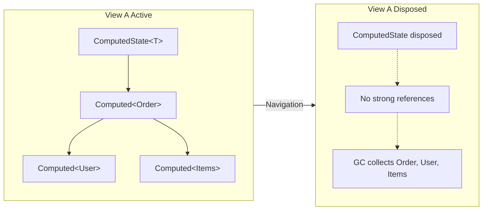

# Memory Management

Understanding how Fusion manages memory is essential for building efficient applications. This document explains how computed values are retained and released, and how to control their lifetime.

## Overview

Fusion uses a **reference-based retention model**:

- **Weak references** — `Computed<T>` instances are tracked via weak references in the `ComputedRegistry`, allowing garbage collection when no longer needed
- **Strong references** — Dependencies form strong reference chains; a computed value keeps all its dependencies alive
- **Automatic cleanup** — When UI components or states are disposed, the entire dependency tree becomes eligible for garbage collection

This design ensures memory is used efficiently: computed values stay in memory only as long as they're being used.

## Default Behavior: Weak References

By default, computed values are **not cached** — they're only reused while something holds a reference to them.

Consider this simple service:

<!-- snippet: PartFSS_Service1 -->
```cs
public partial class Service1 : IComputeService
{
    [ComputeMethod]
    public virtual async Task<string> Get(string key)
    {
        WriteLine($"{nameof(Get)}({key})");
        return key;
    }
}
```
<!-- endSnippet -->

When you call `Get("a")` twice, Fusion reuses the cached result:

<!-- snippet: PartFSS_Caching1 -->
```cs
var service = CreateServices().GetRequiredService<Service1>();
// var computed = await Computed.Capture(() => counters.Get("a"));
WriteLine(await service.Get("a"));
WriteLine(await service.Get("a"));
GC.Collect();
WriteLine("GC.Collect()");
WriteLine(await service.Get("a"));
WriteLine(await service.Get("a"));
```
<!-- endSnippet -->

Output:

```text
Get(a)
a
a
GC.Collect()
Get(a)
a
a
```

The `GC.Collect()` removed the cached `Computed<T>` for `Get("a")` because nothing was holding a strong reference to it. That's why `Get(a)` is printed again after the collection.

## Keeping Computed Values Alive

To keep a computed value in memory, hold a strong reference to it:

<!-- snippet: PartFSS_Caching2 -->
```cs
var service = CreateServices().GetRequiredService<Service1>();
var computed = await Computed.Capture(() => service.Get("a"));
WriteLine(await service.Get("a"));
WriteLine(await service.Get("a"));
GC.Collect();
WriteLine("GC.Collect()");
WriteLine(await service.Get("a"));
WriteLine(await service.Get("a"));
```
<!-- endSnippet -->

Output:

```text
Get(a)
a
a
GC.Collect()
a
a
```

The `computed` variable holds a strong reference, preventing garbage collection.

## Dependency Chains Keep Values Alive

When a computed value depends on others, it holds strong references to all its dependencies:

<!-- snippet: PartFSS_Service2 -->
```cs
public partial class Service2 : IComputeService
{
    [ComputeMethod]
    public virtual async Task<string> Get(string key)
    {
        WriteLine($"{nameof(Get)}({key})");
        return key;
    }

    [ComputeMethod]
    public virtual async Task<string> Combine(string key1, string key2)
    {
        WriteLine($"{nameof(Combine)}({key1}, {key2})");
        return await Get(key1) + await Get(key2);
    }
}
```
<!-- endSnippet -->

<!-- snippet: PartFSS_Caching3 -->
```cs
var service = CreateServices().GetRequiredService<Service2>();
var computed = await Computed.Capture(() => service.Combine("a", "b"));
WriteLine("computed = Combine(a, b) completed");
WriteLine(await service.Combine("a", "b"));
WriteLine(await service.Get("a"));
WriteLine(await service.Get("b"));
WriteLine(await service.Combine("a", "c"));
GC.Collect();
WriteLine("GC.Collect() completed");
WriteLine(await service.Get("a"));
WriteLine(await service.Get("b"));
WriteLine(await service.Combine("a", "c"));
```
<!-- endSnippet -->

Output:

```text
Combine(a, b)
Get(a)
Get(b)
computed = Combine(a, b) completed
ab
a
b
Combine(a, c)
Get(c)
ac
GC.Collect() completed
a
b
Combine(a, c)
Get(c)
ac
```

Key observations:

- Holding a reference to `Combine("a", "b")` keeps both `Get("a")` and `Get("b")` alive
- After `GC.Collect()`, `Get("a")` and `Get("b")` are still cached
- But `Combine("a", "c")` and `Get("c")` were collected (no strong references to them)

**The rule:** Strong referencing a `Computed<T>` keeps the entire dependency graph it was built from in memory.

## The Reverse Is Not True

Holding a dependency does **not** keep its dependants alive:

<!-- snippet: PartFSS_Caching4 -->
```cs
var service = CreateServices().GetRequiredService<Service2>();
var computed = await Computed.Capture(() => service.Get("a"));
WriteLine("computed = Get(a) completed");
WriteLine(await service.Combine("a", "b"));
GC.Collect();
WriteLine("GC.Collect() completed");
WriteLine(await service.Combine("a", "b"));
```
<!-- endSnippet -->

Output:

```text
Get(a)
computed = Get(a) completed
Combine(a, b)
Get(b)
ab
GC.Collect() completed
Combine(a, b)
Get(b)
ab
```

Holding `Get("a")` does not prevent `Combine("a", "b")` from being collected.

## Why This Design?

Fusion's reference model serves several purposes:

1. **Reliable invalidation propagation** — Dependencies must be strongly referenced to ensure that an invalidation event originating from any dependency reliably reaches every dependant that's still in use
2. **Dependant tracking** — Fusion tracks dependants via keys (not object references) to avoid keeping the entire graph in memory
3. **Uniqueness guarantee** — At any moment, there can be only one `Computed<T>` instance for a given computation. This prevents partial invalidation scenarios where different parts of the app see different versions.

## How UI View Switches Free Memory

When a user navigates away from a view in a Blazor or similar UI:



The process:

1. **Component disposal** — When a Blazor component is disposed, it calls `Dispose()` on its `ComputedState<T>`
2. **Update loop stops** — The state's auto-update loop terminates
3. **References released** — The state no longer holds the `Computed<T>` it was tracking
4. **Cascade to dependencies** — If no other code references the computed value or its dependencies, they become eligible for GC
5. **Memory freed** — The next garbage collection reclaims all unreferenced computed values

### Example: Blazor Component Lifecycle

```csharp
public class OrderDetailsComponent : ComputedStateComponent<Order>
{
    [Parameter] public long OrderId { get; set; }

    protected override async Task<Order> ComputeState(CancellationToken ct)
    {
        // This creates/uses Computed<Order> which depends on:
        // - Computed<User> (for the order's customer)
        // - Computed<List<OrderItem>> (for the order's items)
        return await OrderService.Get(OrderId, ct);
    }
}
```

When the user navigates away:

1. Blazor disposes `OrderDetailsComponent`
2. The base class disposes its internal `ComputedState<Order>`
3. The `Computed<Order>` for this specific `OrderId` loses its strong reference
4. All dependencies (`Computed<User>`, `Computed<List<OrderItem>>`) also lose their strong references (unless used elsewhere)
5. On next GC, all these computed values are collected

**Important:** If another component is still displaying the same `OrderId`, the computed values remain alive because that component's state still references them.

## Explicit Caching with MinCacheDuration

For values that should survive brief periods without references, use `MinCacheDuration`:

<!-- snippet: PartFSS_Service3 -->
```cs
public partial class Service3 : IComputeService
{
    [ComputeMethod]
    public virtual async Task<string> Get(string key)
    {
        WriteLine($"{nameof(Get)}({key})");
        return key;
    }

    [ComputeMethod(MinCacheDuration = 0.3)] // MinCacheDuration was added
    public virtual async Task<string> Combine(string key1, string key2)
    {
        WriteLine($"{nameof(Combine)}({key1}, {key2})");
        return await Get(key1) + await Get(key2);
    }
}
```
<!-- endSnippet -->

<!-- snippet: PartFSS_Caching5 -->
```cs
var service = CreateServices().GetRequiredService<Service3>();
WriteLine(await service.Combine("a", "b"));
WriteLine(await service.Get("a"));
WriteLine(await service.Get("x"));
GC.Collect();
WriteLine("GC.Collect()");
WriteLine(await service.Combine("a", "b"));
WriteLine(await service.Get("a"));
WriteLine(await service.Get("x"));
await Task.Delay(1000);
GC.Collect();
WriteLine("Task.Delay(...) and GC.Collect()");
WriteLine(await service.Combine("a", "b"));
WriteLine(await service.Get("a"));
WriteLine(await service.Get("x"));
```
<!-- endSnippet -->

Output:

```text
Combine(a, b)
Get(a)
Get(b)
ab
a
Get(x)
x
GC.Collect()
ab
a
Get(x)
x
Task.Delay(...) and GC.Collect()
Combine(a, b)
Get(a)
Get(b)
ab
a
Get(x)
x
```

The `MinCacheDuration` of 0.3 seconds:

- Keeps `Combine("a", "b")` (and its dependencies `Get("a")`, `Get("b")`) alive after the first `GC.Collect()`
- But after the 1-second delay, the cache duration expires, and the next `GC.Collect()` removes everything

See [ComputedOptions](./PartF-CO.md) for all caching options.

## Summary

| Scenario | Memory Behavior |
|----------|-----------------|
| No references to computed value | Collected on next GC |
| Variable holds `Computed<T>` | Stays alive with all dependencies |
| `ComputedState<T>` tracking value | Stays alive until state is disposed |
| UI component using computed state | Freed when component is disposed |
| `MinCacheDuration` set | Stays alive for specified duration |
| Invalidated computed | Strong reference removed early (no point caching stale data) |

## Best Practices

1. **Let the GC work** — Don't manually cache computed values; Fusion's dependency tracking handles this automatically
2. **Dispose states** — Always dispose `ComputedState<T>` instances to stop update loops and release references
3. **Use MinCacheDuration for hot paths** — Apply it to frequently accessed values that are expensive to compute
4. **Prefer immutable return types** — Records and immutable objects allow sharing without copying
5. **Don't hold old computed values** — They reference the dependency graph, preventing GC of the entire tree
