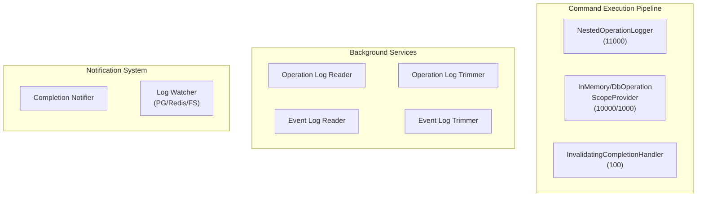
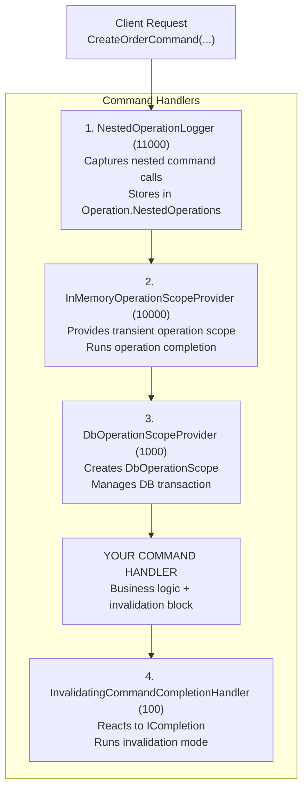
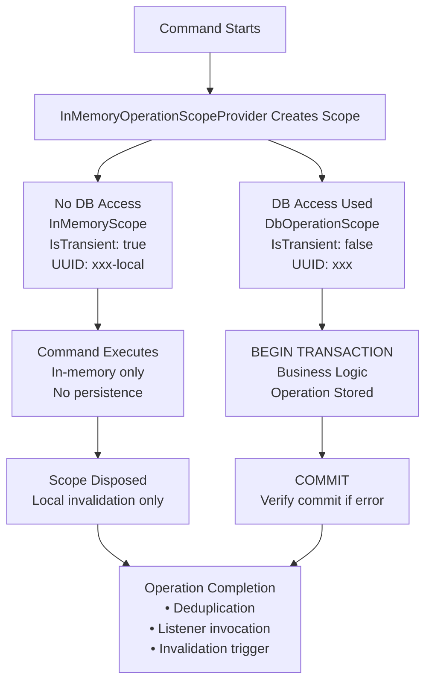
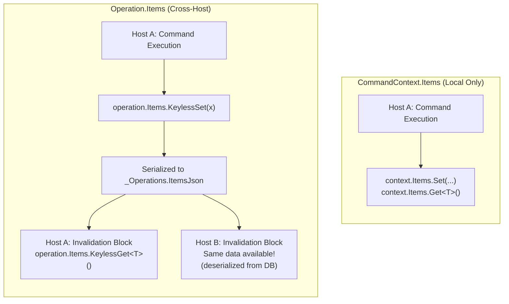
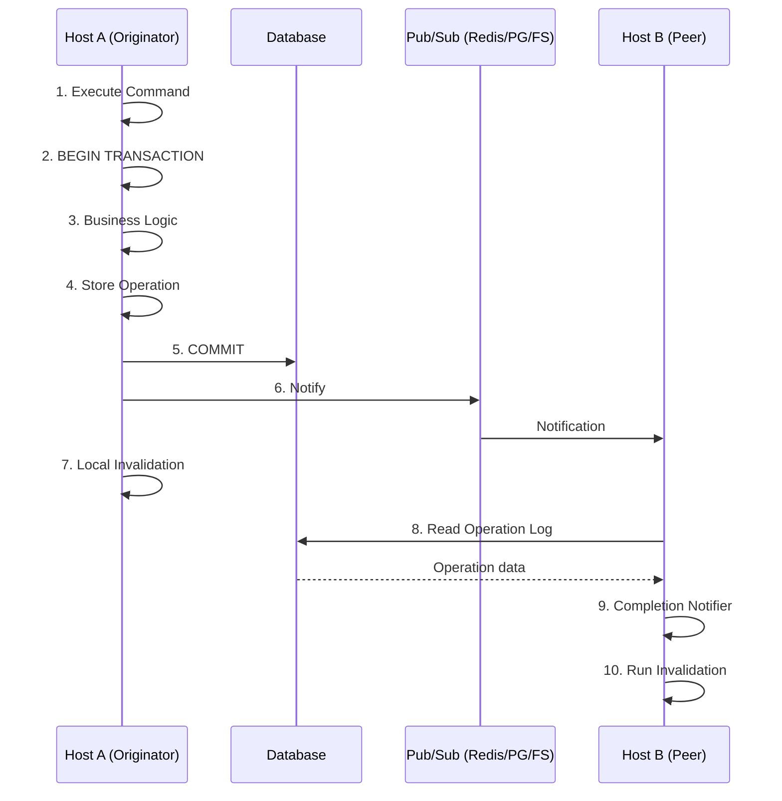
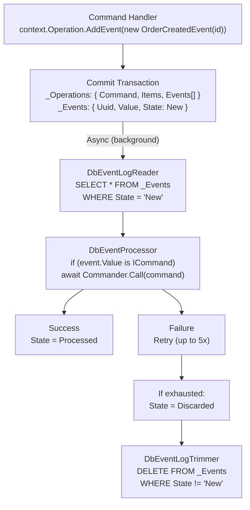

# Operations Framework: Diagrams

This page contains visual diagrams explaining how Operations Framework works.

## High-Level Architecture

**Command Execution Pipeline:**

| Class | Description |
|-------|-------------|
| `NestedOperationLogger` | Captures nested command calls |
| `InMemoryOperationScopeProvider` | Provides transient operation scope |
| `DbOperationScopeProvider` | Provides DB-backed operation scope |
| `InvalidatingCompletionHandler` | Runs invalidation for completed operations |

**Background Services:**

| Class | Description |
|-------|-------------|
| `DbOperationLogReader` | Reads operations from other hosts |
| `DbOperationLogTrimmer` | Removes old operations from log |
| `DbEventLogReader` | Processes pending events |
| `DbEventLogTrimmer` | Removes processed/discarded events |

**Notification System:**

| Class | Description |
|-------|-------------|
| `DbOperationCompletionNotifier` | Triggers invalidation for replayed operations |
| `PostgreSqlDbLogWatcher` | Listens for NOTIFY signals |
| `RedisDbLogWatcher` | Subscribes to Redis pub/sub |
| `FileSystemDbLogWatcher` | Watches for file changes |

## Command Execution Flow

| Handler | Priority | Responsibility |
|---------|----------|----------------|
| `NestedOperationLogger` | 11,000 | Captures nested commands, isolates `Operation.Items` |
| `InMemoryOperationScopeProvider` | 10,000 | Transient scope, completion handling |
| `DbOperationScopeProvider` | 1,000 | DB transaction, operation persistence |
| `InvalidatingCommandCompletionHandler` | 100 | Runs invalidation pass |

## Operation Scope Lifecycle

## Operation Items vs Context Items

| Property | `CommandContext.Items` | `Operation.Items` |
|----------|------------------------|-------------------|
| **Scope** | Single command execution | Operation + invalidation across all hosts |
| **Lifetime** | Command start → end | Command start → invalidation on all hosts |
| **Persistence** | In-memory only | Stored in database (JSON) |
| **Cross-host** | No | Yes |
| **Usage** | `context.Items.Set(...)` / `Get<T>()` | `operation.Items.KeylessSet(x)` / `KeylessGet<T>()` |

## Multi-Host Invalidation Flow

## Event Processing Flow

| Event State | Description |
|-------------|-------------|
| `New` | Freshly added, awaiting processing |
| `Processed` | Successfully executed |
| `Discarded` | Failed after max retries |

## Log Watcher Comparison

| Watcher Type | Mechanism | Latency | Infrastructure |
|--------------|-----------|---------|----------------|
| **PostgreSQL NOTIFY** | `NOTIFY` / `LISTEN` on channel | < 10ms | None (uses DB) |
| **Redis Pub/Sub** | `PUBLISH` / `SUBSCRIBE` on channel | < 1ms | Redis server |
| **FileSystem Watcher** | Touch file / Watch directory | < 100ms | Shared filesystem |
| **No Watcher (Polling)** | Poll `_Operations` table | 0-5s | None |
