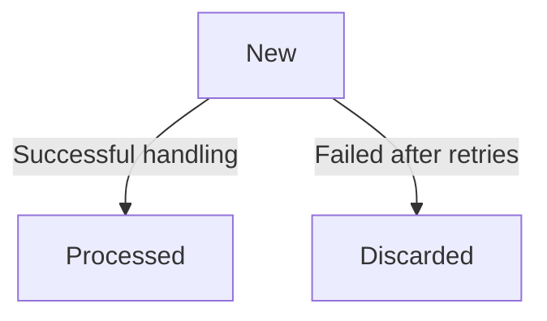

# Operations Framework: Events

Operations Framework supports producing **events** from commands. Events are stored in the database
alongside the operation and processed asynchronously with guaranteed execution.

This is a pure **Transactional Outbox** implementation. Since Operations Framework already provides
infrastructure for on-commit actions (operation logging, invalidation), events are a natural fit.
The key benefit: **if the transaction fails, the event is never committed or processed** &ndash;
you get atomic "business data + event" writes without distributed transactions.

## Overview

Events enable:
- **Asynchronous processing**: Trigger actions after a command completes
- **Delayed execution**: Schedule events for future processing
- **Deduplication**: Prevent duplicate event processing via UUID-based conflict strategies
- **Transactional safety**: Events are stored in the same transaction as the operation &ndash; no event is processed if the transaction rolls back

## DbEvent Entity

Events are persisted using the `DbEvent` entity:

```cs
public class AppDbContext : DbContextBase
{
    public DbSet<DbOperation> Operations => Set<DbOperation>();
    public DbSet<DbEvent> Events => Set<DbEvent>();  // Required for events

    protected override void OnModelCreating(ModelBuilder modelBuilder)
    {
        modelBuilder.Entity<DbOperation>().ToTable("_Operations");
        modelBuilder.Entity<DbEvent>().ToTable("_Events");
    }
}
```

### DbEvent Properties

| Property | Type | Description |
|----------|------|-------------|
| `Uuid` | `string` | Primary key (typically ULID or GUID) |
| `Version` | `long` | Concurrency check field |
| `State` | `LogEntryState` | New, Processed, or Discarded |
| `LoggedAt` | `DateTime` | When the event was logged (UTC) |
| `DelayUntil` | `DateTime` | Earliest processing time (UTC) |
| `ValueJson` | `string` | Serialized event payload |

### Database Indexes

`DbEvent` has two indexes for efficient querying:

```sql
-- For finding events ready to process
CREATE INDEX IX_State_DelayUntil ON Events (State, DelayUntil);

-- For trimming old events
CREATE INDEX IX_DelayUntil_State ON Events (DelayUntil, State);
```

## Adding Events to Operations

Use the `Operation.AddEvent()` method to add events:

```cs
[CommandHandler]
public virtual async Task<Order> CreateOrder(
    CreateOrderCommand command, CancellationToken cancellationToken = default)
{
    if (Invalidation.IsActive) {
        _ = GetOrder(command.OrderId, default);
        return default!;
    }

    var context = CommandContext.GetCurrent();
    await using var dbContext = await DbHub.CreateOperationDbContext(cancellationToken);

    var order = new Order { /* ... */ };
    dbContext.Orders.Add(order);
    await dbContext.SaveChangesAsync(cancellationToken);

    // Add an event to be processed after commit
    context.Operation.AddEvent(new OrderCreatedEvent(order.Id, order.CustomerId));

    return order;
}
```

### OperationEvent Properties

| Property | Type | Description |
|----------|------|-------------|
| `Uuid` | `string` | Unique identifier (auto-generated if not set) |
| `Value` | `object?` | Event payload (must be serializable) |
| `LoggedAt` | `Moment` | Timestamp when event was logged |
| `DelayUntil` | `Moment` | When the event should be processed |
| `UuidConflictStrategy` | `KeyConflictStrategy` | How to handle UUID conflicts |

### Fluent Configuration

`OperationEvent` supports fluent configuration:

```cs
var @event = context.Operation.AddEvent(new OrderCreatedEvent(order.Id))
    .SetDelayBy(TimeSpan.FromMinutes(5))  // Process 5 minutes later
    .SetUuidConflictStrategy(KeyConflictStrategy.Skip);  // Skip if duplicate UUID
```

## Delayed Events

Events can be scheduled for future processing:

```cs
// Process immediately
context.Operation.AddEvent(new ImmediateEvent());

// Process after 5 minutes
context.Operation.AddEvent(new DelayedEvent())
    .SetDelayBy(TimeSpan.FromMinutes(5));

// Process at specific time
context.Operation.AddEvent(new ScheduledEvent())
    .SetDelayUntil(Clocks.SystemClock.Now + TimeSpan.FromHours(1));
```

### Delay Quantization

For rate limiting, you can align delays to time boundaries:

```cs
// Align to 1-minute boundaries (useful for rate limiting)
context.Operation.AddEvent(new RateLimitedEvent())
    .SetDelayUntil(
        Clocks.SystemClock.Now,
        TimeSpan.FromMinutes(1),  // Quantum
        "rate-limit"              // UUID prefix for deduplication
    );
```

This creates events with UUIDs like `rate-limit-at-{timestamp}` and uses `KeyConflictStrategy.Skip`,
ensuring only one event per time quantum.

## UUID Conflict Strategies

When an event UUID already exists, the conflict strategy determines behavior:

| Strategy | Behavior |
|----------|----------|
| `Fail` | Throw an exception (default) |
| `Update` | Update the existing event if `State == New` |
| `Skip` | Silently skip the duplicate |

```cs
// Example: Ensure only one notification per user per hour
context.Operation.AddEvent(new NotificationEvent(userId))
    .SetUuid($"notify-{userId}-{DateTime.UtcNow:yyyy-MM-dd-HH}")
    .SetUuidConflictStrategy(KeyConflictStrategy.Skip);
```

## Event Processing

### DbEventProcessor

Events with `ICommand` values are processed by `DbEventProcessor`:

```cs
public record OrderCreatedEvent(long OrderId, long CustomerId) : ICommand<Unit>;

// This command will be executed when the event is processed
[CommandHandler]
public virtual async Task OnOrderCreated(
    OrderCreatedEvent command, CancellationToken cancellationToken = default)
{
    // Send notification, update analytics, etc.
    await SendOrderConfirmation(command.OrderId, cancellationToken);
}
```

The processor:
1. Reads events where `State == New && DelayUntil <= now`
2. Deserializes the event value
3. If value is `ICommand`, executes it via `Commander.Call(command, true, cancellationToken)`
4. Updates event state to `Processed` or `Discarded`

### Event States



## Event Log Reader

`DbEventLogReader` is a background service that processes events:

```cs
db.AddOperations(operations => {
    operations.ConfigureEventLogReader(_ => new() {
        CheckPeriod = TimeSpan.FromSeconds(5).ToRandom(0.1),
        BatchSize = 64,
        ConcurrencyLevel = Environment.ProcessorCount * 4,
    });
});
```

### Default Settings

| Setting | Default | Description |
|---------|---------|-------------|
| `CheckPeriod` | 5s ± 0.5s | How often to check for new events |
| `BatchSize` | 64 | Events processed per batch |
| `ConcurrencyLevel` | 4 × CPU count | Concurrent event processing |
| `ReprocessPolicy` | 5 retries, 5min timeout | Retry policy for failed events |
| `ReprocessDelay` | 100ms ± 100ms | Delay between retries |

## Event Log Trimmer

`DbEventLogTrimmer` removes old processed events:

```cs
db.AddOperations(operations => {
    operations.ConfigureEventLogTrimmer(_ => new() {
        MaxEntryAge = TimeSpan.FromHours(1),  // Keep events for 1 hour
        CheckPeriod = TimeSpan.FromMinutes(15).ToRandom(0.25),
    });
});
```

### Trimming Condition

Events are trimmed when:
- `DelayUntil <= (now - MaxEntryAge)` AND
- `State != New` (i.e., Processed or Discarded)

This ensures:
- New events are never trimmed
- Recently processed events are kept for debugging
- Old processed events are cleaned up automatically

## Transient Operations and Events

**Important**: Transient operations (in-memory only) cannot have events:

```cs
// This will throw TransientScopeOperationCannotHaveEvents!
if (operation.Scope.IsTransient) {
    operation.AddEvent(new SomeEvent());  // ERROR!
}
```

Events require database persistence because:
1. They're stored in the same transaction as the operation
2. They're processed asynchronously after commit
3. They need guaranteed delivery across host restarts

If you need to trigger actions from in-memory commands, use:
- `IOperationCompletionListener` for synchronous post-commit actions
- A separate database command that produces the event

## Event Log Watcher

Unlike operations, events use `LocalDbLogWatcher` by default because events are:
- Processed by any available host (not necessarily the originating one)
- Not replicated across hosts (each host processes events independently)
- Designed for asynchronous background work

The local watcher is sufficient because events don't need cross-host notification &ndash;
the `DbEventLogReader` on each host polls the database for new events.

## Custom Event Values

Events can carry any JSON-serializable payload:

```cs
// Simple value
context.Operation.AddEvent(new StringEvent("User created"));

// Complex object
context.Operation.AddEvent(new UserCreatedEvent {
    UserId = user.Id,
    Email = user.Email,
    CreatedAt = DateTime.UtcNow,
});

// Command (will be executed)
context.Operation.AddEvent(new SendWelcomeEmailCommand(user.Id, user.Email));
```

### IHasUuid Interface

If your event value implements `IHasUuid`, the UUID is extracted automatically:

```cs
public record OrderEvent(string Uuid, long OrderId) : IHasUuid;

// UUID is taken from the event value
context.Operation.AddEvent(new OrderEvent($"order-{orderId}", orderId));
```

## Best Practices

1. **Use commands as event values** for automatic processing
2. **Set appropriate delays** to avoid overwhelming downstream systems
3. **Use UUID conflict strategies** for idempotency
4. **Keep event payloads small** &ndash; they're serialized to JSON
5. **Don't rely on event ordering** &ndash; events may be processed out of order
6. **Handle failures gracefully** &ndash; events may be retried multiple times
