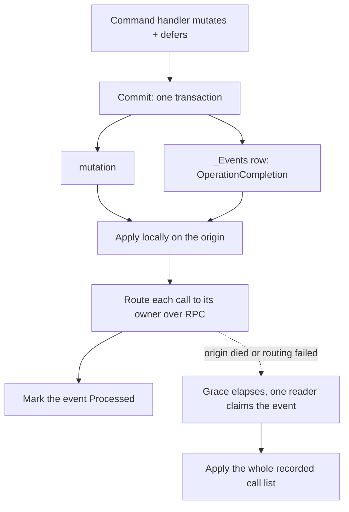

# Operations Framework: Invalidation Modes

A command handler has to do two things: mutate state, and say which computed values that
mutation invalidated. **Invalidation modes** decide *how* the handler says it, and *how far*
the resulting invalidation reaches.

There are three, declared with `[DeferredInvalidationMode(...)]`:

| Mode | Reach |
|------|-------|
| `Local` | the origin host only |
| `Replicated` | every host |
| `Distributed` | the host that owns each value |

Every handler that defers a block declares one of them &ndash; there is no default, and an
undeclared mode throws. A handler that defers nothing needs no attribute, and the enum has no
"unset" member.

::: tip
The enum is `DeferredInvalidationMode`, but the attribute is `[DeferredInvalidationMode]` &ndash; it reads
better at the declaration site, where the `Deferred` prefix would be noise.
:::

## Deferred Invalidation

Fusion used to invalidate by *replay*: the command travelled to every host, and each one re-ran the
handler with `Invalidation.IsActive == true` so its `if (Invalidation.IsActive) { ... }` branch
could name the values to drop. That's gone, and with it three costs:

1. **The handler body ran twice** &ndash; once for real, once per host in invalidation mode.
   Everything the invalidation branch needed had to be reachable from the command alone.
2. **Conditional invalidation needed marshalling.** If which values to invalidate depended on
   something the mutation discovered, that decision had to be encoded into `Operation.Items`
   (now gone) and re-read on every host.
3. **The cost scaled with host count**, even when the value lived on exactly one host.

The three deferred modes replace that branch with a delegate:

<!-- snippet: PartOIM_Local -->
```cs
[DeferredInvalidationMode(DeferredInvalidationMode.Local)]
public class Contacts(IServiceProvider services) : DbServiceBase<AppDbContext>(services), IComputeService
{
    [CommandHandler]
    public virtual async Task OnChange(Contacts_Change command, CancellationToken cancellationToken = default)
    {
        await using var dbContext = await DbHub.CreateOperationDbContext(cancellationToken);
        // ... mutate ...
        await dbContext.SaveChangesAsync(cancellationToken);

        Invalidation.Defer(() => {
            _ = Get(command.OwnerId, command.Id, default);
            _ = ListIds(command.OwnerId, default);
        });
    }

    [ComputeMethod]
    public virtual Task<Contact?> Get(string ownerId, string id, CancellationToken ct)
        => Task.FromResult<Contact?>(null);
    [ComputeMethod]
    public virtual Task<string[]> ListIds(string ownerId, CancellationToken ct)
        => Task.FromResult(Array.Empty<string>());
}
```
<!-- endSnippet -->

`Invalidation.Defer(...)` records a block to run *after the mutation commits*. The handler body
runs once, and the invalidation is written where the data already is.

Conditional and repeated invalidation are ordinary control flow:

<!-- snippet: PartOIM_Conditional -->
```cs
[CommandHandler]
[DeferredInvalidationMode(DeferredInvalidationMode.Local)]
public virtual async Task OnAdd(Tags_Add command, CancellationToken cancellationToken = default)
{
    await using var dbContext = await DbHub.CreateOperationDbContext(cancellationToken);
    var affectedOwnerIds = new[] { "o1", "o2" };
    await dbContext.SaveChangesAsync(cancellationToken);

    // Ordinary control flow - the condition is evaluated once, right here
    Invalidation.Defer(() => {
        foreach (var ownerId in affectedOwnerIds)
            _ = ListIds(ownerId, default);
        if (affectedOwnerIds.Length > 1)
            _ = Count(default);
    });
}
```
<!-- endSnippet -->

### Migrating from replay-based invalidation

| Before | Now |
|---|---|
| `if (Invalidation.IsActive) { ... return; }` at the top of a handler | Delete the branch; move what it invalidated into `Invalidation.Defer(() => ...)` at the end |
| Nothing &ndash; the mode was implicit | `[DeferredInvalidationMode(...)]` on every handler that defers, or it throws |
| `Operation.Items` carrying data to the replayed branch | Nothing to carry: a deferred block is a closure over the handler's own locals |
| `Operation.NestedOperations`, `NestedOperation`, `SuppressNestedOperationLogging()` | Gone &ndash; a nested handler's blocks join the one operation |
| `InMemoryOperationScope` / `InMemoryOperationScopeProvider` | `TransientOperationScope` / `TransientOperationScopeProvider` |
| `Operation.ClearEvents()` | `Operation.RemoveEvents()` |
| A command called from inside an invalidation block | Rejected by `InvalidationGuard` &ndash; nothing replays a handler now |

The mutation half of a handler doesn't change. What changes is that the invalidation half stops
being a second pass over the same body and becomes a delegate the framework runs once the mutation
is durable.

### Placement and timing

- **`Defer(...)` may be called any number of times**, anywhere in the handler &ndash; inside `if`
  branches, inside loops. The blocks run in registration order.
- **The blocks always run on `CancellationToken.None`.** Inheriting the caller's token would let
  an aborted request skip the invalidation, leaving the mutation durable with no cache hearing
  about it.
- **When they run depends on the mode.** Under `Local` they run once the commit is verified. Under
  `Replicated` and `Distributed` they run slightly earlier &ndash; at commit time, under a recording
  context, because the calls they name have to be in the operation row that the mutation's own
  transaction writes. The *invalidation* still happens after the commit either way: what the blocks
  produce then is a list of recorded calls, not an applied invalidation.
- **A block observes the *final* value of a captured local**, not its value at the `Defer(...)`
  call site &ndash; ordinary closure semantics, but easy to trip over when the call reads as if it
  executes in place. Snapshot into a fresh local if you need the earlier value.
- **`Defer(...)` is defer-or-fail.** Outside a capture scope it throws rather than invalidating
  early. A scope is always open where it's legal: `DeferredInvalidationScopeProvider` opens one for
  every command. A non-command mutator opens its own, and because closing a scope only makes its
  blocks final, it also runs them:

  ```cs
  var context = new DeferredInvalidationContext { Mode = DeferredInvalidationMode.Local };
  using (context.Activate())
      await Mutate(); // Invalidation.Defer(...) works in here
  await context.Apply(new InvalidationSource("MyMutator"));
  ```

Because the blocks run after the handler's body either way, **switching a service between the three
deferred modes doesn't change which values a block names.** That is what makes the mode a
configuration decision rather than a rewrite.

A block is for naming compute methods, though, and only that. It must not mutate, call a command, or
call `Defer(...)` again &ndash; all three are rejected in every mode, and under `Replicated` or
`Distributed` a side effect in a block would run inside the mutation's open transaction and run
again on every `OperationReprocessor` retry.

## Declaring the Mode

`[DeferredInvalidationMode]` goes on a handler method, on its declaring type, or on the service
interface. The first one found wins, in that order.

**Prefer the type or the interface.** How far an invalidation has to reach follows from how the
service's data is stored and shared, which is a property of the service rather than of one handler &ndash;
so in practice every handler on a service wants the same mode. Declaring it once on the
implementation or on the interface says that, and keeps a new handler from silently throwing because
somebody forgot the attribute. Reach for the method level only where a handler genuinely differs from
its service.

There is no default mode. A handler that defers a block and declares none throws, because how far
its invalidation has to reach is something only that handler knows: guessing `Local` leaves other
hosts stale, and guessing wider pays for a broadcast nobody asked for. A handler that defers
nothing needs no attribute &ndash; it never gets a say in the mode, which is what lets a command
delegate to handlers whose mode it doesn't know.

<!-- snippet: PartOIM_InterfaceDeclaration -->
```cs
[CommandHandler]
[DeferredInvalidationMode(DeferredInvalidationMode.Distributed)]
Task OnReserve(Inventory_Reserve command, CancellationToken cancellationToken = default);
```
<!-- endSnippet -->

Resolving the mode some other way &ndash; per namespace, per tenant, from configuration &ndash; is a
job for a resolver of your own: derive from
`DeferredInvalidationModeResolver` and override whichever `Resolve` overload you need:

<!-- snippet: PartOIM_ResolverBody -->
```cs
public class TenantInvalidationModeResolver(ServiceTypeResolver serviceTypeResolver)
    : DeferredInvalidationModeResolver(serviceTypeResolver)
{
    public override DeferredInvalidationMode Resolve(IMethodCommandHandler handler)
        => handler.GetHandlerServiceType().Namespace?.StartsWith("MyApp.Sharded", StringComparison.Ordinal) == true
            ? DeferredInvalidationMode.Distributed
            : base.Resolve(handler);
}
```
<!-- endSnippet -->

<!-- snippet: PartOIM_CustomResolver -->
```cs
// The resolver is an ordinary singleton, so registering your own after AddFusion()
// replaces it
services.AddFusion();
services.AddSingleton<DeferredInvalidationModeResolver>(
    c => new TenantInvalidationModeResolver(
        c.GetRequiredService<ServiceTypeResolver>()));
```
<!-- endSnippet -->

## Local

Nothing is recorded. Once the commit is verified, the blocks run in-process inside
`Invalidation.Begin()`.

This is the cheapest mode by a wide margin: no call recording, no argument serialization, no
method identity, and therefore no version-skew surface at all. It works with any operation scope,
including a transient one and no scope at all.

Use it when the values being invalidated are **per-host state** &ndash; a cache of something this
host computed for itself &ndash; or when the service is shard-owned and this host is the owner.

## Replicated

At commit time the blocks run under a recording context, which harvests them into
`Operation.InvalidationCalls`. Those records travel on the operation log row, and **every host applies
them** when it reads the log.

<!-- snippet: PartOIM_Replicated -->
```cs
// Every host caches the whole price table, so every host has to invalidate its own copy
[DeferredInvalidationMode(DeferredInvalidationMode.Replicated)]
public class Prices(IServiceProvider services) : DbServiceBase<AppDbContext>(services), IComputeService
{
    [CommandHandler]
    public virtual async Task OnSet(Prices_Set command, CancellationToken cancellationToken = default)
    {
        await using var dbContext = await DbHub.CreateOperationDbContext(cancellationToken);
        // ... mutate ...
        await dbContext.SaveChangesAsync(cancellationToken);

        Invalidation.Defer(() => _ = Get(command.Symbol, default));
    }

    [ComputeMethod]
    public virtual Task<decimal> Get(string symbol, CancellationToken ct)
        => Task.FromResult(0m);
}
```
<!-- endSnippet -->

Use it when every host caches the same shared state and so every host has to drop its own copy.

`Replicated` needs a carrier, so it **requires an operation scope that stores its operation**.
On a transient scope, or with no scope at all, it throws rather than silently dropping the
invalidation.

## Distributed

`Replicated` doesn't scale with host count. The cost of one mutation's invalidation is
`N × (read + deserialize + reflect + apply)`, and for a shard-routed service `N-1` of those applies
are misses &mdash; the computed value only ever existed on the shard's owner.

`Distributed` pays once. The origin applies the recorded calls locally, then routes each one over
RPC to the host that owns its value. Cost is `1 × (apply + route)`, independent of cluster size.

<!-- snippet: PartOIM_Distributed -->
```cs
// The contact lives on exactly one host, so invalidating it on all of them is wasted work
[DeferredInvalidationMode(DeferredInvalidationMode.Distributed)]
public class ShardedContacts(IServiceProvider services) : DbServiceBase<AppDbContext>(services), IComputeService
{
    [CommandHandler]
    public virtual async Task OnChange(Contacts_Change command, CancellationToken cancellationToken = default)
    {
        await using var dbContext = await DbHub.CreateOperationDbContext(cancellationToken);
        // ... mutate ...
        await dbContext.SaveChangesAsync(cancellationToken);

        Invalidation.Defer(() => _ = Get(command.OwnerId, command.Id, default));
    }

    [ComputeMethod]
    public virtual Task<Contact?> Get(string ownerId, string id, CancellationToken ct)
        => Task.FromResult<Contact?>(null);
}
```
<!-- endSnippet -->

### How it works



The origin's local pass happens **before the mutating call returns**, exactly as under `Local`, so
read-back is immediate. Routing is fire-and-forget: each call is a round trip, and a peer that's
reconnecting would otherwise hold the caller for its connect timeout.

The `_Events` row is what makes that safe. It is written inside the mutation's own transaction and
stays `New` until the routing actually lands, so a host that dies or fails mid-routing leaves the
work for whichever host claims the event. The completion write is one `UPDATE` by `Uuid`, off the
critical path; correctness doesn't depend on it landing, only efficiency does.

### What the mode does and doesn't govern

The mode says where and how a handler's `Defer(...)` blocks run. It says **nothing about what they
may invalidate**: a `Distributed` block invalidating a `Local`-mode service's compute method is
legitimate, and so is a block that mixes routable and non-routable targets.

The reach of an individual invalidation is a property of the **target** service's registration:

| Target's `RpcServiceMode` | Under `Replicated` | Under `Distributed` |
|---|---|---|
| `Distributed`, `Client`, `Server` | every host invalidates its own copy; the owner's is among them | routed to the owner; replicas follow via its invalidation push |
| `Local` | every host invalidates its own copy | only the applying host |

A `Local` service has no single owner, so there is nothing for routing to find. If such a target
caches shared storage, the handler wants `Replicated` &ndash; `Distributed` will leave the other
hosts stale. If it caches per-host state, origin-only is already correct, and then the handler
wants `Local`, since `Distributed` buys it nothing.

### Requirements

- **A database-backed operation.** The recovery event has to be committed in the same transaction
  as the mutation. On a transient scope, or with no scope, `Distributed` throws.
- **`KeepProcessedItems` must stay at its default `true`** on the event log reader. The operation's
  event row is also its commit verifier: `DbOperationScope` reuses the same `Uuid` across
  `OperationReprocessor` retries, so a retry of an operation that actually committed hits the
  unique-`Uuid` violation and is recognised as already committed. Deleting the row on processing
  frees the `Uuid` and lets a later retry re-run the mutation.
- **Backend peers only.** An inbound routed invalidation is rejected unless `Peer.Ref.IsBackend`.
  Cache-busting an arbitrary key is a capability the mesh gets, not clients.

::: tip
If a shard moves between the routing and the arrival, the invalidation lands on a host that doesn't
own the value. By default it is dropped: the new owner has nothing cached to invalidate, and the
old one dropped its values when it lost the shard. Set
`RpcInboundComputeCallHandler.DefaultMustRerouteInvalidations` to `true` to surface the misroute as
a reroute instead.
:::

## Choosing a Mode

| Situation | Mode |
|---|---|
| Handler only delegates to other commands, which declare their own modes | none &ndash; it defers nothing |
| Values are per-host, or this host owns the shard | `Local` |
| Every host caches the same shared state | `Replicated` |
| Shard-routed service, and the cluster is big enough for `N` to matter | `Distributed` |

`Replicated` and `Distributed` both need a stored operation. If you're not sure the operation will
have one, `Local` is the mode that always works.

## Nested Commands

One operation gets one capture scope, and therefore one mode &ndash; but the mode comes from the
**handler that defers a block**, not from the command the scope was opened for:

- The capture scope starts with **no mode**. The first `Defer(...)` resolves the mode of the command
  that's running right then, and that becomes the operation's.
- Every later `Defer(...)` resolves again and is **checked** against it. A handler needing a
  different mode **throws**: one operation gets one carrier, and the alternative is to silently
  narrow or widen one of them, which is the class of bug deferred invalidation exists to remove.
- A handler that **defers nothing has no say**. This is what lets a command delegate: a handler that
  validates and then calls other commands doesn't have to know, or restate, the mode its callees
  need &ndash; it simply never participates in the decision.

So an outer command does *not* override its nested ones. Whichever handlers actually defer have to
agree, and a delegating handler stays out of it entirely.

## Further Reading

- [Operations Framework](./PartO.md) &ndash; The framework these modes belong to
- [Transient Operations](./PartO-TR.md) &ndash; Why some operations can't carry an invalidation
- [Events](./PartO-EV.md) &ndash; The event log `Distributed` recovers from
- [Configuration Options](./PartO-CO.md) &ndash; All configuration options explained
- [Cheat Sheet](./PartO-CS.md) &ndash; Quick reference
