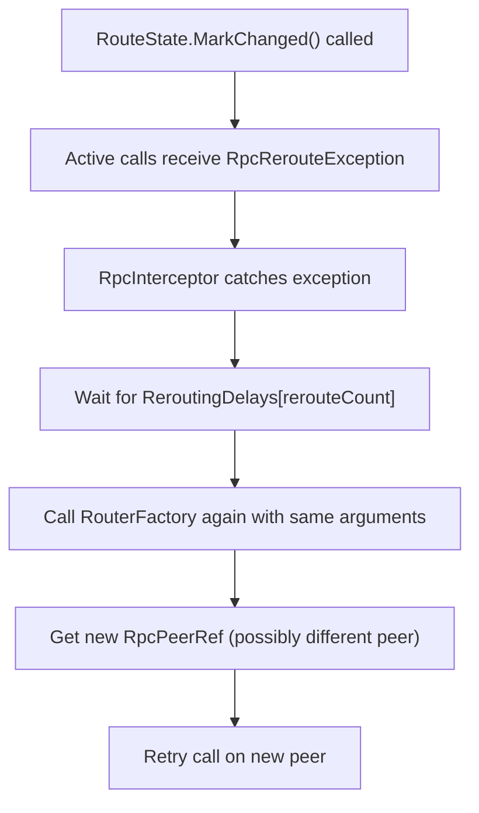

# Call Routing

ActualLab.Rpc supports flexible call routing, enabling scenarios like:
- **Sharding** &ndash; Route calls to specific servers based on a shard key
- **Load balancing** &ndash; Distribute calls across multiple backend servers
- **Affinity routing** &ndash; Route calls based on user ID, entity ID, or other attributes
- **Dynamic topology** &ndash; Handle server additions/removals without client restarts


## Core Concepts

### RouterFactory

The `RouterFactory` is the entry point for custom routing. It's configured via `RpcOutboundCallOptions`:

```cs
services.AddSingleton(_ => RpcOutboundCallOptions.Default with {
    RouterFactory = methodDef => args => {
        // Return RpcPeerRef based on method and arguments
        return RpcPeerRef.Default;
    }
});
```

The factory receives an `RpcMethodDef` and returns a function that maps `ArgumentList` to `RpcPeerRef`. This two-level design allows you to:
1. Inspect the method definition once (outer function)
2. Make per-call routing decisions based on arguments (inner function)


### RpcPeerRef

`RpcPeerRef` identifies the target peer for a call:

| Type | Description |
|------|-------------|
| `RpcPeerRef.Default` | The default remote peer (for single-server scenarios) |
| `RpcPeerRef.Local` | Execute locally (bypass RPC) |
| `RpcPeerRef.Loopback` | In-process loopback (for testing) |
| Custom `RpcPeerRef` | Your own peer reference with routing state |


### RpcRouteState

`RpcRouteState` enables dynamic rerouting when the target peer changes:

```cs
public class MyPeerRef : RpcPeerRef
{
    public MyPeerRef(string targetId)
    {
        HostInfo = targetId;
        RouteState = new RpcRouteState();

        // Start monitoring for topology changes
        _ = Task.Run(async () => {
            await WaitForTopologyChange();
            RouteState.MarkChanged(); // Triggers rerouting
        });
    }
}
```

When `RouteState.MarkChanged()` is called:
1. Active calls on this peer receive `RpcRerouteException`
2. The RPC interceptor catches the exception
3. After a delay (`ReroutingDelays`), the call is rerouted via `RouterFactory`


### RpcRerouteException

`RpcRerouteException` signals that a call must be rerouted to a different peer. It's thrown automatically when:
- `RouteState.MarkChanged()` is called on the peer's `RpcPeerRef`
- An inbound call arrives at a server that's no longer responsible for the shard/entity

```cs
// Throwing manually (e.g., in a service method)
throw RpcRerouteException.MustReroute("Target server changed");
```


## Simple Example: Hash-Based Routing

This example from the `MultiServerRpc` sample routes chat calls based on chat ID hash:

```cs
const int serverCount = 2;
var serverUrls = Enumerable.Range(0, serverCount)
    .Select(i => $"http://localhost:{22222 + i}/")
    .ToArray();
var clientPeerRefs = serverUrls
    .Select(url => RpcPeerRef.NewClient(url))
    .ToArray();

services.AddSingleton(_ => RpcOutboundCallOptions.Default with {
    RouterFactory = methodDef => args => {
        if (methodDef.Service.Type == typeof(IChat)) {
            var arg0Type = args.GetType(0);
            int hash;
            if (arg0Type == typeof(string))
                hash = args.Get<string>(0).GetXxHash3();
            else if (arg0Type == typeof(Chat_Post))
                hash = args.Get<Chat_Post>(0).ChatId.GetXxHash3();
            else
                throw new NotSupportedException("Can't route this call.");

            return clientPeerRefs[hash.PositiveModulo(serverCount)];
        }
        return RpcPeerRef.Default;
    }
});
```

Key points:
- Routes `IChat` calls based on the first argument (chat ID or command)
- Uses `GetXxHash3()` for consistent hashing (doesn't change between runs)
- Falls back to `RpcPeerRef.Default` for other services


## Advanced Example: Dynamic Mesh Routing

The `MeshRpc` sample demonstrates dynamic routing with automatic rerouting when topology changes.

### Custom PeerRef with RouteState

```cs
public sealed class RpcShardPeerRef : RpcPeerRef
{
    private static readonly ConcurrentDictionary<ShardRef, LazySlim<ShardRef, RpcShardPeerRef>> Cache = new();

    public ShardRef ShardRef { get; }
    public string HostId { get; }

    public static RpcShardPeerRef Get(ShardRef shardRef)
        => Cache.GetOrAdd(shardRef, static (shardRef, lazy) => new RpcShardPeerRef(shardRef, lazy));

    private RpcShardPeerRef(ShardRef shardRef, LazySlim<ShardRef, RpcShardPeerRef> lazy)
    {
        var meshState = MeshState.State.Value;
        ShardRef = shardRef;
        HostId = meshState.GetShardHost(shardRef)?.Id ?? "null";
        HostInfo = $"{shardRef}-v{meshState.Version}->{HostId}";

        // Enable rerouting
        RouteState = new RpcRouteState();

        // Monitor for topology changes
        _ = Task.Run(async () => {
            var computed = MeshState.State.Computed;
            // Wait until this host is removed from the mesh
            await computed.When(x => !x.HostById.ContainsKey(HostId), CancellationToken.None);

            // Remove from cache and trigger rerouting
            Cache.TryRemove(ShardRef, lazy);
            RouteState.MarkChanged();
        });
    }
}
```

### RouterFactory with Type-Based Routing

```cs
public Func<ArgumentList, RpcPeerRef> RouterFactory(RpcMethodDef methodDef)
    => args => {
        if (args.Length == 0)
            return RpcPeerRef.Local;

        var arg0Type = args.GetType(0);

        // Route by HostRef
        if (arg0Type == typeof(HostRef))
            return RpcHostPeerRef.Get(args.Get<HostRef>(0));
        if (typeof(IHasHostRef).IsAssignableFrom(arg0Type))
            return RpcHostPeerRef.Get(args.Get<IHasHostRef>(0).HostRef);

        // Route by ShardRef
        if (arg0Type == typeof(ShardRef))
            return RpcShardPeerRef.Get(args.Get<ShardRef>(0));
        if (typeof(IHasShardRef).IsAssignableFrom(arg0Type))
            return RpcShardPeerRef.Get(args.Get<IHasShardRef>(0).ShardRef);

        // Route by hash of first argument
        if (arg0Type == typeof(int))
            return RpcShardPeerRef.Get(ShardRef.New(args.Get<int>(0)));

        return RpcShardPeerRef.Get(ShardRef.New(args.GetUntyped(0)));
    };
```


## Rerouting Flow

When a peer's route state changes, the following sequence occurs:




## Configuration

### Rerouting Delays

Configure delays between rerouting attempts via `RpcOutboundCallOptions`:

```cs
services.AddSingleton(_ => RpcOutboundCallOptions.Default with {
    ReroutingDelays = RetryDelaySeq.Exp(0.1, 5), // 0.1s to 5s exponential backoff
});
```

The delay sequence uses exponential backoff to avoid overwhelming the system during topology changes.

### Host URL Resolution

When using custom `RpcPeerRef` types, configure how to resolve the actual host URL:

```cs
services.Configure<RpcWebSocketClientOptions>(o => {
    o.HostUrlResolver = peer => {
        if (peer.Ref is IMyMeshPeerRef meshPeerRef) {
            var host = GetHostById(meshPeerRef.HostId);
            return host?.Url ?? "";
        }
        return peer.Ref.HostInfo;
    };
});
```

### Connection Kind Detection

Detect whether a peer reference points to a local or remote peer:

```cs
services.Configure<RpcPeerOptions>(o => {
    o.ConnectionKindDetector = peerRef => {
        if (peerRef is MyShardPeerRef shardPeerRef)
            return shardPeerRef.HostId == currentHostId
                ? RpcPeerConnectionKind.Local
                : RpcPeerConnectionKind.Remote;

        return peerRef.ConnectionKind;
    };
});
```


## Best Practices

1. **Cache PeerRefs** &ndash; Create and reuse `RpcPeerRef` instances for the same routing key. The `MeshRpc` sample uses `ConcurrentDictionary` with `LazySlim` for thread-safe caching.

2. **Use consistent hashing** &ndash; Use `GetXxHash3()` or similar stable hash functions. `string.GetHashCode()` varies between runs.

3. **Handle topology changes gracefully** &ndash; Use `RpcRouteState` to automatically reroute when servers come and go.

4. **Monitor rerouting** &ndash; Rerouting is logged at Warning level. High rerouting rates may indicate topology instability.

5. **Consider local execution** &ndash; Return `RpcPeerRef.Local` when the call can be handled by the current server to avoid network overhead.
