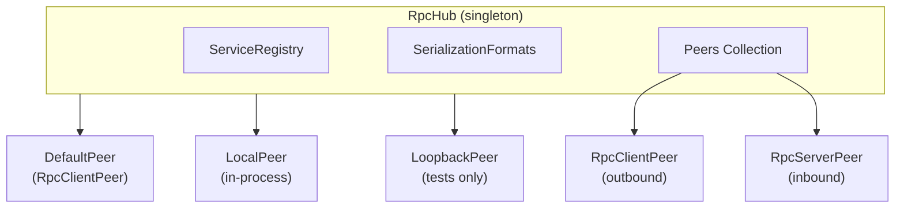
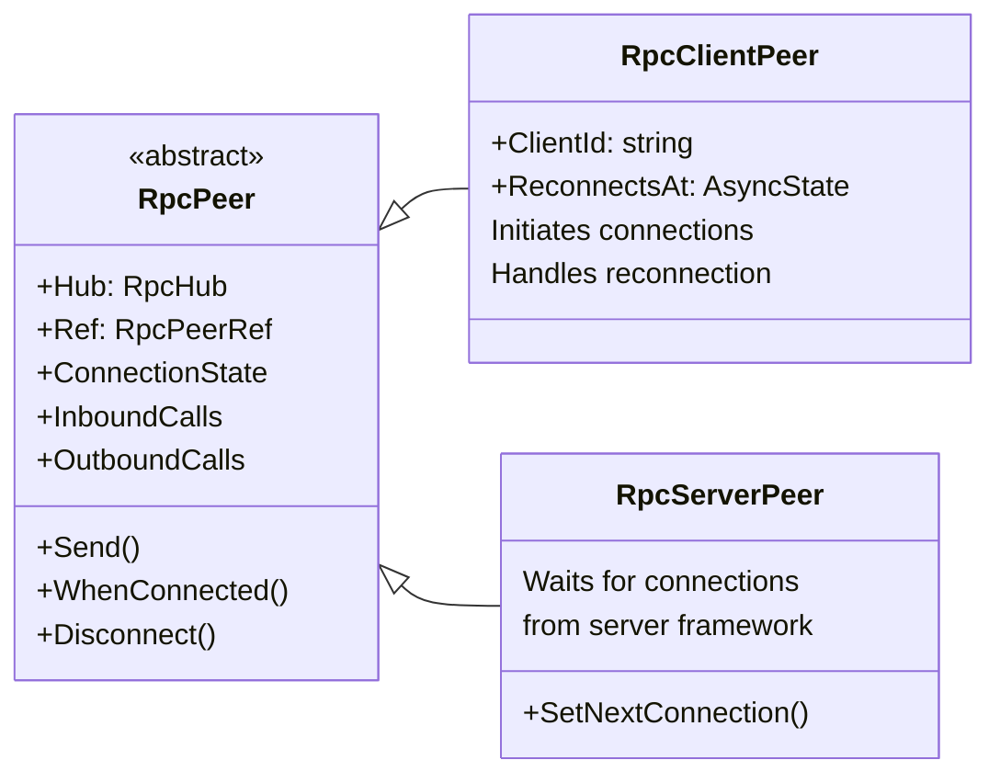
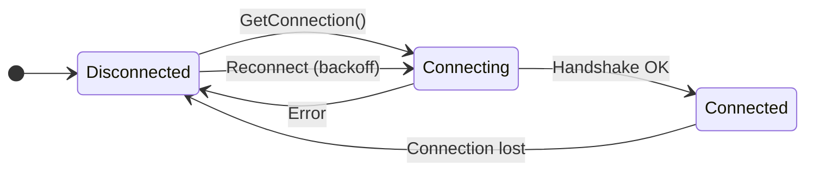
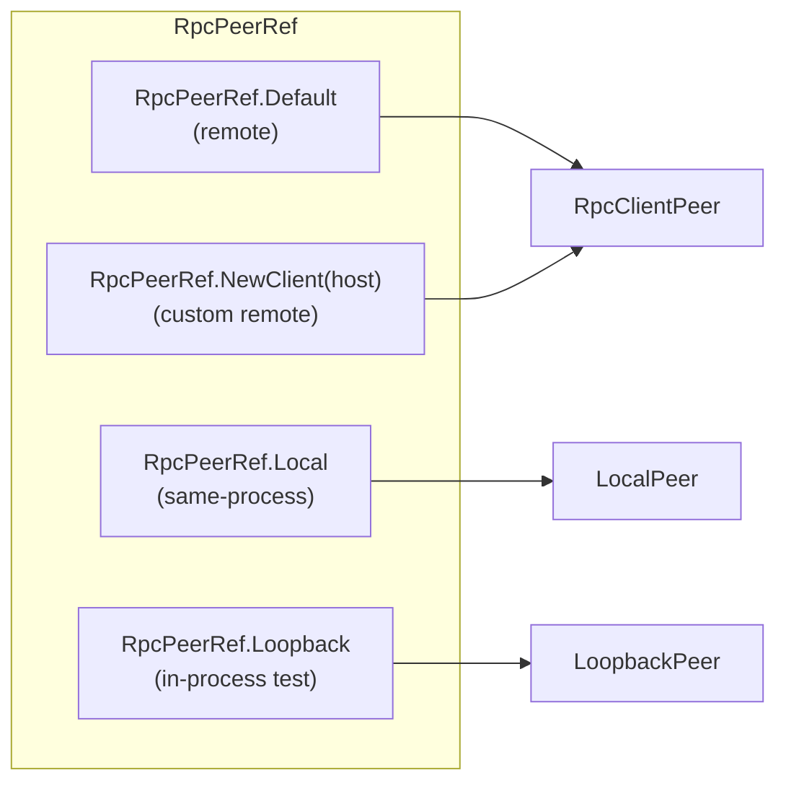
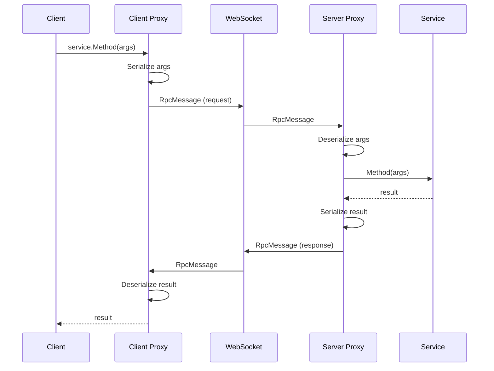
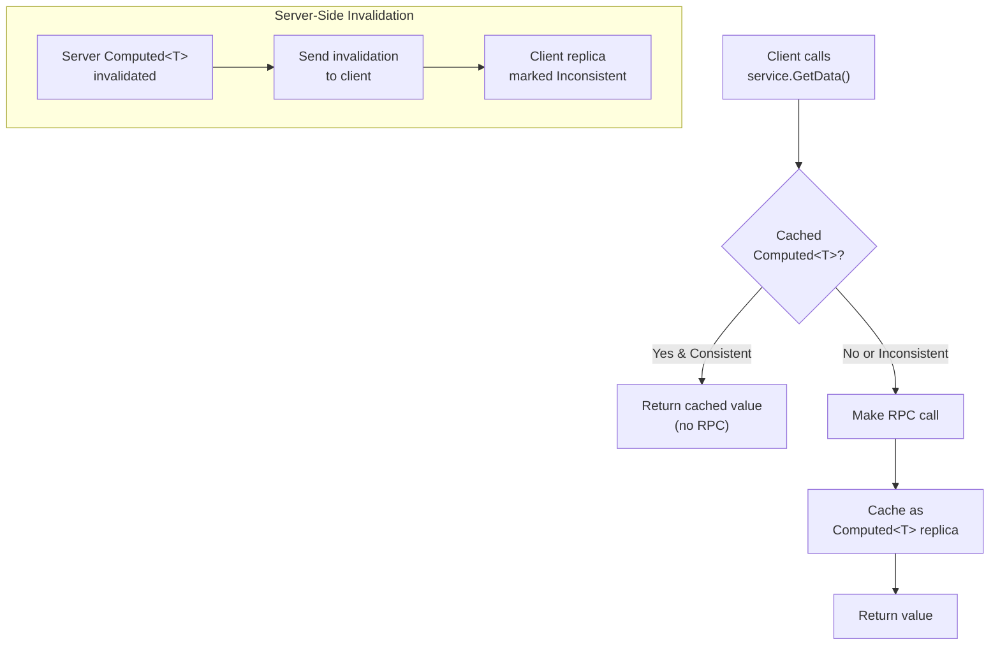
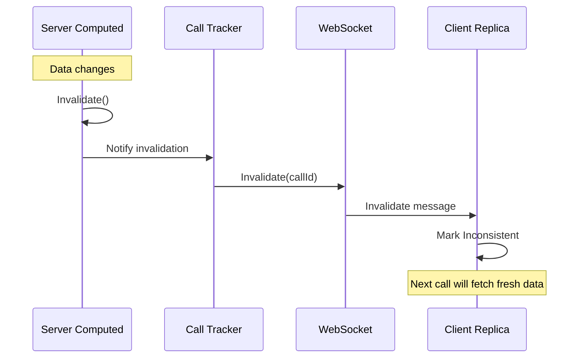
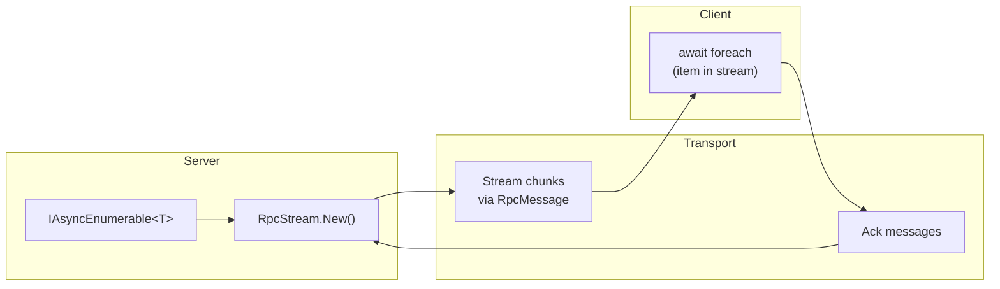
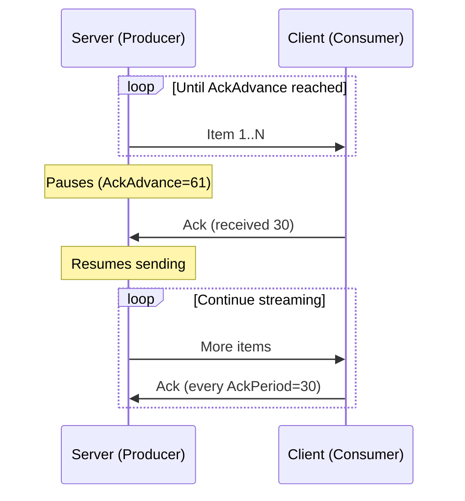

# ActualLab.Rpc: Diagrams

Diagrams for the RPC concepts introduced in [Part 2](PartR.md).

## RpcHub Architecture

| Component | Description |
|-----------|-------------|
| `RpcHub` | Singleton orchestrator managing all peers and service proxies |
| `ServiceRegistry` | Registry of RPC service definitions |
| `DefaultPeer` | Default peer for outbound calls |
| `LocalPeer` | Peer for same-process calls |
| `LoopbackPeer` | In-process loopback for testing |

## RpcPeer Hierarchy

| Peer Type | Direction | Description |
|-----------|-----------|-------------|
| `RpcClientPeer` | Outbound | Initiates connections, handles reconnection with backoff |
| `RpcServerPeer` | Inbound | Receives connections from server framework (e.g., ASP.NET) |

## Connection State Machine

| State | Description |
|-------|-------------|
| Disconnected | No active connection |
| Connecting | Establishing connection and exchanging handshake |
| Connected | Active connection, can send/receive messages |

## RpcPeerRef Types

| PeerRef | ConnectionKind | Use Case |
|---------|----------------|----------|
| `Default` | Remote | Standard client-server communication |
| `Local` | Local | Same-process calls (no serialization) |
| `Loopback` | Loopback | Testing with serialization but no network |
| `NewClient(host)` | Remote | Connect to specific host |

## RPC Call Flow

## Compute Service Client Caching

| Scenario | Behavior |
|----------|----------|
| Cache hit (consistent) | Return immediately, no RPC |
| Cache miss | Make RPC, cache result |
| Server invalidation | Client replica invalidated, next call triggers RPC |

## Invalidation Propagation

## RpcStream Data Flow

| Direction | Description |
|-----------|-------------|
| Server → Client | Stream items sent in chunks |
| Client → Server | Acknowledgments for backpressure |

## RpcStream Backpressure

| Property | Default | Description |
|----------|---------|-------------|
| `AckPeriod` | 30 | Consumer acks every N items |
| `AckAdvance` | 61 | Producer can send N items ahead before waiting |
