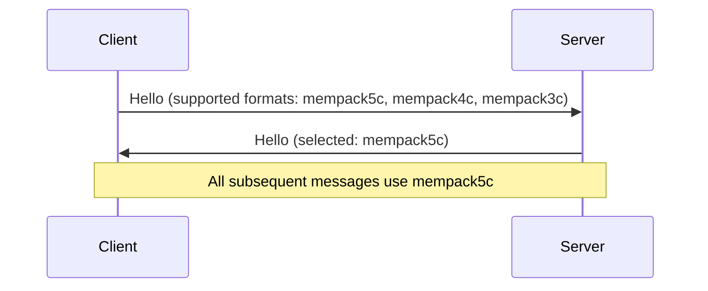
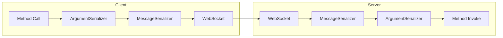

# RPC Serialization Formats

ActualLab.Rpc supports multiple serialization formats with automatic version negotiation between clients and servers.
This enables gradual upgrades and interoperability between different Fusion versions.

## Overview

RPC serialization has two layers:

1. **Argument serialization**: How method arguments are encoded
2. **Message serialization**: How RPC messages (containing arguments) are framed

Each combination of these is packaged as an `RpcSerializationFormat`.


## Available Formats

### Text Formats (JSON)

| Format | Key | Description |
|--------|-----|-------------|
| `SystemJsonV5` | `json5` | System.Text.Json with V4 arguments, V3 messages |
| `NewtonsoftJsonV5` | `njson5` | Newtonsoft.Json with V4 arguments, V3 messages |

### Binary Formats (MemoryPack)

| Format          | Key | Description           |
|-----------------|-----|-----------------------|
| `MemoryPackV5`  | `mempack5` | V4 args, V4 messages  |
| `MemoryPackV5C` | `mempack5c` | Compact variant of V5 |
| `MemoryPackV6`  | `mempack5` | V4 args, V5 messages  |
| `MemoryPackV6C` | `mempack5c` | Compact variant of V5 |

### Binary Formats (MessagePack)

| Format           | Key | Description           |
|------------------|-----|-----------------------|
| `MessagePackV5`  | `msgpack5` | V4 args, V4 messages  |
| `MessagePackV5C` | `msgpack5c` | Compact variant of V5 |
| `MessagePackV6`  | `msgpack5` | V4 args, V5 messages  |
| `MessagePackV6C` | `msgpack5c` | Compact variant of V5 |

## Format Selection

### Default Format

The default format is typically `MemoryPackV5C` (or latest version) for .NET 6+ and `MessagePackV5C` for .NET Standard.

### Client-Server Negotiation

When a client connects, it sends its supported formats. The server selects the best matching format:



### Accessing All Formats

<!-- snippet: PartRSerialization_AccessingFormats -->
```cs
// All registered formats
ImmutableList<RpcSerializationFormat> all = RpcSerializationFormat.All;

// Find by key
var format = RpcSerializationFormat.All.First(f => f.Key == "mempack5c");
```
<!-- endSnippet -->


## Format Structure

Each `RpcSerializationFormat` consists of:

<!-- snippet: PartRSerialization_FormatStructure -->
```cs
public sealed class RpcSerializationFormatExample(
    string key,
    Func<RpcArgumentSerializer> argumentSerializerFactory,
    Func<RpcPeer, IByteSerializer<RpcMessage>> messageSerializerFactory)
{
    public string Key { get; } = key;
    public RpcArgumentSerializer ArgumentSerializer { get; } = argumentSerializerFactory();
    public Func<RpcPeer, IByteSerializer<RpcMessage>> MessageSerializerFactory { get; } = messageSerializerFactory;
}
```
<!-- endSnippet -->

| Property | Description |
|----------|-------------|
| `Key` | Unique string identifier for negotiation |
| `ArgumentSerializer` | Serializes method arguments |
| `MessageSerializerFactory` | Creates message serializers per peer |


## Version Differences

### Argument Serializer Versions

| Version | Description |
|---------|-------------|
| V4      | Latest, best performance |

### Message Serializer Versions

| Version | Variants | Description                      |
|---------|----------|----------------------------------|
| V4      | Normal, Compact | Was optimal up to Fusion v11.5.X |
| V5      | Normal, Compact | Saves 1 byte per message over V4 |

### Compact vs Normal

Compact variants (`*C` suffix) use smaller message framing at a slight CPU cost. Choose compact for:
- Lower bandwidth scenarios
- When message overhead is significant relative to payload


## Configuring Formats

### Registering Additional Formats

<!-- snippet: PartRSerialization_RegisterFormat -->
```cs
RpcSerializationFormat.All = RpcSerializationFormat.All.Add(
    new RpcSerializationFormat(
        "custom",
        () => new MyArgumentSerializer(),
        peer => new MyMessageSerializer(peer)));
```
<!-- endSnippet -->

### Removing Formats

To disable older formats for security:

<!-- snippet: PartRSerialization_RemoveFormats -->
```cs
// To disable older formats for security:
RpcSerializationFormat.All = RpcSerializationFormat.All
    .RemoveAll(f => f.Key.StartsWith("mempack5") || f.Key.StartsWith("msgpack5"));
```
<!-- endSnippet -->


## Format Selection Factors

When choosing formats, consider:

| Factor | Recommendation |
|--------|----------------|
| Performance | Binary formats (MemoryPack > MessagePack > JSON) |
| Debugging | JSON formats (human-readable) |
| Compatibility | MessagePack for .NET Standard clients |
| Bandwidth | Compact variants (`*C`) |
| Security | Latest versions, disable V1 |


## Serialization in RPC Pipeline



1. Client serializes method arguments using `ArgumentSerializer`
2. Arguments are wrapped in an `RpcMessage` and serialized by `MessageSerializer`
3. Binary data is sent over WebSocket
4. Server deserializes in reverse order


## Related Topics

- [Core Serialization](./PartS.md) - General serialization infrastructure
- [RPC Key Concepts](./PartR-CC.md) - RPC architecture overview
- [Configuration Options](./PartR-CO.md) - RPC configuration
