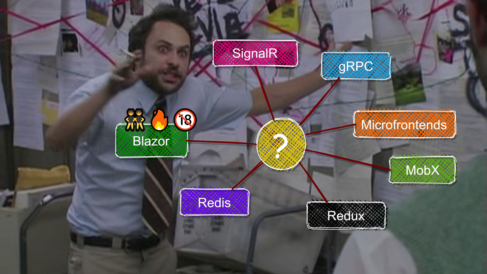

# Videos and Slides

## Videos

<a href="https://youtu.be/eMO7AmI6ui4" style="text-decoration: none;">

ActualLab.Fusion Video

</a>

<a href="https://youtu.be/vwm1l8eevak" style="text-decoration: none;">

ActualLab.Rpc Video

</a>

## Slides

<a href="https://alexyakunin.github.io/ActualLab.Fusion.Materials/Slides/Fusion_v2/Slides.html" style="text-decoration: none;">

"Why real-time web apps need Blazor and Fusion?" talk

</a>

This presentation explains how many problems Fusion tackles are connected, how Fusion addresses the root cause, and how to code a simplified version of Fusion's key abstraction in C#.

> **Note:** The slides are somewhat outdated (e.g., now Fusion clients use `ActualLab.Rpc` rather than HTTP to communicate with the server), but all the concepts they cover are still intact.
