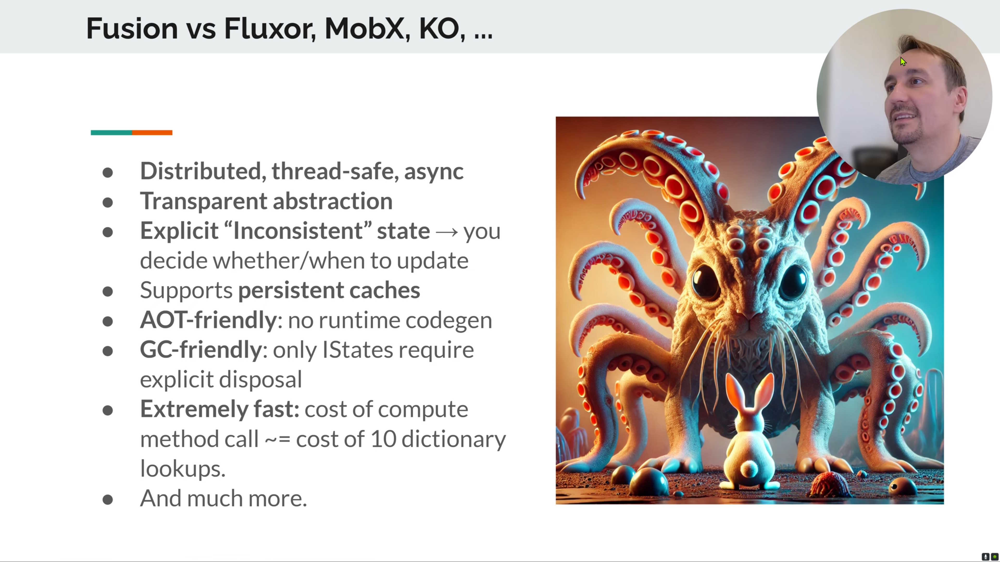
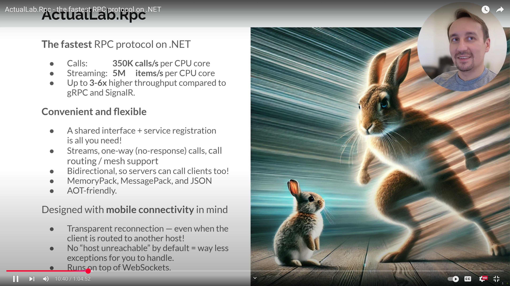
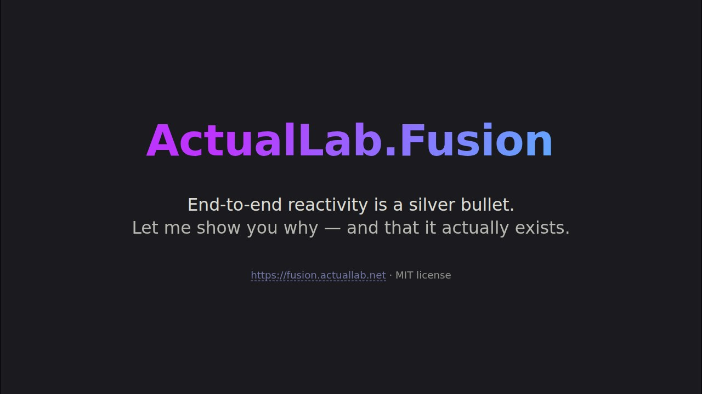
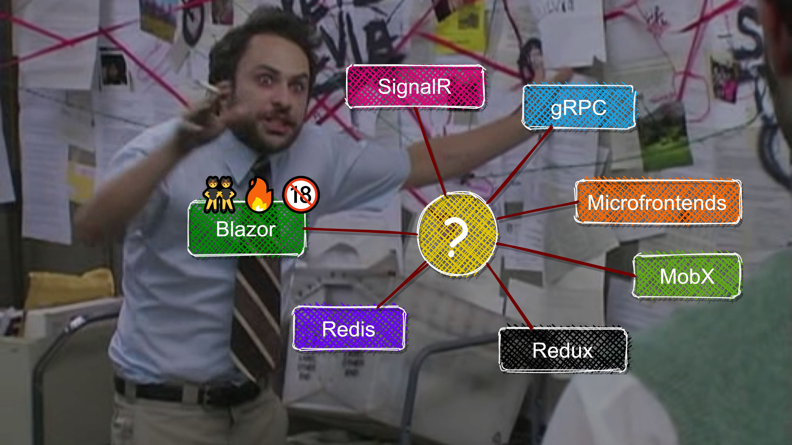
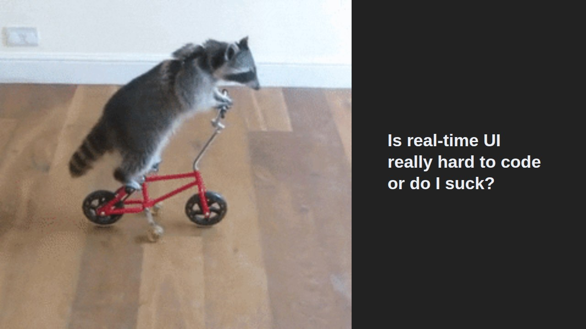

# Videos and Slides

## Videos

<a href="https://youtu.be/eMO7AmI6ui4" style="text-decoration: none;">

ActualLab.Fusion Video

</a>

<a href="https://youtu.be/vwm1l8eevak" style="text-decoration: none;">

ActualLab.Rpc Video

</a>

## Slides

<a href="/slides/fusion-intro/" target="_blank" rel="noopener" style="text-decoration: none;">

Fusion: End-to-End Reactivity is a Silver Bullet — latest (2026)

</a>

<a href="/slides-old/fusion-v2/" target="_blank" rel="noopener" style="text-decoration: none;">

Why real-time web apps need Blazor and Fusion? — late 2021

</a>

<a href="/slides-old/fusion-v1/" target="_blank" rel="noopener" style="text-decoration: none;">

Is real-time UI hard to code? — early 2021

</a>

The latest deck — **Fusion: End-to-End Reactivity is a Silver Bullet** — is the best starting point. It explains how the problems Fusion tackles are connected and how Fusion addresses their root cause, then walks through a range of C# examples — from simple to advanced — drawn from the [Voxt](https://voxt.ai/) codebase.

The two earlier decks are kept for historical reference. They predate `ActualLab.Rpc` (back then Fusion clients talked to the server over HTTP), but all the concepts they cover are still intact.
