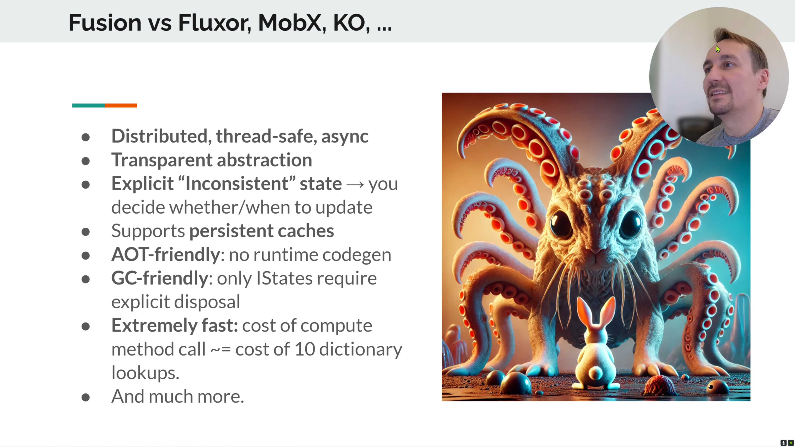
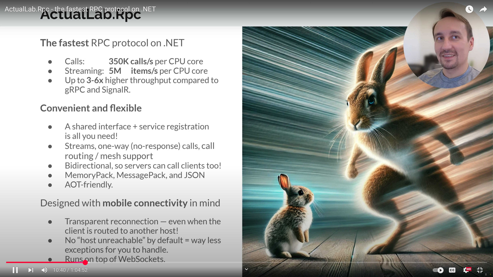
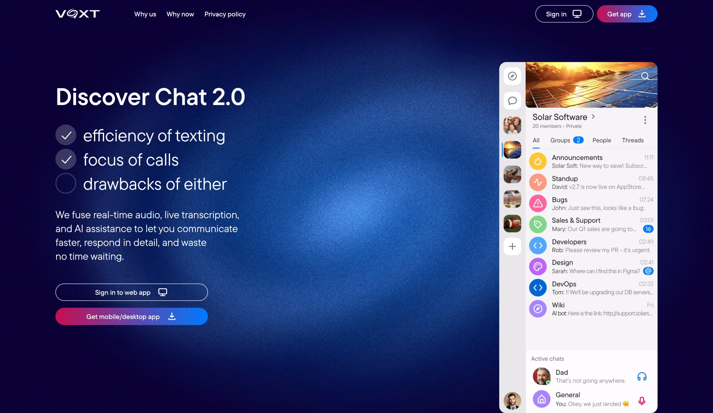

<style>
:root {
  --hl-rt: #c2410c;
  --hl-cache: #a16207;
  --hl-nocode: #0e7490;
  --hl-scale: #7c3aed;
  --hl-feat: var(--vp-c-text-1);
  --hl-mit: #15803d;
}
.dark {
  --hl-rt: #fb923c;
  --hl-cache: #fbbf24;
  --hl-nocode: #22d3ee;
  --hl-scale: #a78bfa;
  --hl-mit: #22c55e;
}
</style>

<div class="vp-doc" style="padding: 0 24px; max-width: 1152px; margin: 0 auto;">

<!-- Badges -->
<div align="center" style="margin-top: 2rem;">

[](https://github.com/ActualLab/Fusion/actions?query=workflow%3A%22Build%22)
[](https://www.nuget.org/packages?q=tags%3A%22actual_lab_fusion%22+Owner%3A%22Actual.chat%22)

[](https://www.nuget.org/packages?q=tags%3A%22actual_lab_fusion%22+Owner%3A%22Actual.chat%22)
[](https://voxt.ai/chat/s-1KCdcYy9z2-uJVPKZsbEo)

</div>

## See It In Action

<div style="display: flex; gap: 24px; flex-wrap: wrap; justify-content: center; margin: 2rem 0;">

<a href="https://youtu.be/eMO7AmI6ui4" style="text-decoration: none;">
<div style="text-align: center;">

<p style="margin-top: 8px; font-weight: 600;">ActualLab.Fusion Video</p>
</div>
</a>

<a href="https://youtu.be/vwm1l8eevak" style="text-decoration: none;">
<div style="text-align: center;">

<p style="margin-top: 8px; font-weight: 600;">ActualLab.Rpc Video</p>
</div>
</a>

<a href="https://github.com/ActualLab/Fusion.Samples" style="text-decoration: none;">
<div style="text-align: center;">

<p style="margin-top: 8px; font-weight: 600;">Fusion Samples</p>
</div>
</a>

<a href="https://voxt.ai" style="text-decoration: none;">
<div style="text-align: center;">

<p style="margin-top: 8px; font-weight: 600;">Voxt.ai - voice chat powered by Fusion</p>
</div>
</a>

</div>

## The Problem

Building real-time apps is **hard**. Traditional approaches force you into painful trade-offs:

- 🐢 **No cache = slow UI.** But caching brings the invalidation problem. Miss one case and users get stuck seeing stale data.
- 📚 **Real-time = a lot of extra code.** Design an update notification protocol, ensure UI subscribes only to relevant updates, apply them so the UI state stays eventually consistent with the ground truth... And that's just the client side!
- 🤯 **Complexity multiplies.** Each data type needs its own subscription groups, update messages, and client-side handlers. Reconnection? Re-negotiate everything, reconcile state. What starts as "just add SignalR" becomes thousands of lines of infrastructure.
- 🌋 **Platform-specific code multiplies it further.** We pair .NET servers with JS and mobile clients, all sharing the same data and the same complex logic for caching and real-time updates.

But if you think about it, **caching and real-time updates are facets of the same problem.**
Both require knowing **when something changes** and **who cares**.
Yet we treat them as separate concerns with separate infrastructure.

Fusion solves all of this:
- 🪄 Tracks dependencies automatically
- 🎯 Invalidates precisely what it should
- 📡 Propagates invalidations to everyone who cares, including remote clients
- 🤗 Works identically everywhere, turning your server farm, mobile apps, and web clients into a single distributed dependency graph.

**The best part: you get all of this without turning your code into a mess.**
You can think of Fusion as a *call middleware* or a *decorator*. 
That's why Fusion-based code looks as if there is no Fusion at all!
So you can *focus on building your app and ship faster* — and save yourself from dealing with a 2–3× larger codebase
and a plethora of "why is it stale?" bugs, which are among the hardest to debug.

## Performance That Changes Everything

Fusion doesn't just add real-time—it makes your app **thousands of times faster**.

### Fusion Compute Services

| Scenario | Without Fusion | With Fusion | Speedup |
|----------|----------------|-------------|---------|
| Local service, minimal writes | 38.6K calls/s | **313.8M calls/s** | <span style="color: #22c55e; font-weight: bold;">8,127x</span> |
| Local service, continuous writes | 135.4K calls/s | **266.6M calls/s** | <span style="color: #22c55e; font-weight: bold;">1,968x</span> |
| Remote service, continuous writes | 100.7K calls/s (REST) | **226.7M calls/s** | <span style="color: #22c55e; font-weight: bold;">2,251x</span> |

<p style="font-size: 0.85em; color: #666; margin-top: 0.5rem;">
Benchmarks on AMD Ryzen 9 9950X3D. See <a href="/Performance">full benchmark details</a>.
</p>

### ActualLab.Rpc vs Alternatives

| Framework | RPC Calls/sec | Streaming Items/sec |
|-----------|---------------|---------------------|
| **ActualLab.Rpc** | **9.33M** | **101.17M** |
| SignalR | 5.30M | 17.17M |
| gRPC | 1.11M | 39.59M |
| **Speedup** | <span style="color: #22c55e; font-weight: bold;">1.8..8.4x</span> | <span style="color: #22c55e; font-weight: bold;">2.6..5.9x</span> |

<p style="font-size: 0.85em; color: #666;">
8.4x faster than gRPC for calls. 5.9x faster than SignalR for streaming.
</p>

## How It Works: The MSBuild/Make Analogy

Think of Fusion as **MSBuild for data processed by your backend, API, and even client-side UI**:

- **Targets** = Method calls like `GetUser(userId)`
- **Artifacts** = Method call results (cached values)
- **Dependencies** = Other method call results acquired during method execution
- **Incremental builds** = When you request a result, only outdated parts recompute

<AnimatedSvg src="/img/call-graph-computation.svg" alt="Animated diagram showing Fusion computing and caching a dependency graph" :duration="10" :restart-delay="5" max-width="750px" />

When `GetThumbnail(imgId, 64)` is invalidated, the invalidation **cascades immediately**:

<AnimatedSvg src="/img/call-graph-invalidation.svg" alt="Animated diagram showing invalidation cascading from GetThumbnail up through GetUserAvatar to GetUserProfile" :duration="10" :restart-delay="5" max-width="750px" />

Next request for `GetUserProfile(3)` triggers **partial recomputation** —
only the affected parts recompute, while `GetUser(3)` is served from cache:

<AnimatedSvg src="/img/call-graph-recomputation.svg" alt="Animated diagram showing partial recomputation: GetUser served from cache, GetThumbnail and GetUserAvatar recomputed" :duration="10" :restart-delay="5" max-width="750px" />

The **invalidation is always immediate and cascading**: when you invalidate a given call,
its dependency sub-graph is also invalidated, including remote dependencies.

But **invalidation doesn't imply immediate recomputation**:
the recomputation typically happens later, when the call is repeated,
typically in a UI component.
But old cached values wrapped into `Computed<T>` instances remain accessible indefinitely,
so UI can keep displaying them as long as it needs to (while updates are in progress or even later).

**The dependency graph updates automatically** as your methods call each other or when invalidation occurs,
so typically you don't even need to know it exists.

This is exactly how incremental builds work: you mark targets as dirty by removing them,
but they only rebuild when you run the build, and every artifact that's still consistent is reused.

### What Gets Cached

Fusion tracks one `Computed<T>` per each **(service, method, arguments)** combination
in a `WeakMap`-style structure &mdash; invalidation evicts the entry,
so the next call recomputes it, while unrelated entries stay cached:

<AnimatedSvg src="/img/computed-caching.svg" alt="Animated diagram showing how Fusion caches one Computed value per unique method-arguments pair, with invalidation and recomputation" :duration="14" :restart-delay="5" max-width="900px" />

### The Distributed Picture

The same dependency graph extends across network boundaries &mdash;
invalidation cascades from backend to client, then recomputation flows
back from client to backend, reusing every node that's still consistent:

<AnimatedSvg src="/img/distributed-graph.svg" alt="Animated diagram showing Fusion's distributed dependency graph across Client, API Server, and Backend — invalidation cascades right-to-left, recomputation flows left-to-right reusing cached nodes" :duration="18" :restart-delay="5" max-width="850px" />

## See The Code

A Fusion service looks almost identical to a regular service:

```csharp
public class UserService(IServiceProvider services) : DbServiceBase<AppDbContext>(services), 
    IComputeService // A tagging interface that enables [ComputeMethod] and other Fusion features
{
    [ComputeMethod] // Also has to be virtual
    public virtual async Task<User?> GetUser(long id, CancellationToken cancellationToken = default)
    {
        // Fusion services are thread-safe by default, but DbContext is not, 
        // so we can't use shared DbContext instance here.
        // That's why we use DbHub, which provides DbContext-s on demand and pools them.
        await using var dbContext = await DbHub.CreateDbContext(cancellationToken);
        return await dbContext.Users.FindAsync([id], cancellationToken);
    }

    [ComputeMethod] // Also has to be virtual
    public virtual async Task<UserProfile> GetUserProfile(long id, CancellationToken cancellationToken = default)
    {
        // Calls other compute methods - dependencies tracked automatically
        var user = await GetUser(id, cancellationToken);
        var avatar = await GetUserAvatar(id, cancellationToken);
        return new UserProfile(user, avatar);
    }

    // Regular method
    public async Task UpdateUser(long id, User update, CancellationToken cancellationToken = default)
    {
        await using var dbContext = await DbHub.CreateDbContext(readWrite: true, cancellationToken);
        var user = await dbContext.Users.FindAsync([id], cancellationToken);
        user!.ApplyUpdate(update);
        await dbContext.SaveChangesAsync(cancellationToken);

        using (Invalidation.Begin()) { // Invalidation block
            _ = GetUser(id, default); // Invalidate GetUser(id), this call completes synchronously w/o actual evaluation
        }
    }
}
```

**That's it.** No event buses. No cache managers. No subscription tracking.

## Real-Time UI in Blazor

Fusion provides `ComputedStateComponent<T>`, which has a `State` property —
a `ComputedState<T>` instance that holds the latest result of the `ComputeState` call.
Any `ComputedState<T>` is essentially a compute method + update loop,
so it invalidates when any dependency of its last computation gets invalidated,
and recomputes after a short delay (configurable via `GetStateOptions`).

When `State` gets recomputed, `StateHasChanged()` is called and the component re-renders.

```razor
@inherits ComputedStateComponent<UserProfile>
@inject IUserService UserService

<div class="profile">
    <h1>@State.Value.Name</h1>
    <p>@State.Value.Bio</p>
    <span>Posts: @State.Value.PostCount</span>
</div>

@code {
    [Parameter] public long UserId { get; set; }

    protected override Task<UserProfile> ComputeState()
        => UserService.GetUserProfile(UserId);
}
```

## Why Developers Choose Fusion

<div style="display: grid; grid-template-columns: repeat(auto-fit, minmax(280px, 1fr)); gap: 1.5rem; margin: 2rem 0;">

<div style="padding: 0 1.5rem 0.5rem; background: linear-gradient(135deg, #667eea 0%, #764ba2 100%); border-radius: 8px; color: white;">

### 🚀 Ship Faster

Skip building real-time and caching infrastructure.
Add `[ComputeMethod]` to your existing services and get both for free.

</div>

<div style="padding: 0 1.5rem 0.5rem; background: linear-gradient(135deg, #667eea 0%, #764ba2 100%); border-radius: 8px; color: white;">

### 🌱 Start Small, Go Big

Same service code works for a single Blazor app or a distributed cluster. Going from prototype to planet-scale is almost a flip of a switch.

</div>

<div style="padding: 0 1.5rem 0.5rem; background: linear-gradient(135deg, #667eea 0%, #764ba2 100%); border-radius: 8px; color: white;">

### 🏔️ 10⁶ Scale Headroom

With 10,000x faster services, just 100 sharded servers give you a million-fold scale headroom.

</div>

<div style="padding: 0 1.5rem 0.5rem; background: linear-gradient(135deg, #667eea 0%, #764ba2 100%); border-radius: 8px; color: white;">

### 🐛 Fewer Bugs

No more "it's stale — find out why" debugging sessions.
Automatic dependency tracking ensures dependents update when something changes.

</div>

<div style="padding: 0 1.5rem 0.5rem; background: linear-gradient(135deg, #667eea 0%, #764ba2 100%); border-radius: 8px; color: white;">

### 💻 No (Micro)Service Zoo

Your services run locally or distributed with zero changes. No complex dependencies. AI agents can debug your code by running E2E tests right on your laptop. Or in Docker.

</div>

<div style="padding: 0 1.5rem 0.5rem; background: linear-gradient(135deg, #667eea 0%, #764ba2 100%); border-radius: 8px; color: white;">

### 💎 Clean Code

Your code stays focused on business logic, Fusion handles the rest.
Forget about the boilerplate for real-time updates or cache invalidation.

</div>

</div>

<div style="background: var(--vp-c-bg-alt); border: 1px solid var(--vp-c-border); border-radius: 12px; padding: 0 2rem 0.5rem; margin: 2rem 0;">

### <span style="background: linear-gradient(135deg, #667eea 0%, #764ba2 100%); -webkit-background-clip: text; -webkit-text-fill-color: transparent; background-clip: text;">Built & Battle-Tested at Voxt.ai</span>

[**Voxt**](https://voxt.ai) is a real-time chat app built by the creators of Fusion. It features:

- 🎙️ **Real-time audio** with 🔤 live transcription, 🌐 translation, 📝 AI summaries, and much more
- 📱 **Clients for WebAssembly, iOS, Android, and Windows**
- 💰 **~100% code sharing** across all platforms
- ✈️ **Offline mode** powered by Fusion's persistent caching.

Check out how it works at [Voxt.ai](https://voxt.ai/mchat/s-1KCdcYy9z2-uJVPKZsbEo),
or reach out to [Alex Y. @ Voxt.ai](https://voxt.ai/u/@alex-yakunin) if you want to chat in real time.
Fusion handles everything related to real-time there.

</div>

## Get Started in Minutes

### 1. Install the Package

```bash
dotnet add package ActualLab.Fusion
```

### 2. Register Your Services

```csharp
services.AddFusion().AddService<UserService>(); // UserService must "implement" tagging IComputeService
```

### 3. Add [ComputeMethod] to Your Methods

```csharp
[ComputeMethod]
public virtual async Task<User> GetUser(long id) { ... }
```

**That's the entire setup.** Your service now has automatic caching, dependency tracking, and real-time invalidation.

<div style="display: flex; gap: 1rem; flex-wrap: wrap; margin: 2rem 0;">

<a href="/PartF" style="display: inline-block; padding: 0.875rem 1.75rem; background: #3451b2; color: white; border-radius: 8px; font-weight: 600; text-decoration: none;">Documentation →</a>

<a href="https://github.com/ActualLab/Fusion.Samples" style="display: inline-block; padding: 0.875rem 1.75rem; background: #f3f4f6; color: #374151; border-radius: 8px; font-weight: 600; text-decoration: none;">Samples →</a>

</div>

## Join the Community

Questions? Want to see how others use Fusion? Join the discussion:

<div style="display: flex; gap: 1rem; flex-wrap: wrap; align-items: center; margin: 1.5rem 0;">

<a href="https://voxt.ai/chat/s-1KCdcYy9z2-uJVPKZsbEo" style="display: inline-flex; align-items: center; gap: 0.5rem; padding: 0.75rem 1.25rem; background: #BE145B; color: white; border-radius: 6px; font-weight: 500; text-decoration: none;">
💬 Fusion @ Voxt
</a>

<a href="https://github.com/ActualLab/Fusion" style="display: inline-flex; align-items: center; gap: 0.5rem; padding: 0.75rem 1.25rem; background: #24292e; color: white; border-radius: 6px; font-weight: 500; text-decoration: none;">
⭐ Star on GitHub
</a>

</div>

## Credits

Indirect contributors & everyone else who made Fusion possible:

- [ServiceTitan](https://www.servicetitan.com) &ndash; Fusion was originally created there.
- [Quora](https://www.quora.com) &ndash; a huge part of the inspiration for Fusion was Quora's LiveNode framework
- GitHub contributors: [alexyakunin](https://github.com/alexyakunin), [crui3er](https://github.com/crui3er), [alexis-kochetov](https://github.com/alexis-kochetov), [frolyo](https://github.com/frolyo), [iqmulator](https://github.com/iqmulator), [hypercodeplace](https://github.com/hypercodeplace), [AlexUstinov](https://github.com/AlexUstinov), [wdichler](https://github.com/wdichler), [AliveDevil](https://github.com/AliveDevil), [timeshift92](https://github.com/timeshift92), [maheshwariST](https://github.com/maheshwariST), [adampaquette](https://github.com/adampaquette), [Tyrrrz](https://github.com/Tyrrrz), [riesvriend](https://github.com/riesvriend), and others.

**ActualLab.Fusion** is developed by the creators of [Voxt](https://voxt.ai)
and is the successor of [Stl.Fusion](https://github.com/servicetitan/Stl.Fusion), originally created at [ServiceTitan](https://www.servicetitan.com).
Check out [The Story Behind Fusion](Story.md) to learn more about its origins.

</div>
