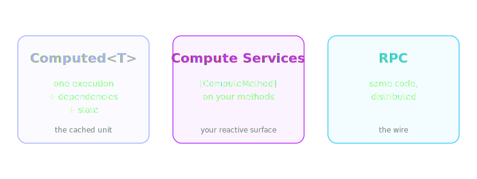
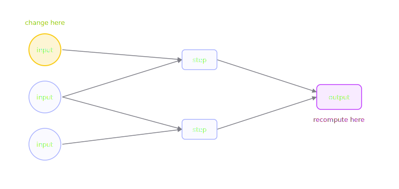
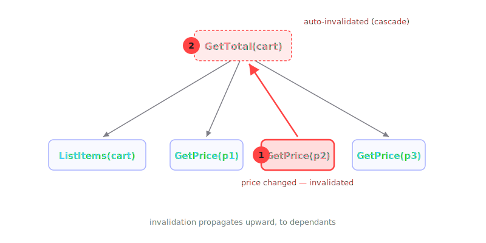
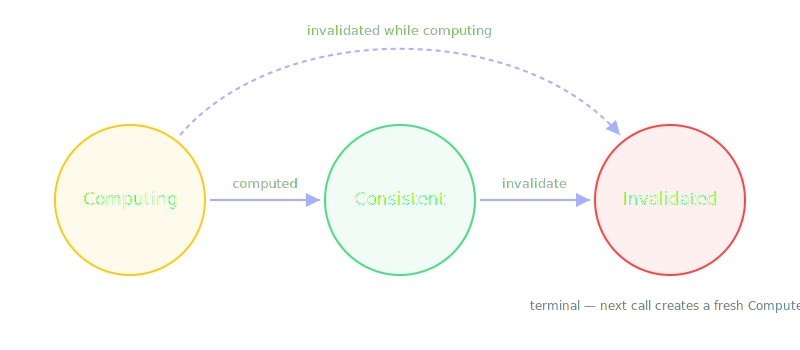
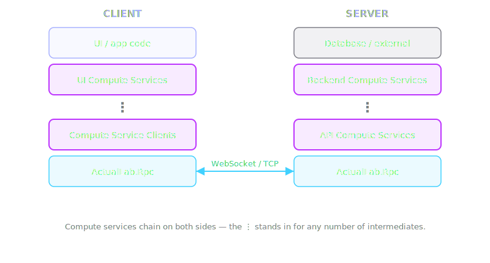
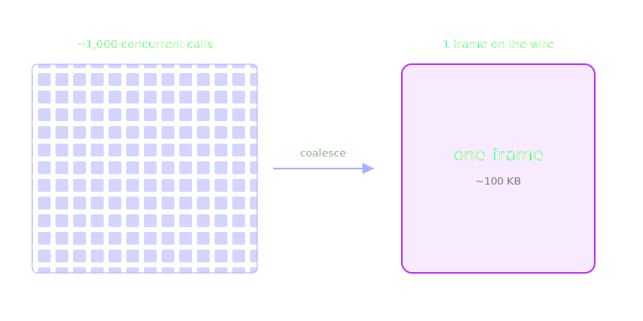
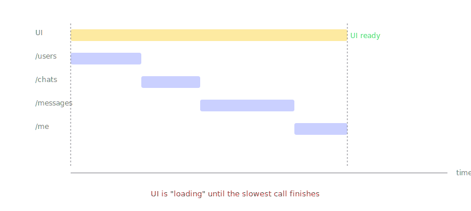
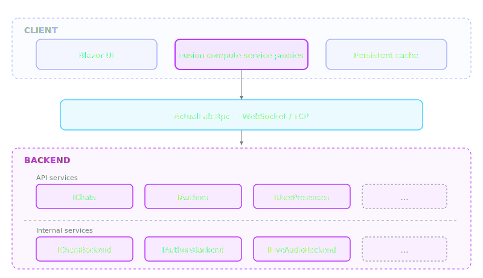
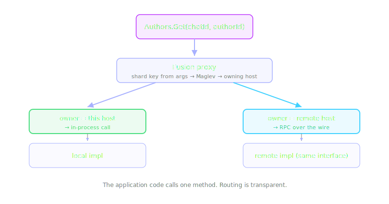

# Welcome to Fusion

<div class="pt-12 opacity-80">
  Real-time updates and caching for any .NET app — with almost no code changes.
</div>

<div class="pt-3 text-sm opacity-60">
  10⁶ scale headroom · production-proven · MIT license
</div>

---

# What we'll cover

1. **How it works** — Computed&lt;T&gt;, compute services, RPC
2. **Why it wins** — speculative execution, batching, the comparisons
3. **In production** — patterns from ActualChat

<!--
~60 min. Stop me with questions.
-->

---
layout: section
---

# Part 1
## How Fusion works

---

# What is Fusion?

A library that turns ordinary C# methods into **dependency-tracked, auto-invalidating, distributable computations.**

Three pillars:

- **Computed&lt;T&gt;** — the cached result with state
- **Compute Services** — your methods, made reactive
- **RPC** — the distributed wire

---

# Three pillars at a glance



---

# The mental model

> Like <span style="color: #41d1ff">**MSBuild**</span> — but for application state.

- A method invocation is a build target.
- Its dependencies form a DAG, captured automatically.
- When inputs change, dependants are marked dirty — not recomputed eagerly.

---

# Incremental compute, applied to state



<div class="text-sm opacity-60 mt-4">
A change at the root propagates to dependants; recompute happens lazily, only for what you ask for.
</div>

---

# Why this isn't "just a cache"

- A cache stores values; **Fusion tracks the graph** that produced them.
- Invalidation isn't TTL-based — it follows real dependencies.
- The same primitive powers caching, change-feeds, and reactive UI.

---
layout: section
---

# Computed&lt;T&gt;

---

# Computed&lt;T&gt; in one slide

An immutable record of "one execution of one method call":

- the arguments, the result, and the **dependencies** it touched
- a **consistency state** (Computing / Consistent / Invalidated)
- **dependants** — other Computeds that used this one

---

# The DAG forms automatically

```csharp
[ComputeMethod]
public virtual async Task<int> GetTotal(CartId id, CancellationToken ct) {
    var items = await ListItems(id, ct); // !!!
    var subtotal = 0;
    foreach (var i in items)
        subtotal += await GetPrice(i.ProductId, ct); // !!!
    return subtotal;
}
```

`GetTotal` now depends on `ListItems` and each `GetPrice`. No annotations.

---

# Visualized


---

# Invalidation cascades

When **any** node in the DAG is invalidated, all dependants invalidate too.

- Cascading is immediate (synchronous bookkeeping).
- Recomputation is lazy — only when somebody asks for the value again.
- Old invalidated instances stay accessible — UI keeps rendering stale data while fresh data is in flight.

---

# Cascade in pictures



---

# Three consistency states



---

# Computing

The method is currently running.

- The Computed instance exists, but the value isn't set yet.
- It's collecting dependencies as it executes.

---

# Consistent

Method finished. Value is current.

- Subsequent calls with the same arguments are resolved to value of this Computed — **no recompute**.
- This is "the cache hit" in everyday terms.

---

# Invalidated

The Computed knows it might be stale.

- Next call recomputes (lazily).
- UI can still read the last value while the new one is being computed.
- All dependants get invalidated synchronously — unless they are remote.

---
layout: section
---

# Compute Services

---

# The [ComputeMethod] attribute

```csharp
public class CounterService : ICounterService {
    [ComputeMethod] // !!!
    public virtual Task<int> Get(string key, CancellationToken ct)
        => Task.FromResult(_counters.GetValueOrDefault(key, 0));
}
```

- `IComputeService` marks compute services, directly or through your service interface.
- Class methods must be `virtual` / `override` and return `Task` / `ValueTask`.
- Calls are intercepted by a Fusion-generated proxy (next slide).

---

# ... and a DI registration

```csharp
// Server:
services.AddFusion().AddServer<ICounterService, CounterService>();

// Client:
services.AddFusion().AddClient<ICounterService>();
```

- `AddClient` / `AddServer` make the role **explicit**.
- `AddService` is a shortcut — the builder's `RpcServiceMode` decides local / client / server / distributed.
- DI hands out the **proxy** wherever you inject `ICounterService`.

---

# Fusion or plain RPC?

```csharp
// Pure RPC — typed remote calls, no caching:
services.AddRpc().AddClient<IFileTransfer>();

// Fusion compute service — same shape, plus caching + invalidation:
services.AddFusion().AddClient<ICounterService>();
```

- Same `AddClient` / `AddServer` shape on both builders.
- The Fusion proxy uses a **different interception chain** — compute calls get wrapped in a `Computed<T>`.
- Reach for `Rpc` for typed remote calls; reach for `Fusion` to make them cached and reactive.

---

# What gets registered

For a class-backed service, Fusion swaps your implementation for a **proxy** that subclasses it.

- `CounterService` → `CounterServiceProxy : CounterService`
- The proxy **overrides interceptable async-returning virtual methods**.
- Each override routes through an interceptor before calling `base`.

You inject `ICounterService` — DI hands you the proxy.

---

# Inside the proxy

What the source generator emits (simplified):

```csharp
public override Task<int> Get(string key, CancellationToken ct) {
    var intercepted = args => base.Get(key, ct);
    var invocation = new Invocation(
        this, __cachedMethod, ArgumentList.New(key, ct), intercepted);
    return __interceptor.Intercept<Task<int>>(invocation); // !!!
}
```

- One generated file per service — at compile time, no IL emit.
- The interceptor owns the caching / dependency tracking / invalidation.

---

# Invalidating: the Invalidation block

```csharp
public void Increment(string key) {
    _counters.AddOrUpdate(key, 1, (_, v) => v + 1);
    using (Invalidation.Begin()) // !!!
        _ = Get(key, default);
}
```

- Calls inside the block don't execute — they only mark cached values invalid.
- Selective: invalidate exactly the calls whose results actually changed.

---

# What you got for free

- **Caching** — same `(service, method, args)` → cached `Computed<T>`, no recompute
- **Change notifications** — `Computed.WhenInvalidated()`
- **Cross-thread safety** — Computed is immutable
- **Composition** — call other compute methods, dependencies just work

---

# Trying it out

```csharp
public class Stats : IComputeService {
    [ComputeMethod]
    public virtual async Task<bool> IsEven(string key, CancellationToken ct)
        => (await counter.Get(key, ct)) % 2 == 0;
}

await stats.IsEven("hits", default);   // true; Get and IsEven both cache
counter.Increment("hits");              // !!! cascade: Get AND IsEven invalidate
await stats.IsEven("hits", default);   // false; whole chain recomputes
```

The dependant recomputes — not because we asked it to, but because `Get` changed.

---
layout: section
---

# State&lt;T&gt;

---

# What is State?

A `State<T>` is the **current Computed** for a value.

- `IState<T>` — the base interface; read-side API only.
- `IMutableState<T>` — wraps a plain value; set `Value` to update.
- `IComputedState<T>` — auto-runs a compute function; re-runs on dependency invalidation.

---

# Quick example

```csharp
var states = services.StateFactory();
var name = states.NewMutable("Anonymous");

name.Value = "Alice";   // !!! invalidates old Computed, creates new one

await name.Computed.When(v => v == "Bob");
```

`When(...)` waits until the predicate matches a fresh Computed.

---

# States stay thread-safe

`name.Value = "Alice"` doesn't write to the value in place — it **swaps in a new `Computed<T>`**.

- `state.Computed` always returns an immutable snapshot.
- Many threads can read concurrently — no locks, no races.
- The "mutation" is a single atomic reference swap.

The same is true for `ComputedState` — every auto-update produces a fresh Computed.

---

# ComputedState for auto-update

```csharp
var cs = states.NewComputed<int>(async (_, ct) =>
    await counter.Get("hits", ct));

cs.Updated += (s, _) => Console.WriteLine(s.Value); // !!!
```

- **Unlike a compute method, this runs its own update loop.**
- Re-runs whenever a dependency invalidates.
- Update delay is configurable (debounce, instant-on-action).

---

# Auto-update lives in the UI

Most reactive frameworks auto-update **every** piece of state, everywhere.

In Fusion:

- Compute methods stay **lazy** — they recompute only when asked.
- `ComputedState` — the auto-updater — sits at the **UI edge**.
- A backend compute refreshes only when something is **observing** it: a rendered UI plus everything in its dependency chain.

Auto-updating everything on a server doesn't scale; Fusion makes that asymmetry the default.

---

# In Blazor

`ComputedStateComponent<T>` re-renders when its computed value updates.

```csharp
public class HitCounter : ComputedStateComponent<int> {
    [Inject] ICounterService Service { get; set; } = default!;
    protected override Task<int> ComputeState(CancellationToken ct) // !!!
        => Service.Get("hits", ct);
}
```

The component is reactive — no `StateHasChanged` calls.

---

# State recap

- States solve **"what is the latest Computed for X?"**
- Two concrete flavors: mutable (you set the value) and computed (auto-runs).
- They bridge Computed&lt;T&gt; and UI / event loops.

---
layout: section
---

# RPC and distribution

---

# Same code, now distributed

```csharp
public interface ICounterService : IComputeService {
    [ComputeMethod]
    Task<int> Get(string key, CancellationToken ct);
}
```

- Server: a concrete `CounterService : ICounterService`.
- Client: Fusion generates a proxy that calls over RPC.
- **Same method signature on both sides.**

---

# Where RPC fits



---

# Wiring it up — server

```csharp
services.AddFusion()
    .AddService<ICounterService, CounterService>();
```

---

# Wiring it up — client

```csharp
services.AddFusion()
    .Rpc.AddClient<ICounterService>();
```

The client gets a proxy implementing `ICounterService`. UI code calls it as if it were local.

---

# What RPC brings

- **Auto-batching** — many calls → one frame
- **Formats** — MessagePack, MemoryPack, System.Text.Json, custom
- **`RpcStream<T>`** — typed streams, backpressure, both ways
- **Invalidation over the wire** — no polling
- **Reconnection & state recovery** — built-in
- **One-way & server-to-client calls** — and way more

> The **fastest** RPC on .NET — by a wide margin.

---
layout: section
---

# Part 2
## Why Fusion

---
layout: section
---

# How calls fly

---

# Auto-batching



Many concurrent calls in the same tick → coalesced into **one frame** on the wire.

---

# Persistent cache on the client


- Remote compute-method calls go through a **client-side cache** first.
- Any `IRemoteComputedCache` — localStorage, IndexedDB, SQLite, …
- Cached value is returned **immediately**; refresh happens in the background.

---

# Cache-match responses

```
Client → Server:  GetUser(42),  header  "#": "8a3f…e91"
Server → Client:  match.        (no body)
```

- The background RPC carries only the **hash** of the cached value.
- Server replies with a tiny **"match"** when the hash is still current.
- Only on **mismatch** does a fresh value travel — and the old `Computed` invalidates.

---
layout: section
---

# Speculative execution

---

# Traditional UI on startup



- Each component awaits its data before rendering.
- UI sits empty until the slowest call finishes.

---

# Fusion: the cache is an oracle

For every compute call the client has a **likely answer** already.

- Render the UI from cached values **right now**.
- The background RPC validates each call as a tiny hash compare.
- On mismatch: invalidate; the *next* render uses the fresh value.

---

# N+1 made instantaneous

"List the members of a chat, with their presence":

```
ListMemberIds(chatId)         📱⮂☁️
  GetMember(m_i)      × 20    📱⮂☁️
    GetPresence(m_i)  × 20    📱⮂☁️
```

- Cold start: 41 sequential round-trips.
- With the persistent cache: the dependency chain can unfold immediately — the wire carries tiny hash matches.

---

# What you get

- **Instant UI** — renders as if everything were local.
- **Normal-looking code** — no special calls, no manual cache.
- **Offline-capable** — cached values keep serving while the network is down.

---
layout: section
---

# Fusion vs the alternatives

---

# vs REST

REST is **pull**. Fusion is **sync**.

- REST clients must poll or run a parallel WebSocket layer.
- Fusion clients do nothing — updates arrive when something invalidates.
- One mental model for cache, real-time, and remote calls.

> Even the transport: ActualLab.Rpc alone is **~15× faster** than HTTP — 6.16 M vs 0.4 M calls/s.

---

# vs GraphQL

GraphQL: clients **describe** what they want.
Fusion: each component **calls** what it wants.

- No [DataLoader](https://github.com/graphql/dataloader) / N+1 boilerplate — caching is automatic.
- No schema-stitching service — your service interface is the schema.

---

# vs Redis / IDistributedCache

Redis: **TTL keys**. Fusion: **dependency invalidation**.

- No string keys to design or namespace.
- No cache-coherency bugs from forgetting to invalidate a key.
- Fusion turns *every* compute service into an efficient distributed cache — backed by the same invalidation graph.

---
layout: section
---

# Performance

---

# Compute services — local

**~20 M calls/s per core**, **~316 M calls/s** across cores (Ryzen 9 9950X3D, 32 logical cores).

- Cache hit cost ≈ a dictionary lookup, in-process.
- Redis baseline over the network: **~230 K calls/s** — **85× slower per core**.

---

# Compute services — over RPC

**~215 M calls/s** when the call hits the client cache.

- The wire only sees mismatches and cold starts.
- Versus a plain HTTP + DB baseline: **2,679×**.

---

# ActualLab.Rpc — raw calls

| | calls/s | vs ActualLab.Rpc |
|---|---:|---:|
| **ActualLab.Rpc** | **10.16 M** | 1× |
| SignalR | 5.31 M | 1.9× slower |
| gRPC | 1.29 M | **7.9× slower** |

Pure protocol throughput — no Fusion caching layer.

---

# ActualLab.Rpc — streams (1-byte items)

| | items/s | throughput |
|---|---:|---:|
| **ActualLab.Rpc** | **96.96 M** | 96.96 MB/s |
| gRPC | 43.78 M | 43.78 MB/s |
| SignalR | 18.30 M | 18.30 MB/s |

5.3× faster than SignalR; 2.2× faster than gRPC.

---

# ActualLab.Rpc — streams (100-byte items)

| | items/s | throughput |
|---|---:|---:|
| **ActualLab.Rpc** | **43.01 M** | **4.30 GB/s** |
| gRPC | 25.87 M | 2.59 GB/s |
| SignalR | 14.25 M | 1.43 GB/s |

3.0× faster than SignalR; 1.7× faster than gRPC at 100-byte payloads.

---

# Fusion vs Redis

| Workload | Fusion | Redis | Ratio |
|---|---:|---:|---:|
| Local cache hit (all cores) | 316 M/s | 0.23 M/s | **1,380×** |
| Remote, with client cache | 215 M/s | 0.23 M/s | **939×** |
| Raw RPC | 10 M/s | 0.23 M/s | **44×** |

Dependency tracking + in-process cache is fundamentally cheaper than a network hop to a KV store.

---
layout: section
---

# Part 3
## In production: Voxt

---

# Voxt at a glance

Voxt (formerly ActualChat) — text + voice + video + AI chat, built on Fusion end-to-end.

- Backend: distributed compute services.
- Frontend: Blazor with `ComputedStateComponent`.
- RPC: ActualLab.Rpc for both client↔server and server↔server.

---

# Service map



Three layers: Blazor UI + RPC client proxies on the client, ActualLab.Rpc on the wire, a mesh of compute services on the backend.

---
layout: section
---

# Call routing

---

# Why routing matters

A distributed Fusion service can call **its own methods** — and the proxy decides where each call lands.

- Some calls resolve to a **local** implementation on the same instance.
- Some get routed over RPC to the **remote** instance that owns the relevant shard.
- The application code doesn't change either way.

---

# Routing a single call



Each call carries a shard key (from its arguments). The router maps shard → host.

---

# Sharding & failover


- N shards per service; Maglev consistent-hash assigns shards to hosts.
- A host dies → its shards relocate; in-flight calls auto-reroute.

---
layout: section
---

# Patterns in code

---

# AddMembersBanner

```csharp
protected override async Task<bool> ComputeState(CancellationToken ct) {
    if (!_settings.WhenFirstTimeRead.IsCompleted)
        await _settings.WhenFirstTimeRead;
    if (!EditMembersUI.CanAddMembers(Chat)) return false;

    var dismissedAt = await _settings.Use(ct); // !!!
    if (dismissedAt.DismissedAt + DismissDuration > Clocks.ServerClock.Now)
        return false;

    var authorIds = await Authors.ListAuthorIds(Session, Chat.Id, ct);
    if (authorIds.Length > 1) return false;
    var ownerIds = await Roles.ListOwnerIds(Session, Chat.Id, ct);
    return !authorIds.Except(ownerIds).Any();
}
```

---

# AddMembersBanner — chain

```
📱 AddChatMembersBanner.ComputeState
  📱 _settings.Use            ← SyncedState<T>, server-synced
  📱⮂☁️ Authors.ListAuthorIds
  📱⮂☁️ Roles.ListOwnerIds
```

`SyncedState<T>` mirrors a server-side value and pushes local changes back — bidirectional sync, baked in.

---

# Self-invalidation

```csharp
protected override async Task<Moment?> ComputeState(CancellationToken ct) {
    var stopAt = await ChatAudioUI.GetStopListeningAt(ChatId, ct);
    if (!stopAt.HasValue) return null;

    var remaining = (stopAt.Value - Now).TotalSeconds;
    if (remaining > 30)
        Computed.GetCurrent().Invalidate(TimeSpan.FromSeconds(remaining - 30)); // !!!
    else if (remaining > 0) {
        var fractional = remaining - Math.Floor(remaining);
        var delay = fractional > 0.05 ? fractional : fractional + 1.0;
        Computed.GetCurrent().Invalidate(TimeSpan.FromSeconds(delay)); // !!!
    }
    return stopAt;
}
```

---

# Self-invalidation — the trick

- `Computed.GetCurrent()` reaches the **currently-running** `Computed<T>`.
- `.Invalidate(delay)` schedules its invalidation after `delay`.
- Used here for a smooth countdown — aligned to second boundaries, no timers, no polling.

---

# Priming — push values into the cache

```csharp
// On the backend service:
private readonly VersionedComputeMethodPrimer<ChatId, long, State> _listRawPrimer
    = new(ListRaw);

[ComputeMethod]
protected virtual async Task<State> ListRaw(ChatId chatId, CancellationToken ct) {
    if (_listRawPrimer.TryUsePrimed(chatId, out var primed)) // !!!
        return WithAutoInvalidation(primed);
    var state = await _redisScope.Get(chatId.Value)
                ?? await ReconstructFromChats(chatId, ct);
    return WithAutoInvalidation(state);
}

// On every write:
await _listRawPrimer.Prime(chatId, nextState.Version, nextState, ct); // !!!
```

The writer **pushes** the new value into the compute cache. The next reader hits the primer — no Redis round-trip, no race.

---

# State-sync workers

```csharp
private async Task InvalidateActiveChatDependencies(CancellationToken ct) {
    var changes = ActiveChatsUI.ActiveChats.Computed
        .ChangesUntyped(FixedDelayer.NoneUnsafe, ct);
    await foreach (var c in changes) {
        var activeChats = ((Computed<ActiveChat[]>)c).Value;
        var newRecording = activeChats.FirstOrDefault(x => x.IsRecording);
        var newListening = activeChats.Where(x => x.IsListening).ToHashSet();
        var changed = newListening.SymmetricExcept(_oldListening).ToList();
        using (Invalidation.Begin()) { // !!!
            if (newRecording != _oldRecording) _ = GetRecordingChatId();
            if (changed.Count > 0)             _ = GetListeningChatIds();
            foreach (var ch in changed)        _ = GetState(ch.ChatId);
        }
    }
}
```

A background worker subscribes to a Computed via `.Changes(...)` and translates value transitions into **targeted invalidations** — without polling.

---

# Pseudo-methods

```csharp
[ComputeMethod]
protected virtual Task<Unit> PseudoContactStartingFrom(char firstChar)
    => TaskExt.UnitTask;

[ComputeMethod]
public virtual async Task<Contact?> GetContact(ContactId id, CancellationToken ct) {
    var contact = await ReadFromDb(id, ct);
    if (contact != null)
        await PseudoContactStartingFrom(char.ToUpper(contact.Name[0])); // !!!
    return contact;
}
```

---

# Pseudo-methods — why

- Want to invalidate "all contacts whose name starts with **A**"?
- You can't enumerate every cached `GetContact(id)` to find which ones qualify.
- One `Invalidate(PseudoContactStartingFrom('A'))` cascades to all of them — because each `GetContact` registered its membership on that pseudo node.

---

# ConsolidationDelay — a filter, not a debounce

```csharp
[ComputeMethod(MinCacheDuration = 60, ConsolidationDelay = 0.01)]
Task<AccountFull> GetOwn(Session session, CancellationToken ct);
```

When the source invalidates:

1. Wait `ConsolidationDelay`.
2. Recompute the source.
3. Compare with the old value.
4. **Same → swallow the invalidation. Different → propagate.**

Filters out invalidations that don't change the result. Debouncing is the separate `InvalidationDelay`.

---

# Patterns at scale

- **SyncedState** — bidirectional client↔server state binding.
- **Self-invalidation** — methods that schedule their own re-runs.
- **Priming** — writers push fresh values into the cache.
- **State-sync workers** — watch computed values, fan out targeted invalidations.
- **Pseudo-methods** — single fan-out handles for unenumerable cascades.
- **`ConsolidationDelay`** — suppress no-op invalidations from propagating.

All built on Fusion's primitives. Nothing extra to install.

---
layout: section
---

# Wrap-up

---

# What we covered

- **Part 1**: Computed&lt;T&gt;, compute services, RPC.
- **Part 2**: speculative execution, batching, Fusion vs everything else.
- **Part 3**: real patterns from a production codebase.

The same primitive — a tracked computation — powers all of it.

---

# What we didn't cover

- **CommandR** — CQRS-style command pipeline above compute methods.
- **Operations Framework** — durable commands, event sourcing, distributed locking.
- **EF Core integration** — `DbContext`-aware compute services, invalidate-on-commit.
- **Fusion for TypeScript** — the same model on the JS side.
- **Auth, AOT, computed options, core utilities, …** — and much more.

---

# Resources

- **Docs**: https://fusion.actuallab.net
- **Samples**: https://github.com/ActualLab/Fusion.Samples
- **Source**: https://github.com/ActualLab/Fusion
- **Fusion Place at Voxt**: https://voxt.ai/chat/s-1KCdcYy9z2-uJVPKZsbEo

---
layout: end
---

# Questions
