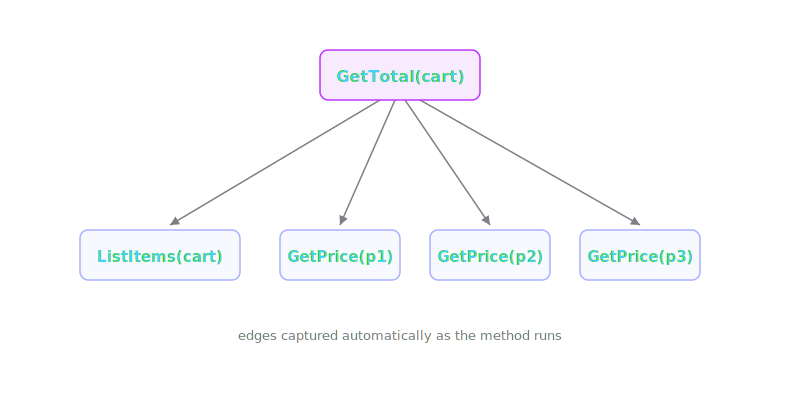
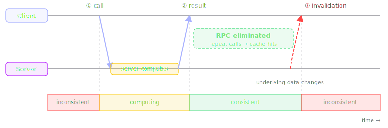
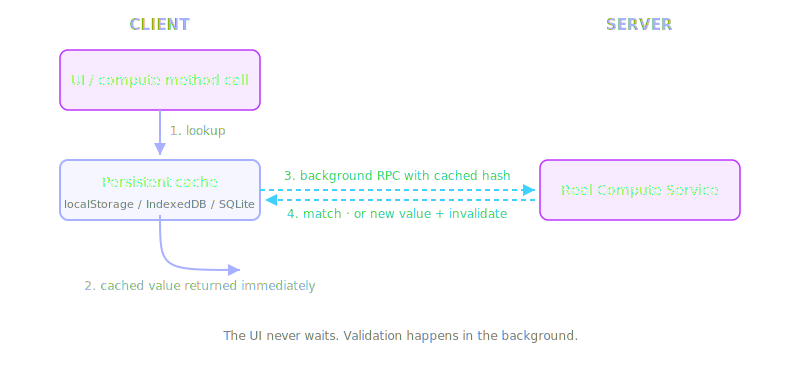
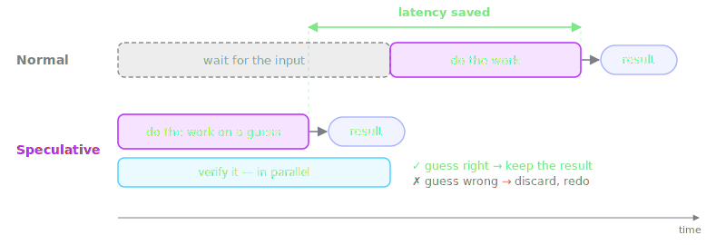
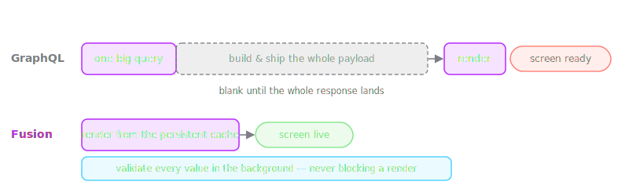
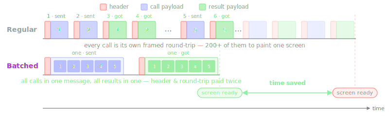
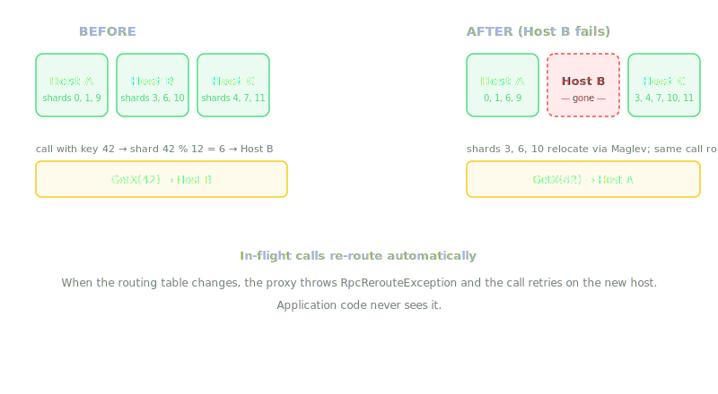

# ActualLab.Fusion

<div class="text-2xl">
End-to-end reactivity is a silver bullet.
</div>

<div class="text-2xl opacity-80">
Let me show you why — and that it actually exists.
</div>

<div class="pt-10 text-sm opacity-60">
<a href="https://fusion.actuallab.net">https://fusion.actuallab.net</a> · MIT license
</div>

---
layout: quote
---
# Let's get straight to the point

## No theory up front. We start with code.

---
layout: section
---

# Part 1
## Code first — Example 1: a TODO app

---

# Where one render leads

A Blazor component renders one todo item. Follow the call down to the database:

```text
TodoItemView.ComputeState(ct)            a Blazor component
  │
  └─▶ Todos.Get(id)                      a UI-side service
        ┊
        ┊  ══ RPC #1 ══▶                 the UI calls the API
        ┊
        └─▶ TodoApi.Get(session, id)     the API service
              │
              ├─ ══ RPC #2 ══▶ auth.GetUser(session)       the auth service
              │
              └─ ══ RPC #3 ══▶ TodoBackend.Get(scope, id)  the backend service
                               │
                               └─▶  database
```

One render, three RPCs, three services. The code for each is next — top to bottom.

---

# The component

```csharp {7-8}
// A Blazor component. It shows one todo item — and keeps it live.
public class TodoItemView : ComputedStateComponent<TodoItem?>
{
    [Parameter] public Ulid Id { get; set; }
    [Inject] Todos Todos { get; set; } = null!;

    protected override Task<TodoItem?> ComputeState(CancellationToken ct)
        => Todos.Get(Id, ct);
}
```

`ComputeState` runs to produce `State.Value`; the markup just shows it. That is the whole component.

---

# The UI service

```csharp {6}
// A UI-side service. On the client, todoApi calls the server over RPC.
public class Todos(Session session, ITodoApi todoApi) : IComputeService
{
    [ComputeMethod]
    public virtual Task<TodoItem?> Get(Ulid id, CancellationToken ct)
        => todoApi.Get(session, id, ct);      // !!! the call that crosses the wire
}
```

A thin wrapper. That one line — `todoApi.Get` — is where the UI reaches the server.

---

# The API service

```csharp {7,13}
public class TodoApi(IAuth auth, ITodoBackend backend) : ITodoApi
{
    [ComputeMethod]
    public virtual async Task<TodoItem?> Get(Session session, Ulid id, CancellationToken ct)
    {
        var scope = await GetScope(session, ct);  // resolves the user — see below
        return await backend.Get(scope, id, ct);  // !!! RPC to the backend
    }

    // Resolve the user, derive the data scope they're allowed to see.
    async ValueTask<string> GetScope(Session session, CancellationToken ct)
    {
        var user = await auth.GetUser(session, ct);  // !!! RPC to the auth service
        return user != null ? $"user/{user.Id}" : "global";
    }
}
```

`auth.GetUser` and `backend.Get` are separate services — **each call is its own RPC.** One `Get`, two more round-trips.

---

# The backend service

```csharp {7}
// The backend service. It owns the data; it talks to the DB.
public class TodoBackend(IDbEntityResolver<string, DbTodo> dbTodos) : ITodoBackend
{
    [ComputeMethod]
    public virtual async Task<TodoItem?> Get(string scope, Ulid id, CancellationToken ct)
    {
        var dbTodo = await dbTodos.Get(DbTodo.ComposeKey(scope, id), ct);
        return dbTodo?.ToModel();
    }
}
```

One DB read, nothing else — the entire backend read path for a todo.

---

# Question 1 — what makes it live?

```csharp
protected override Task<TodoItem?> ComputeState(CancellationToken ct)
    => Todos.Get(Id, ct);   // called once
```

<div class="pt-4"></div>

- It calls `Get` **once**. No polling, no `StateHasChanged`, no event handler.
- Yet when *another user* edits this todo, this component re-renders.
- **Why that's hard:** reactivity normally means wiring — events, subscriptions, observers. There is none here.
- And `Get` is a network round-trip. So how fast is the **first paint** on a cold start?

---

# Render a list of them

```csharp {6-7}
// TodoPage2 — the list page. It fetches the ids, nothing else.
public class TodoPage2 : ComputedStateComponent<Ulid[]>
{
    [Inject] ITodoApi TodoApi { get; set; } = null!;

    protected override Task<Ulid[]> ComputeState(CancellationToken ct)
        => TodoApi.ListIds(Session, 200, ct);
}
```

The markup loops over the ids — one `<TodoItemView Id="id" />` each.
The page fetches *ids*; every `TodoItemView` fetches its *own* item.

---

# Question 2 — 200 rows, 200 calls?

A list page renders 200 of the `TodoItemView` component:

```text
TodoPage2              ──▶  ListIds        1 call  → 200 ids
  │
  ├─ TodoItemView #1    ──▶  Get   ┐
  ├─ TodoItemView #2    ──▶  Get   ├──  200 calls → one item each
  ├─ ⋮                              │
  └─ TodoItemView #200  ──▶  Get   ┘
```

<div class="pt-4"></div>

- Each arrow is a full two-RPC chain — that's **201 round-trips** for one screen.
- **Why that's hard:** the classic N+1. The usual cure is hand-written batching or a `DataLoader` — neither is here.
- 201 round-trips to paint one list — or not?

---

# Question 3 — is anything cached?

```csharp
var scope = await GetScope(session, ct);   // auth.GetUser + ...
return await backend.Get(scope, id, ct);   // ... + a DB read
```

<div class="pt-4"></div>

- Every `Get` runs `auth.GetUser` **and** `backend.Get` — three-plus lookups per call.
- There is **no cache code**: no keys, no TTLs, no `IMemoryCache`. Just `[ComputeMethod]`.
- **Why that's hard:** under load, three DB hits per request melts the database — unless something quietly caches.
- Does it? And if so, what could ever **evict** that cache?

---

# Question 4 — how does a cache find out?

- User logs out. `GetScope` now returns a different (shared) scope for unauthenticated users. Will the UI change?
- A todo's DB row changes. `TodoBackend.Get` cached it once; nobody calls anything.
- **Why that's hard:** the stale value lives in the UI; the change happens in the DB — on another machine.
- Something must carry *"this is no longer true"* all the way across. How does the cached `Get` ever learn it?

---
layout: section
---

# Example 2
## The same pattern — in production

---

# The same shape, everywhere

[Voxt](https://voxt.ai) — text, voice, video and AI chat. Built on Fusion, end to end.


Every reactive surface is a `ComputedStateComponent` over a few plain-looking services. We'll skim three.

---

# Is this person speaking?

The live "recording" dot on an avatar. Same shape as the TODO app — one layer deeper:

```text
AuthorPresenceIndicator.ComputeState(ct)         Blazor component
  │
  └─▶ LiveStreamUI.IsAuthorStreaming(chat, author)   a UI-side service
        ┊
        ┊  ══ RPC #1 ══▶                          client ➜ server
        ┊
        └─▶ LiveAudioStreams.List(session, chat)  API: permission check
              ┊
              ┊  ══ RPC #2 ══▶                    ➜ the node owning this chat's shard
              ┊
              └─▶ LiveAudioBackend.List(chat)     sharded backend service
                    │
                    └─▶  audio ingest — we stop here
```

**Multiple RPCs** — and the one to the backend may not even leave the machine.

---

# The component

```csharp {11-12}
// The dot on an avatar — green when online, pulsing when the mic is live.
public class AuthorPresenceIndicator : ComputedStateComponent<Presence>
{
    [Parameter] public AuthorId AuthorId { get; set; }
    [Inject] IAuthors Authors { get; set; } = null!;
    [Inject] LiveStreamUI LiveStreamUI { get; set; } = null!;

    protected override async Task<Presence> ComputeState(CancellationToken ct)
    {
        var chatId = AuthorId.ChatId;
        var presence = await Authors.GetPresence(Session, chatId, AuthorId, ct);
        if (await LiveStreamUI.IsAuthorStreaming(chatId, AuthorId, ct))
            presence = Presence.Recording;   // their mic is open right now
        return presence;
    }
}
```

Same base class as `TodoItemView`. Two compute calls; re-renders when **either** changes.

---

# The UI service

```csharp {6,11}
// A UI-side service: who is streaming audio into this chat?
public class LiveStreamUI(/* ... */) : IComputeService
{
    [ComputeMethod]   // <- the component calls this one
    public virtual async Task<bool> IsAuthorStreaming(ChatId chatId, AuthorId authorId, CancellationToken ct)
        => (await GetStreamingAuthorIds(chatId, ct)).Contains(authorId);

    [ComputeMethod]
    public virtual async Task<AuthorId[]> GetStreamingAuthorIds(ChatId chatId, CancellationToken ct)
    {
        var streams = await LiveAudioStreams.List(Session, chatId, ct);   // !!! RPC
        return streams.Select(s => s.AuthorId).Distinct().ToArray();
    }
}
```

100 avatars in a chat → 100 `IsAuthorStreaming` calls → all share **one** `GetStreamingAuthorIds`.

---

# The API service

```csharp {6,10}
// The API method — itself built from two more compute calls.
[ComputeMethod]
public virtual async Task<ApiArray<LiveStreamInfo>> List(
    Session session, ChatId chatId, CancellationToken ct)
{
    var chat = await Chats.Get(session, chatId, ct);   // compute call
    chat.Require();
    if (!chat.Rules.Has(ChatPermissions.ReadAudio))    // just a flag test
        return [];
    return await LiveAudioBackend.List(chatId, ct);    // compute call
}
```

`Chats.Get` and `LiveAudioBackend.List` are compute methods — cached, tracked, invalidated. The check between them is a flag test on data `Chats.Get` already returned.

---

# The sharded backend

```csharp {1-2}
[BackendService(HostRole.LiveBackend, ServiceMode.Distributed)]   // !!!
[BackendShardScheme(HostRole.LiveBackend)]
public interface ILiveAudioBackend : IComputeService, IBackendService
{
    [ComputeMethod]
    Task<ApiArray<LiveStreamInfo>> List(ChatId chatId, CancellationToken ct);
}
```

<div class="pt-4"></div>

- `ServiceMode.Distributed` — this backend is **sharded** across the LiveBackend nodes, keyed by `ChatId`.
- `LiveAudioBackend.List(chatId, …)` runs **locally if this node owns the chat's shard — otherwise it hops** to the one that does.
- The calling code in `LiveAudioStreams` never changes either way.

---

# The last message in your chat list

```csharp {4,10,12,14}
// IChats — the method the UI calls. One extra line: a permission check.
[ComputeMethod]
public virtual async Task<ChatNews?> GetNews(Session session, ChatId chatId, CancellationToken ct)
    => await CanRead(session, chatId, ct) ? await Backend.GetNews(chatId, ct) : null;

// IChatsBackend — where the preview line is actually built.
[ComputeMethod]
public virtual async Task<ChatNews?> GetNews(ChatId chatId, CancellationToken ct)
{
    var chat = await Get(chatId, ct);
    if (chat is null) return null;
    var idRange = await GetLidRange(chatId, false, ct);          // entry-id range
    var idTile = IdTileStack.FirstLayer.GetTile(idRange.End - 1); // its last tile
    var tile = await GetTile(chatId, idTile.Range, false, ct);
    return new ChatNews(idRange, tile.Entries.LastOrDefault());
}
```

The UI calls the frontend `GetNews`; it forwards to the backend one — which depends on `Get`, `GetLidRange` and `GetTile`. Post a message → `GetTile` changes → `GetNews` changes → the row re-renders.

---

# Even a banner is reactive

```csharp {10-12}
// The real "You are the only person in this chat!" banner.
public class AddChatMembersBanner : ComputedStateComponent<bool>
{
    [Parameter] public Chat Chat { get; set; } = null!;
    [Inject] IAuthors Authors { get; set; } = null!;

    // Visible when you are the only author in the chat.
    protected override async Task<bool> ComputeState(CancellationToken ct)
    {
        var own = await Authors.GetOwn(Session, Chat.Id, ct);
        var authorIds = await Authors.ListAuthorIds(Session, Chat.Id, ct);
        return authorIds.All(id => id == own?.Id);
    }
}
```

Voxt's `AddChatMembersBanner`, simplified to its gist. The markup is one `<Banner IsVisible="State.Value">` — it appears and vanishes as people join or leave. No events, no subscription.

---

# Two apps, the same questions

<div class="pt-4 text-xl">

A tiny TodoApp sample and a production chat app raise the **identical** list of questions.

</div>

<div class="text-xl">

Caching, invalidation, reactivity, RPC call batching and multi-host call routing —<br/>
**none of it is in the code you saw.**

</div>

---
layout: section
---

# Part 2
## Why end-to-end reactivity is a silver bullet

---

# Compute service calls are cached

> Every compute method call — keyed by `(service, method, arguments)` — remembers its result.

- Not *some* calls. **Every** call, at every layer of both chains you saw.
- The cached result is a `Computed<T>` — the value, plus how to learn it went stale.
- Ask the same question twice, and the answer is already there.

---

# Caching eliminates compute

You can view caching as a **decorator** — a higher-order function that wraps
any original `fn`:

```csharp {4}
Func<TIn, TOut> ToCaching<TIn, TOut>(Func<TIn, TOut> fn)
    => input => {
        var key = Cache.CreateKey(fn, input);

        if (Cache.TryGet(key, out var output)) return output; // hit → fn never runs
        lock (Cache.Lock(key)) { // double-check locking
            if (Cache.TryGet(key, out output)) return output;

            output = fn(input); 
            Cache[key] = output;
            return output;
        }
    };

var cachingFn = ToCaching(OriginalFn);
```

Proxies and interceptors used by Fusion produce a very similar transform 
for each `[ComputeMethod]`.

---

# The distributed dependency graph updates itself

> While `[ComputeMethod]` runs, it records **every computed value it accesses**.



This is how nodes and edges are added to the graph.

---

# Invalidation

> When a cached value becomes stale, it gets **invalidated**.

```csharp {2-3}
// Inside TodoBackend's write command, once the DB row has changed:
using (Invalidation.Begin())
    _ = Get(scope, id, default);   // marks TodoBackend.Get(scope, id) stale
```

- Calls inside the block don't execute — they **mark** the matching cached result invalid.
- Not a TTL, not "5 minutes and hope" — a precise signal
- In-process invalidation is synchronous: a flag flip, not a recompute
- The stale value stays readable; the *next* reader triggers the refresh.

---

# Invalidation cascades

> Invalidate one value, and **everything that used it** invalidates too, including **remote dependencies**!


This is how nodes edges are removed from the graph.

---

# You can watch it happen

A cached result is a `Computed<T>` — capture it, then observe it directly:

```csharp {4,5,6,9}
// Capture the Computed<T> produced by any compute call:
var c0 = await Computed.Capture(() => todos.Get(id, ct));

await c0.WhenInvalidated(ct);             // fires the moment it goes stale
await c0.When(t => t?.IsDone == true);    // waits until the value matches
await foreach (var c in c0.Changes(ct))   // a stream of every new version
    Render(c.Value);

var c1 = await c0.Update(ct);             // invalidated? pull the fresh one
```

`WhenInvalidated`, `When`, `Changes`, `Update` — this one object is the whole engine of reactive UI.

---

# Compute service *clients* eliminate ~~compute~~ RPC

```csharp {3,5}
Func<TIn, TOut> todosGetRpc = input => Rpc.Call("ITodos.Get", input);
var cachingTodosGetRpc = ToCaching(todosGetRpc); // Almost like this :)
```
It's also invalidation-aware, and that's why Fusion uses its own RPC protocol:



- ① **call** and ② **result** are the familiar request/response — they leave the result **consistent**.
- ③ **invalidation** is the extra leg: pushed *later,* only if the data changes — it flips the result back to **inconsistent**.
- Between ② and ③, every repeat call is a cache hit — **the RPC is eliminated** for the whole consistent window.

---

# The *persistent* cache at the client edge



- Compute service client may use **persistent cache**
- It relies on IndexedDB, SQLite, or your custom `IRemoteComputedCache` implementation
- It **survives app restarts**, so on startup the client already holds a *likely-correct* value for almost every call it's about to make.

---

# Slow network? No network? Your app still works!

> The persistent cache keeps serving the last known values.

- The UI stays interactive while the network is slow or fully down.
- "Read path" calls still succeed — from cache — so rendering never stalls.
- When the connection returns, it automatically reconciles every value.

---

# What is speculative execution?

Don't wait to learn what to do — **guess, do the work now, and verify in parallel.**
Guess right, and you skipped the wait. Guess wrong, and you discard the work and redo it.



- **CPUs** — branch prediction runs instructions past a branch before its condition is known.
- **LLMs** — speculative decoding: a small draft model proposes tokens; the large model verifies a whole batch in one pass.
- Always the same deal: spend a little throw-away work to buy a lot of latency.

---

# Speculative execution, the Fusion way

Two ways to paint a screen:



- **GraphQL & friends:** one big query — the screen is blank until the whole payload lands.
- **Fusion:** your code renders from the persistent cache *now*; each value is validated in the background — a mismatch just re-renders that one spot.
- And since your code runs *speculatively*, not only your whole UI gets rendered almost instantly, but all RPC requests thrown while it's rendering are **batched**.

---

# RPC batching, or how N+1 stops being a problem

Rendering 100 rows at once? 100 RPC calls fire at once, batched by ActualLab.Rpc:



- It happens on RPC message level, so server responses are batched as well
- *Like errands: ten car trips to the store, or one trip with a loaded trunk.*

> Voxt fires **0.5-2K calls at startup running speculatively** — just a few batches out, a few batches of tiny responses back.

---

# RPC call routing

- [RpcOutboundCallOptions.RouterFactory](https://fusion.actuallab.net/PartR-CO#example-2) lets you route each call to **local** or **remote host**, use **shard-based routing** with dynamic shard relocation, and more.
- In-flight calls are **auto-rerouted** when its target dies. With multiple retries.
- **Even this.SomeMethod(...) calls can be routed** dynamically, so local <-> distributed mode is an external toggle, **your code is identical either way!**



---

# Performance

| Workload | Fusion | Baseline | Ratio |
|---|---:|---:|---:|
| Local cache hit (all cores) | 316 M/s | Redis: 0.23 M/s | **1,380×** |
| Remote, client cache hit | 215 M/s | HTTP + DB: 80 K/s | **2,679×** |
| Plain RPC calls | 10.2 M/s | gRPC 1.29 M/s | **7.9×** |
| Streaming 100-byte items | 4.30 GB/s | gRPC 1.43 GB/s | **3.0×** |

<div class="pt-16 text-sm opacity-60 mt-3">
Ryzen 9 9950X3D, 32 logical cores.<br/>
Full benchmarks &amp; methodology: <a href="https://fusion.actuallab.net/Performance">fusion.actuallab.net/Performance</a>
</div>

---
layout: iframe
url: https://fusion.actuallab.net/Performance#local-services
---

---
layout: section
---

<div class="text-2xl opacity-80">
This is <strong>end-to-end reactivity</strong> for your whole app.
</div>

<div class="pt-4 text-2xl opacity-80">
And <strong>one library</strong> is underneath all of it.
</div>

---
layout: section
---

# Part 3
## How it works

---

# What is Fusion, really?

A library that turns ordinary C# methods into
**dependency-tracked, auto-invalidating, distributable computations.**


Three pillars: **Computed&lt;T&gt;**, **Compute Services**, **RPC**.

---

# Mental model: MSBuild for state

> Like **MSBuild** — but the build targets are your method calls.


A change at the root marks dependants dirty; recompute is lazy — only for what someone actually asks for.

---

# Computed&lt;T&gt;

An immutable record of **one execution of one method call**:

- the arguments, the result, and the **dependencies** it touched
- a **consistency state** — Computing / Consistent / Invalidated
- its **dependants** — the Computeds that used this one

Every cache entry, every cascade edge, every "await invalidation" — it's this one object.

---

# Three consistency states


- **Computing** — running, collecting dependencies.
- **Consistent** — value is current; same args resolve to it, no recompute.
- **Invalidated** — might be stale; next call recomputes, but the old value stays readable.

---

# Compute services & [ComputeMethod]

```csharp {3}
public class TodoApi(IAuth auth, ITodoBackend backend) : ITodoApi
{
    [ComputeMethod] // !!!
    public virtual async Task<TodoItem?> Get(
        Session session, Ulid id, CancellationToken ct)
        => /* ... */;
}
```

- Methods are `virtual` and return `Task` / `ValueTask`.
- Fusion's source generator emits a **proxy** that overrides them — at compile time.
- The override routes through an interceptor that owns caching, dependency tracking, invalidation.

---

# Invalidation: write evicts read

The DB-row question from Part 1 — the row changes, the cache finds out:

```csharp {2}
// inside the command that writes the todo:
using (Invalidation.Begin()) // !!!
    _ = Get(scope, item.Id, ct);
```

- Calls inside the block **don't execute** — they mark cached results invalid.
- Selective: invalidate exactly the calls whose results actually changed.
- The cascade does the rest — all the way up to the UI.

---

# State&lt;T&gt; — the bridge to the UI

A `State<T>` tracks **the current Computed** for a value.

- `IComputedState<T>` runs a compute function and **re-runs on invalidation** — the auto-updater.
- It lives at the **UI edge**; backend compute methods stay lazy.
- `ComputedStateComponent<T>` — the base class of every component you saw — wraps one and re-renders when it updates.

The loop closes: that "live todo item" is a `ComputedState` reacting to a cascade.

---
layout: two-cols-header
---
# ActualLab.Rpc

- Auto-batching, typed `RpcStream<T>`, reconnection & state recovery built in.
- For compute services, invalidation travels over the wire — server-to-client, no polling.
<div class="pt-8"></div>

::left::
```csharp {2}
var services = new ServiceCollection();
var rpc = services.AddRpc();

// Server-side
rpc.AddServer<IMyRpcService, MyRpcService>();
// Server-side distributed service (req. call routing setup)
rpc.AddDistributed<IMyRpcService, MyRpcService>();

// Client-side
rpc.AddClient<IMyRpcService>();

// Use: 
var svc = serviceProvider.GetRequiredService<IMyRpcService>();
```

::right::
```csharp {2}
var services = new ServiceCollection();
var fusion = services.AddFusion();

// Server-side
fusion.AddServer<IMyComputeService, MyComputeService>();
// Server-side distributed service (req. call routing setup)
fusion.AddDistributed<IMyComputeService, MyComputeService>();

// Client-side
fusion.AddClient<IMyComputeService>();

// Use: 
var svc = serviceProvider.GetRequiredService<IMyComputeService>();
```

---
layout: section
---

# Extras
## A Bit More Advanced Patterns

---

# Self-invalidation

- `Computed.GetCurrent()` reaches the **currently-running** `Computed<T>`.
- `.Invalidate(delay)` schedules its invalidation after `delay`.

```csharp {7,11}
protected override async Task<Moment?> ComputeState(CancellationToken ct) {
    var stopAt = await ChatAudioUI.GetStopListeningAt(ChatId, ct);
    if (!stopAt.HasValue) return null;

    var remaining = (stopAt.Value - Now).TotalSeconds;
    if (remaining > 30)
        Computed.GetCurrent().Invalidate(TimeSpan.FromSeconds(remaining - 30)); 
    else if (remaining > 0) {
        var fractional = remaining - Math.Floor(remaining);
        var delay = fractional > 0.05 ? fractional : fractional + 1.0;
        Computed.GetCurrent().Invalidate(TimeSpan.FromSeconds(delay));
    }
    return stopAt;
}
```

---

# Priming — push values into the cache

The writer **pushes** the new value into the compute cache. The next reader hits the primer — no Redis round-trip, no race.

```csharp {2,6,15}
// On the backend service:
private readonly VersionedComputeMethodPrimer<ChatId, long, State> _listRawPrimer = new(ListRaw);

[ComputeMethod]
protected virtual async Task<State> ListRaw(ChatId chatId, CancellationToken ct) {
    if (_listRawPrimer.TryUsePrimed(chatId, out var primed)) // !!!
        return primed;

    // Fallback to Redis, then to DB
    var state = await _redisScope.Get(chatId.Value) ?? await ReconstructFromChats(chatId, ct);
    return state;
}

// On every write:
await _listRawPrimer.Prime(chatId, nextState.Version, nextState, ct); // !!!
```

---

# State-sync workers - manually invalidate dependencies on change

A background worker subscribes to a Computed via `.Changes(...)` and translates value transitions 
into **targeted invalidations**.

```csharp {3,4,8,9,10,11}
private async Task InvalidateActiveChatDependencies(CancellationToken ct) {
    var activeChatsState = ActiveChatsUI.ActiveChats;
    var changes = activeChatsState.Computed.Changes(FixedDelayer.NoneUnsafe, ct);
    await foreach (var (activeChats, error) in changes) {
        var newRecording = activeChats.FirstOrDefault(x => x.IsRecording);
        var newListening = activeChats.Where(x => x.IsListening).ToHashSet();
        var changed = newListening.SymmetricExcept(_oldListening).ToList();
        using (Invalidation.Begin()) {
            if (newRecording != _oldRecording) _ = GetRecordingChatId();
            if (changed.Count > 0)             _ = GetListeningChatIds();
            foreach (var ch in changed)        _ = GetState(ch.ChatId);
        }
    }
}
```

---

# Pseudo-methods - invalidate unenumerable dependencies

- Want to invalidate "all contacts whose name starts with **A**"?
- You can't enumerate every cached `GetContact(id)` to find which ones qualify.
- But invalidating one `PseudoContactStartingFrom('A')` cascades to all of them — 
  because each `GetContact` calls that pseudo method.

```csharp{2,9}
[ComputeMethod]
protected virtual Task<Unit> PseudoContactStartingFrom(char firstChar)
    => TaskExt.UnitTask;

[ComputeMethod]
public virtual async Task<Contact?> GetContact(ContactId id, CancellationToken ct) {
    var contact = await ReadFromDb(id, ct);
    if (contact != null)
        await PseudoContactStartingFrom(char.ToUpper(contact.Name[0])); // !!!
    return contact;
}
```

---

# ConsolidationDelay — filter "no-op" invalidations

```csharp{1}
[ComputeMethod(MinCacheDuration = 60, ConsolidationDelay = 0.01)]
Task<AccountFull> GetOwn(Session session, CancellationToken ct);
```

When such a method invalidates:

1. Wait `ConsolidationDelay`
2. Recompute the value
3. `Equals(newValue, oldValue) ? swallowInvalidation() : cascadeInvalidation();`

Filters out invalidations that don't change the result. Debouncing is the separate `InvalidationDelay`.

Internally such methods are represented as a pair of methods: one is "inner", and another one is "outer".

---

# What we didn't cover

- **CommandR** — the CQRS-style command pipeline.
- **Operations Framework** — distributed invalidation for replicated services.
- **EF Core integration** — `IDbEntityResolver` batching key -> row lookups, etc.
- **Fusion for TypeScript** — the same APIs on the JS side.
- **Auth, AOT, ComputedOptions,** and much more.

---
layout: cover
---

# Questions?

- **Docs**: https://fusion.actuallab.net
- **Samples**: https://github.com/ActualLab/Fusion.Samples
- **Source**: https://github.com/ActualLab/Fusion
- **Chat**: https://voxt.ai/chat/s-1KCdcYy9z2-uJVPKZsbEo

---