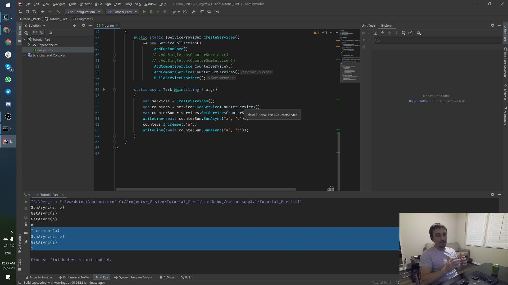

<!--
GENERATED FILE - DO NOT EDIT
This file was generated by [MarkdownSnippets](https://github.com/SimonCropp/MarkdownSnippets).
Source File: /tutorial/mdsource/Part01.source.md
To change this file edit the source file and then run MarkdownSnippets.
-->

# Part 1: Compute Services

Video covering this part:

[](https://youtu.be/G-MIdfDP3gI)

Fusion offers 3 key abstractions enabling you to build real-time services:

1. **Computed Value** &ndash; an object describing the result of a computation
   of type `T`, which is also capable of notifying you when this result
   becomes *invalidated* (most likely inconsistent with the ground truth).
   Such values always implement `Computed<T>`; you don't need to implement
   this interface though, because the most useful implementations of it
   are already there.
2. **Compute Service** &ndash; a service that automatically captures
   dependencies of outputs of its methods and transparently "backs" them with
   `Computed<T>` instances allowing anyone to learn when such outputs become
   invalidated (inconsistent with the ground truth).
   Compute Services are supposed to be written by you.
3. **State** &ndash; an abstraction that "tracks" a single `Computed<T>`,
   i.e. continuously references the most up-to-date version of it.
   Again, you typically don't need to implement your own `IState<T>` -
   Fusion provides its 3 most useful flavors.

Since Compute Services is what you mostly have to deal with,
let's start from this part.

But first, let's create a helper method allowing us to create an
`IServiceProvider` hosting our Compute Services:

<!-- snippet: Part01_CreateServices -->
<a id='snippet-Part01_CreateServices'></a>
```cs
public static IServiceProvider CreateServices()
{
    var services = new ServiceCollection();
    var fusion = services.AddFusion();
    fusion.AddService<CounterService>();
    fusion.AddService<CounterSumService>(); // We'll be using it later
    fusion.AddService<HelloService>();      // We'll be using it later
    return services.BuildServiceProvider();
}
```
<sup><a href='/tutorial/Part01.cs#L7-L17' title='Snippet source file'>snippet source</a> | <a href='#snippet-Part01_CreateServices' title='Start of snippet'>anchor</a></sup>
<!-- endSnippet -->

Now we're ready to declare our first Compute Service:

<!-- snippet: Part01_CounterService -->
<a id='snippet-Part01_CounterService'></a>
```cs
public class CounterService : IComputeService
{
    private readonly ConcurrentDictionary<string, int> _counters = new ConcurrentDictionary<string, int>();

    [ComputeMethod]
    public virtual async Task<int> Get(string key)
    {
        WriteLine($"{nameof(Get)}({key})");
        return _counters.TryGetValue(key, out var value) ? value : 0;
    }

    public void Increment(string key)
    {
        WriteLine($"{nameof(Increment)}({key})");
        _counters.AddOrUpdate(key, k => 1, (k, v) => v + 1);
        using (Invalidation.Begin())
            _ = Get(key);
    }
}
```
<sup><a href='/tutorial/Part01.cs#L19-L39' title='Snippet source file'>snippet source</a> | <a href='#snippet-Part01_CounterService' title='Start of snippet'>anchor</a></sup>
<!-- endSnippet -->

For now, please ignore the fact `Get` is declared as asynchronous method,
even though it isn't truly asynchronous - later I'll explain why it's reasonable.

Let's use `CounterService`:

<!-- snippet: Part01_UseCounterService1 -->
<a id='snippet-Part01_UseCounterService1'></a>
```cs
var counters = CreateServices().GetRequiredService<CounterService>();
WriteLine(await counters.Get("a"));
WriteLine(await counters.Get("b"));
```
<sup><a href='/tutorial/Part01.cs#L43-L47' title='Snippet source file'>snippet source</a> | <a href='#snippet-Part01_UseCounterService1' title='Start of snippet'>anchor</a></sup>
<!-- endSnippet -->

The output should be:

```text
Get(a)
0
Get(b)
0
```

It looks normal, right? But how about this:

<!-- snippet: Part01_UseCounterService2 -->
<a id='snippet-Part01_UseCounterService2'></a>
```cs
var counters = CreateServices().GetRequiredService<CounterService>();
WriteLine(await counters.Get("a"));
WriteLine(await counters.Get("a"));
```
<sup><a href='/tutorial/Part01.cs#L52-L56' title='Snippet source file'>snippet source</a> | <a href='#snippet-Part01_UseCounterService2' title='Start of snippet'>anchor</a></sup>
<!-- endSnippet -->

The output looks weird now:

```text
Get(a)
0
0
```

So why "Get(a)" wasn't printed twice here? The answer is:

* You may think *any compute method automatically caches its output*.
* The cache key is `(MethodInfo, this, argument1, argument2, ...)`
* The cached value is method output
* The entry expires once you call `Invalidation.Begin(() => ...)`
  for the same method of the same service with the same set of arguments.

Let's see how it works:

<!-- snippet: Part01_UseCounterService3 -->
<a id='snippet-Part01_UseCounterService3'></a>
```cs
var counters = CreateServices().GetRequiredService<CounterService>();
WriteLine(await counters.Get("a"));
counters.Increment("a");
WriteLine(await counters.Get("a"));
```
<sup><a href='/tutorial/Part01.cs#L61-L66' title='Snippet source file'>snippet source</a> | <a href='#snippet-Part01_UseCounterService3' title='Start of snippet'>anchor</a></sup>
<!-- endSnippet -->

The output:

```text
Get(a)
0
Increment(a)
Get(a)
1
```

Check out `CounterService.Increment` source code above - it calls
`Invalidation.Begin`, which evicts the entry. This explains why
in this example "Get(a)" is printed twice, even though previously
it was printed just for the first call.

## Dependencies

Now let's add another Compute Service:

<!-- snippet: Part01_CounterSumService -->
<a id='snippet-Part01_CounterSumService'></a>
```cs
public class CounterSumService : IComputeService
{
    public CounterService Counters { get; }

    public CounterSumService(CounterService counters) => Counters = counters;

    [ComputeMethod]
    public virtual async Task<int> Sum(string key1, string key2)
    {
        WriteLine($"{nameof(Sum)}({key1}, {key2})");
        return await Counters.Get(key1) + await Counters.Get(key2);
    }
}
```
<sup><a href='/tutorial/Part01.cs#L69-L83' title='Snippet source file'>snippet source</a> | <a href='#snippet-Part01_CounterSumService' title='Start of snippet'>anchor</a></sup>
<!-- endSnippet -->

And use it:

<!-- snippet: Part01_UseCounterSumService1 -->
<a id='snippet-Part01_UseCounterSumService1'></a>
```cs
var services = CreateServices();
var counterSum = services.GetRequiredService<CounterSumService>();
WriteLine(await counterSum.Sum("a", "b"));
WriteLine(await counterSum.Sum("a", "b"));
```
<sup><a href='/tutorial/Part01.cs#L87-L92' title='Snippet source file'>snippet source</a> | <a href='#snippet-Part01_UseCounterSumService1' title='Start of snippet'>anchor</a></sup>
<!-- endSnippet -->

The output:

```text
Sum(a, b)
Get(a)
Get(b)
0
0
```

Assuming you know how these services work now, this is exactly what you'd expect.

Another example:

<!-- snippet: Part01_UseCounterSumService2 -->
<a id='snippet-Part01_UseCounterSumService2'></a>
```cs
var services = CreateServices();
var counterSum = services.GetRequiredService<CounterSumService>();
WriteLine("Nothing is cached (yet):");
WriteLine(await counterSum.Sum("a", "b"));
WriteLine("Only Get(a) and Get(b) outputs are cached:");
WriteLine(await counterSum.Sum("b", "a"));
WriteLine("Everything is cached:");
WriteLine(await counterSum.Sum("a", "b"));
```
<sup><a href='/tutorial/Part01.cs#L97-L106' title='Snippet source file'>snippet source</a> | <a href='#snippet-Part01_UseCounterSumService2' title='Start of snippet'>anchor</a></sup>
<!-- endSnippet -->

The output:

```text
Nothing is cached (yet):
Sum(a, b)
Get(a)
Get(b)
0
Only Get(a) and Get(b) results are cached:
Sum(b, a)
0
Everything is cached:
0
```

Again, nothing unexpected. The results are still cached, but since the
key is sensitive to the order of arguments, entries for `("a", "b")` and
`("b", "a")` differ.

But what about this?

<!-- snippet: Part01_UseCounterSumService3 -->
<a id='snippet-Part01_UseCounterSumService3'></a>
```cs
var services = CreateServices();
var counters = services.GetRequiredService<CounterService>();
var counterSum = services.GetRequiredService<CounterSumService>();
WriteLine(await counterSum.Sum("a", "b"));
counters.Increment("a");
WriteLine(await counterSum.Sum("a", "b"));
```
<sup><a href='/tutorial/Part01.cs#L111-L118' title='Snippet source file'>snippet source</a> | <a href='#snippet-Part01_UseCounterSumService3' title='Start of snippet'>anchor</a></sup>
<!-- endSnippet -->

The output:

```text
Sum(a, b)
Get(a)
Get(b)
0
Increment(a)
Sum(a, b)
Get(a)
1
```

This is quite unusual, right? *Somehow* `Sum("a", "b")` figured out that
it has to refresh `Get("a")` result first, because it was invalidated
due to increment. But how?

In reality, every compute method either gets a cached output, or builds
a new `Computed<T>` instance "backing" the computation it's going to run,
and *while the computation runs*, this instance stays available via
`Computed.GetCurrent()` method. So any other compute method *invoked
during the computation* gets a chance to enlist its own hidden output
(`Computed<T>` as well) as a *dependency* of the current computed instance.

The actual process is a bit more complex, because it accounts for
scenarios you may not anticipate yet:

- Recursion and multiple levels of compute method calls are fully supported
- Some results can be invalidated right during their computation
- No more than one computation for each distinct result should
  be running at any given moment.

To close this section, let's look at the last property closer.

## Concurrent Evaluations

Let's create a simple service to test how Fusion handles concurrency:

<!-- snippet: Part01_HelloService -->
<a id='snippet-Part01_HelloService'></a>
```cs
public class HelloService : IComputeService
{
    [ComputeMethod]
    public virtual async Task<string> Hello(string name)
    {
        WriteLine($"+ {nameof(Hello)}({name})");
        await Task.Delay(1000);
        WriteLine($"- {nameof(Hello)}({name})");
        return $"Hello, {name}!";
    }
}
```
<sup><a href='/tutorial/Part01.cs#L121-L133' title='Snippet source file'>snippet source</a> | <a href='#snippet-Part01_HelloService' title='Start of snippet'>anchor</a></sup>
<!-- endSnippet -->

As you see, `Hello` method simply returns a formatted "Hello, X!" message,
but with a 1-second delay. Let's try to run it concurrently:

<!-- snippet: Part01_UseHelloService1 -->
<a id='snippet-Part01_UseHelloService1'></a>
```cs
var hello = CreateServices().GetRequiredService<HelloService>();
var t1 = Task.Run(() => hello.Hello("Alice"));
var t2 = Task.Run(() => hello.Hello("Bob"));
var t3 = Task.Run(() => hello.Hello("Bob"));
var t4 = Task.Run(() => hello.Hello("Alice"));
await Task.WhenAll(t1, t2, t3, t4);
WriteLine(t1.Result);
WriteLine(t2.Result);
WriteLine(t3.Result);
WriteLine(t4.Result);
```
<sup><a href='/tutorial/Part01.cs#L137-L148' title='Snippet source file'>snippet source</a> | <a href='#snippet-Part01_UseHelloService1' title='Start of snippet'>anchor</a></sup>
<!-- endSnippet -->

The output:

```text
+ Hello(Bob)
+ Hello(Alice)
- Hello(Bob)
- Hello(Alice)
Hello, Alice!
Hello, Bob!
Hello, Bob!
Hello, Alice!
```

As you see, even though all 4 values were computed, there were just
2 `Hello` evaluations (for distinct arguments only), and moreover,
these two evaluations were running concurrently with each other.

This is an expected behavior: even though nothing is cached in the
beginning, there is no reason to run more than one computation
for e.g. "Bob" argument concurrently, since all of them are supposed
to produce the same result. This is exactly what Fusion ensures.

And on contrary, it's totally reasonable to let `Hello("Alice")`
computation to run concurrently with `Hello("Bob")`, because they
might produce different output, and if they were launched concurrently,
`HelloService` is designed to support this.

Overall, nearly everything in Fusion supports concurrent invocations:

- Compute Services are supposed to be singletons that support concurrency
- Any `Computed<T>` implementation is fully concurrent
- As well as any `IState<T>`
- The exceptions are mostly such types as `XxxOptions` and methods that
  are supposed to be used during the service registration stage, as well
  as types that aren't supposed to be concurrent (e.g. all Blazor components - `StatefulComponentBase<TState>` and its descendants).

#### [Next: Part 2 &raquo;](./Part02.md) | [Tutorial Home](./README.md)
